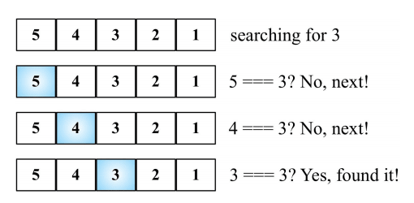
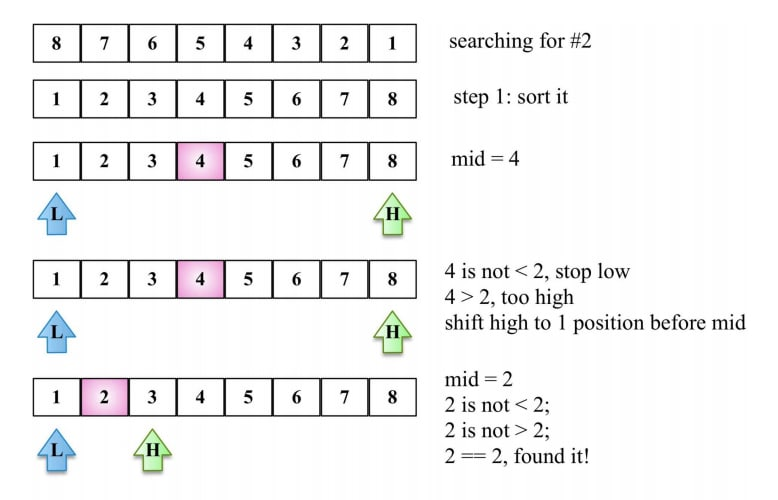

# Linear Search

- **Complexity**: O(n)
- Also known as the **sequential search**, the linear search is the most basic searching algorithm.
- With a big-O notation of **O(n)**, the linear search consists of comparing each element of the data structure with the one you are searching for.



```ts
const linearSearch = (arr: any[], target: any) => {
  for (let i = 0; i < arr.length; i++) {
    if (arr[i] === target) return i;
  }
  return null;
};
```

# Binary Search

- **Complexity**: O(log n)
- The binary search algorithm works with a sorted data structure.
- Flow:
  - Select a value in the middle of the (sorted) array
  - If the value is what we are searching for, we are done
  - Otherwise, if what we are searching for is less than the value, go back to step one with the left subarray
  - Or, if what we are searching for is greater than the value, go back to step one with the right subarray



```ts
const binarySearch = (arr: any[], target: any) => {
  const sortedArr = quickSort(arr);
  let low = 0;
  let high = sortedArr.length - 1;
  while (low <= high) {
    const mid = Math.floor(low + high);
    const element = sortedArr[mid];
    if (element < target) {
      low = mid + 1;
    } else if (element > target) {
      high = mid - 1;
    } else {
      return mid;
    }
  }
  return null;
};
```

# Interpolation Search

TBC: https://dev.to/christinamcmahon/linear-binary-and-interpolation-search-algorithms-explained-55ni
