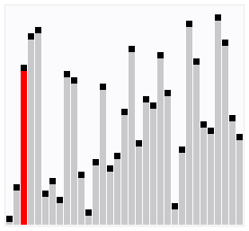
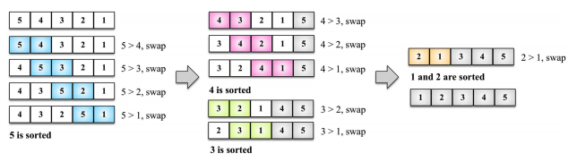
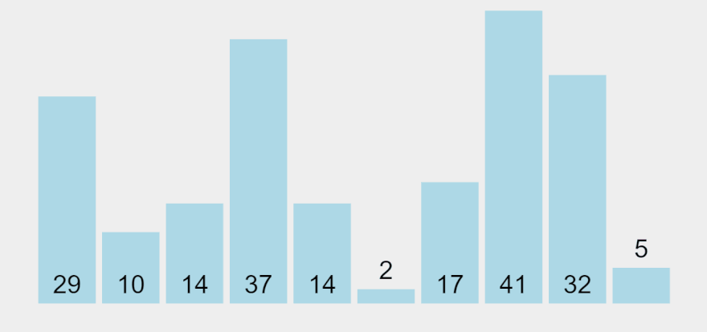
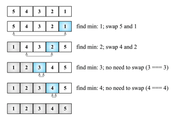
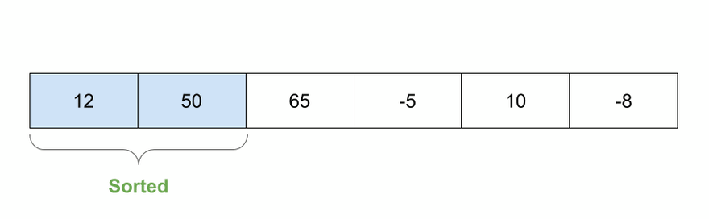
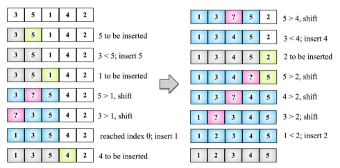
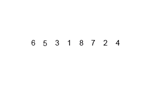
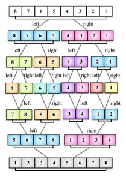

# Helper Functions:

```ts
enum Comparion {
  LESS_THAN = -1,
  BIGGER_THAN = 1,
}

const compare = (a: number, b: number) => {
  if (a === b) {
    return 0;
  }
  return a < b ? Comparion.LESS_THAN : Comparion.BIGGER_THAN;
};

const swap = (arr: number[], a: number, b: number) => {
  [arr[a + 1], arr[a]] = [arr[a], arr[a + 1]];
};
```

# Bubble Sort

- **Best**: O(N)
- **Worst**: O(N^2)





```ts
const bubbleSort = (arr: number[]) => {
  for (let i = 0; i < arr.length; i++) {
    for (let j = 0; j < arr.length - 1 - i; j++) {
      if (compare(arr[j], arr[j + 1]) === Comparion.BIGGER_THAN) {
        swap(arr, j, j + 1);
      }
    }
  }
  return arr;
};
```

# Selection Sort

- **Best**: O(N^2)
- **Worst**: O(N^2)





```ts
const selectionSort = (arr: number[]) => {
  let minIndex = 0;
  for (let i = 0; i < arr.length - 1; i++) {
    minIndex = i;
    for (let j = i; j < arr.length; j++) {
      if (compare(arr[j], arr[minIndex]) === Comparion.LESS_THAN) {
        minIndex = j;
      }
    }
    if (i !== minIndex) {
      swap(arr, i, minIndex);
    }
  }
  return arr;
};
```

# Insertion Sort

- **Best**: O(N)
- **Worst**: O(N^2)





```ts
const insertionSort = (arr: number[]) => {
  let temp;
  for (let i = 1; i < arr.length; i++) {
    temp = arr[i];
    let j = i;
    while (j > 0 && compare(arr[j - 1], temp) === Comparion.BIGGER_THAN) {
      arr[j] = arr[j - 1];
      j--;
    }
    arr[j] = temp;
  }
  return arr;
};
```

# Merge Sort

- **Best**: O(N Log N)
- **Worst**: O(N Log N)

The merge sort algorithm is a divide-and-conquer algorithm. In other words, it divides the original array into smaller arrays until each small array has only one position, then it merges the smaller arrays into a bigger one that is sorted.





```ts
const mergeSort = (arr: number[]) => {
  if (arr.length > 1) {
    const { length } = arr;
    const middle = Math.floor(length / 2);
    const left = mergeSort(arr.slice(0, middle));
    const right = mergeSort(arr.slice(middle, length));
    arr = merge(left, right);
  }
  return arr;
};

const merge = (left: number[], right: number[]) => {
  let i = 0;
  let j = 0;
  const result = [];
  while (i < left.length && j < right.length) {
    result.push(
      compare(left[i], right[j]) === Comparison.LESS_THAN
        ? left[i++]
        : right[j++]
    );
  }
  return result.concat(i < left.length ? left.slice(i) : right.slice(j));
};
```

# Quick Sort

TBC: https://dev.to/christinamcmahon/common-sorting-algorithms-in-javascript-58a7
