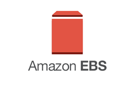
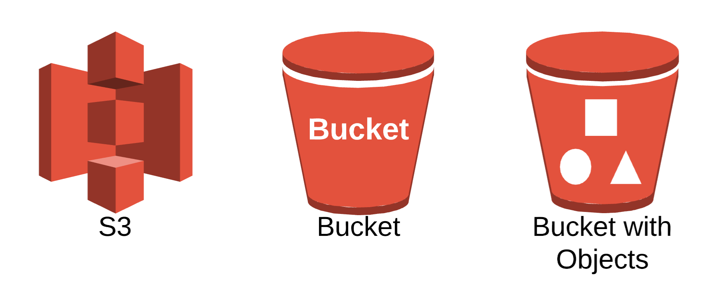
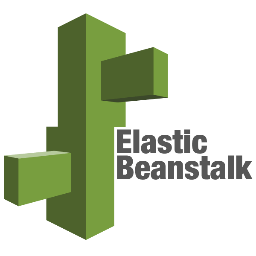
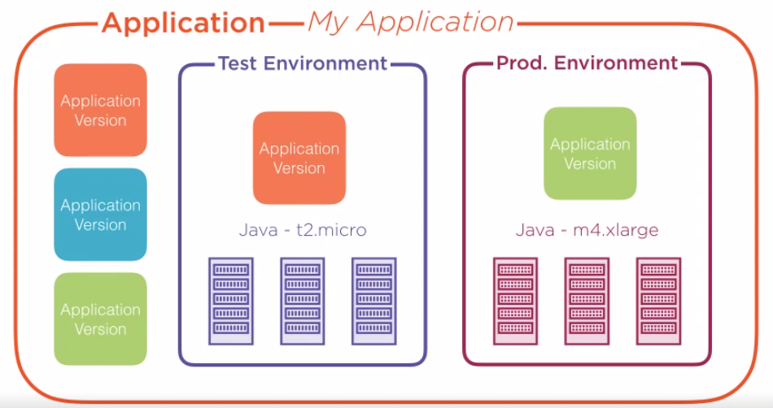
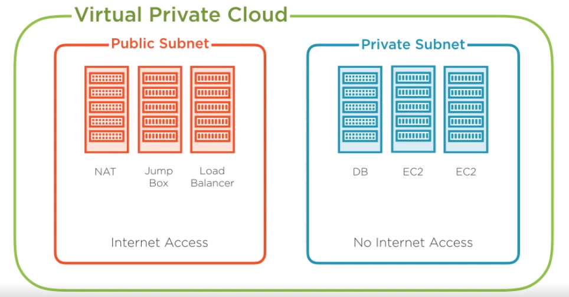

# EC2 (Elastic Cloud Computing)

* Basically computer with operating system and pre-installed softwares

# EBS (Elastic Block Storage)

* Storage of the EC2 file system

# S3 (Simple Storage Service)

* Triggers events when objects are added/modified/deleted
* Keeps older versions of objects
* S3 buckets can be accessed throug URL
* Enables the hosting of static web sites
  

# CloudFront
* Basically it is a CDN
* Works perfectly with S3, EC2, Route53, LoadBalancer
  

# RDS (Relational Database Service)

# Route53
* DNS service

# EB (Elastic Beanstalk)
* AWS Elastic Beanstalk is an easy-to-use service for deploying and scaling web applications and services developed with Java, .NET, PHP, Node.js, Python, Ruby, Go, and Docker on familiar servers such as Apache, Nginx, Passenger, and IIS.
* You can simply upload your code and Elastic Beanstalk automatically handles the deployment, from capacity provisioning, load balancing, auto-scaling to application health monitoring.
* App versions are stored in S3
* Free, just pay for EC2 instances, load balancers and S3 buckets

# Lambda
* Function code execution as a service
* FaaS, Serverless
* Executes code
* No server management required
* Only pay when your code is running
* Structure
  * Code
  * Platform type (Node, Java, Go etc.)
  * Triggers (API gateway, cloudwatch, cloudfront etc.)
  * Configuration

# DynamoDb
* Managed NoSQL db server
* No hardware choices
* Pay only for storage
* First 25GB free

# VPC (Virtual Private Cloud)
* Secure and control access
* VPCs secure groups of instances
* Configure VPC routing tables
* Use NAT Gateway for outbound traffic
* Internal IP address allocation
* Basic VPC config is free

# CloudWatch
* Monitoring service
* Monitoring resources
* Acting on alerts
* Monitor and aggregate the logs

