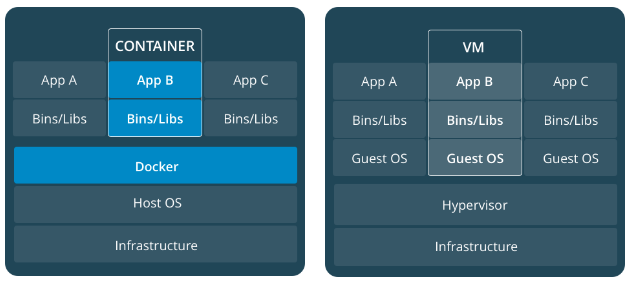

- [Images](#images)
  - [List](#list)
  - [Remove](#remove)
  - [Run](#run)
    - [Run Options](#run-options)
  - [Build](#build)
    - [Dockerfile](#dockerfile)
  - [Publish and Pull Image](#publish-and-pull-image)
    - [Publish](#publish)
    - [Pull and Run](#pull-and-run)
- [Containers](#containers)
  - [List](#list-1)
  - [Stop](#stop)
  - [Kill](#kill)
  - [Remove](#remove-1)
  - [Shell Access](#shell-access)
  - [Show Tasks (Processes)](#show-tasks-processes)
- [Services](#services)
  - [docker-compose.yml](#docker-composeyml)
  - [Run Services](#run-services)
  - [List](#list-2)
  - [Remove](#remove-2)
- [Swarms](#swarms)
  - [Swarm Manager](#swarm-manager)
  - [Setting Up Swarm](#setting-up-swarm)
    - [Init](#init)
    - [Join](#join)


* **Docker for Mac/Linux/Windows** − It allows to run Docker containers.
* **Docker Engine** − It is used for building Docker images and creating Docker containers.
* **Docker Hub** − This is the registry which is used to host various Docker images.
* **Docker Compose** − This is used to define applications using multiple Docker containers.


# Images

* An image is an **executable package** that includes everything needed to run an application (the code, a runtime, libraries, environment variables, and configuration files).

## List
```sh
docker image ls -a
```

## Remove
```sh
docker image rm <image id>

# Remove all
docker image rm $(docker image ls -a -q)
```

## Run
```sh
docker run <image-name>
```

### Run Options
* **-it**
  * interactive
* **-d**
  * detached run (run in background)
* **-e**
  * set environment variable (KEY=VALUE)
* **-p local-port:container-port** 
  * publish container port to local port
* **-v local-dir:container-dir** 
  * bind disk volumes between container and local filesystem
* **--name \<my-container-name\>**
  * assign a name to a container


## Build

### Dockerfile
* Dockerfile defines what goes on in the environment inside your container.
* Build operation uses dockerfile.
* Directives:
  * **FROM**
    * Base image
    * **Ex**: FROM nginx:latest
  * **WORKDIR**
    * Container working directory
    * **Ex**: WORKDIR /usr/share/nginx/html
  * **COPY**
    * Copy files
    * **Ex**: COPY *.html .
  * **RUN**
    * Run command
    * **Ex**: RUN npm i
  * **ENV**
    * Set environment variable
    * **Ex**: ENV NODE_ENV production
  * **EXPOSE**
    * Container port definition.
    * **Ex**: EXPOSE 3000
  * **CMD**
    * Run application when the container launched
    * **Ex**: CMD ["npm", "start"]
  * and much more...


```sh
# build image from directives that define in Dockerfile in current directory
docker build -t mysuperapp:v0.0.1 .

# build from another Dockerfile that locate in different directory
docker build -f config/docker/Dockerfile -t mysuperapp:v0.0.1 .
```


## Publish and Pull Image

### Publish
```sh
# login
docker login

# tag the image
docker tag <image-name> username/repository:tag

# push tagged image
docker push username/repository:tag
```

### Pull and Run
```sh
docker run username/repository:tag
```


# Containers
* A container is a runtime instance of an **image**.



## List
```sh
docker container ls -a
```

## Stop
```sh
docker container stop <hash>
```

## Kill
```sh
# Force stop
docker container kill <hash>
```

## Remove
```sh
docker container rm <hash>

# remove all
docker container rm $(docker container ls -a -q)

# force remove
docker container rm <hash> -f
```

## Shell Access
```sh
docker container exec -it <container-name> bash

# shorthand
docker exec -it <container-name> bash
```

## Show Tasks (Processes)
```sh
docker container top <container-name>
```


# Services
* In a distributed application, different pieces of the app are called “services”.
* A service only runs one image, but it codifies the way that image runs
  * what ports it should use
  * how many replicas of the container should run
  * and so on
* Scaling a service changes the number of container instances running that piece of software, assigning more computing resources to the service in the process.
* To be done with **docker compose** and **docker-compose.yml** file

## docker-compose.yml

* Example docker-compose.yml

```yml
version: "3"
services:
  web:
    # replace username/repo:tag with your name and image details
    image: username/repo:tag
    deploy:
      replicas: 5
      resources:
        limits:
          cpus: "0.1"
          memory: 50M
      restart_policy:
        condition: on-failure
    ports:
      - "4000:80"
    networks:
      - webnet
networks:
  # default is a load-balanced overlay network
  webnet:
```

## Run Services

```sh
# init the swarm
docker swarm init

# run services according to compose file
docker stack deploy -c docker-compose.yml <stack-name|app-name>
```

## List
```sh
# List stacks or apps
docker stack ls

# lets you view all services associated with the stack
docker stack services <stack-name>

# view all tasks of a stack
docker stack ps <stack-name>

# view all tasks of a service
docker service ps <service-name>

# view all services
docker service ls

```

## Remove
```sh
# Take the app down
docker stack rm <stack-name>

# Take the swarm down
docker swarm leave --force
```


# Swarms
* A swarm is a group of machines that are running Docker and joined into a **cluster**.
* Commands are executed on a cluster by a **swarm manager**.
* After joining a swarm, they are referred to as **nodes**.

## Swarm Manager
* Swarm managers can use several strategies to run containers:
  * **Emptiest node**
    * fills the least utilized machines with containers
  * **Global**
    * ensures that each machine gets exactly one instance of the specified container

## Setting Up Swarm

### Init
* Enables swarm mode and makes your current machine a swarm manager.

```sh
docker swarm init
```

### Join
* Run the command below on other machines to have them join the swarm as workers.

```sh
docker swarm join
```

