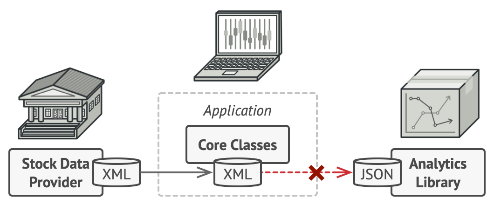

# Adapter

- Adapter is a structural design pattern that allows objects with incompatible interfaces to collaborate.

### Problem

- Imagine that you’re creating a stock market monitoring app.
- The app downloads the stock data from multiple sources in XML format and then displays nice-looking charts and diagrams for the user.
- At some point, you decide to improve the app by integrating a smart 3rd-party analytics library. But there’s a catch: the analytics library only works with data in JSON format.



### Solution

- You can create an adapter. This is a special object that converts the interface of one object so that another object can understand it.
- An adapter wraps one of the objects to hide the complexity of conversion happening behind the scenes. The wrapped object isn’t even aware of the adapter.

### Applicability

- Use the Adapter class when you want to use some existing class, but its interface isn’t compatible with the rest of your code.
- Use the pattern when you want to reuse several existing subclasses that lack some common functionality that can’t be added to the superclass.

### Sample Code

```ts
// The Target defines the domain-specific interface used by the client code.
class Target {
  public request(): string {
    return "Target: The default target's behavior.";
  }
}

/**
 * The Adaptee contains some useful behavior, but its interface is incompatible
 * with the existing client code. The Adaptee needs some adaptation before the
 * client code can use it.
 */
class Adaptee {
  public specificRequest(): string {
    return ".eetpadA eht fo roivaheb laicepS";
  }
}

/**
 * The Adapter makes the Adaptee's interface compatible with the Target's
 * interface.
 */
class Adapter extends Target {
  private adaptee: Adaptee;

  constructor(adaptee: Adaptee) {
    super();
    this.adaptee = adaptee;
  }

  public request(): string {
    const result = this.adaptee.specificRequest().split("").reverse().join("");
    return `Adapter: (TRANSLATED) ${result}`;
  }
}

/**
 * The client code supports all classes that follow the Target interface.
 */
function clientCode(target: Target) {
  console.log(target.request());
}

console.log("Client: I can work just fine with the Target objects:");
const target = new Target();
clientCode(target);

console.log("");

const adaptee = new Adaptee();
console.log(
  "Client: The Adaptee class has a weird interface. See, I don't understand it:"
);
console.log(`Adaptee: ${adaptee.specificRequest()}`);

console.log("");

console.log("Client: But I can work with it via the Adapter:");
const adapter = new Adapter(adaptee);
clientCode(adapter);
```

# Bridge

- Bridge is a structural design pattern that lets you split a large class or a set of closely related classes into two separate hierarchies—abstraction and implementation—which can be developed independently of each other.

### Problem

- Say you have a geometric `Shape` class with a pair of subclasses: `Circle` and `Square`.
- You want to extend this class hierarchy to incorporate colors, so you plan to create `Red` and `Blue` shape subclasses.
- However, since you already have two subclasses, you’ll need to create four class combinations such as `BlueCircle` and `RedSquare`.
- Adding new shape types and colors to the hierarchy will grow it **exponentially**.


