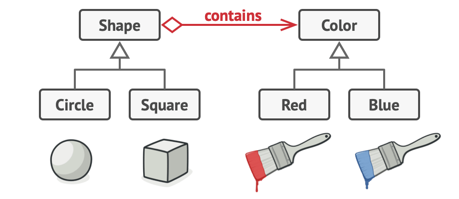

# Adapter


- Allows objects with incompatible interfaces to collaborate.

### Problem

- Imagine that you’re creating a stock market monitoring app.
- The app downloads the stock data from multiple sources in XML format and then displays nice-looking charts and diagrams for the user.
- At some point, you decide to improve the app by integrating a smart 3rd-party analytics library. But there’s a catch: the analytics library only works with data in JSON format.


### Solution

- You can create an adapter. This is a special object that converts the interface of one object so that another object can understand it.
- An adapter **wraps** one of the objects to hide the complexity of conversion happening behind the scenes. The wrapped object isn’t even aware of the adapter.

### Applicability

- Use the Adapter class when you want to use some existing class, but its interface isn’t compatible with the rest of your code.
- Use the pattern when you want to reuse several existing subclasses that lack some common functionality that can’t be added to the superclass.

### Sample Code

```ts
// The Target defines the domain-specific interface used by the client code.
class Target {
  public request(): string {
    return "Target: The default target's behavior.";
  }
}

/**
 * The Adaptee contains some useful behavior, but its interface is incompatible
 * with the existing client code. The Adaptee needs some adaptation before the
 * client code can use it.
 */
class Adaptee {
  public specificRequest(): string {
    return ".eetpadA eht fo roivaheb laicepS";
  }
}

/**
 * The Adapter makes the Adaptee's interface compatible with the Target's
 * interface.
 */
class Adapter extends Target {
  private adaptee: Adaptee;

  constructor(adaptee: Adaptee) {
    super();
    this.adaptee = adaptee;
  }

  public request(): string {
    const result = this.adaptee.specificRequest().split("").reverse().join("");
    return `Adapter: (TRANSLATED) ${result}`;
  }
}

/**
 * The client code supports all classes that follow the Target interface.
 */
function clientCode(target: Target) {
  console.log(target.request());
}

console.log("Client: I can work just fine with the Target objects:");
const target = new Target();
clientCode(target);

console.log("");

const adaptee = new Adaptee();
console.log(
  "Client: The Adaptee class has a weird interface. See, I don't understand it:"
);
console.log(`Adaptee: ${adaptee.specificRequest()}`);

console.log("");

console.log("Client: But I can work with it via the Adapter:");
const adapter = new Adapter(adaptee);
clientCode(adapter);
```

<br />
<br />
<br />
<br />
<br />


# Bridge


- Lets you split a large class or a set of closely related classes into **two separate hierarchies** (**abstraction** and **implementation**) which can be developed independently of each other.

### Problem

- Say you have a geometric `Shape` class with a pair of subclasses: `Circle` and `Square`.
- You want to extend this class hierarchy to incorporate colors, so you plan to create `Red` and `Blue` shape subclasses.
- However, since you already have two subclasses, you’ll need to create four class combinations such as `BlueCircle` and `RedSquare`.
- Adding new shape types and colors to the hierarchy will grow it **exponentially**.
- This problem occurs because we’re trying to extend the shape classes in two independent **dimensions**: by form and by color. 


### Solution
- The Bridge pattern solves this problem by switching from inheritance to the **object composition**.
- This means, you extract one of the dimensions into a separate class hierarchy, so that the original classes will reference an object of the new hierarchy.
- With this approach, we can extract the color-related code into its own class with two subclasses: `Red` and `Blue`. 
- The `Shape` class then has a reference field pointing to one of the color objects. 
- That reference will act as a **bridge** between the `Shape` and `Color` classes. 
- From now on, adding new colors won’t require changing the shape hierarchy, and vice versa.





### Structure


### Applicability

- Use the Bridge pattern when you want to divide and organize a monolithic class that has several variants of some functionality (for example, if the class can work with various database servers)
  - After this, you can change the classes in each hierarchy **independently** of the classes in the others. 
  - This approach simplifies code **maintenance** and **minimizes the risk** of breaking existing code.
- Use the pattern when you need to extend a class in several **orthogonal (independent) dimensions**.
  - The Bridge suggests that you extract a separate class hierarchy **for each of the dimensions**. 
  - The original class **delegates** the related work to the objects belonging to those hierarchies instead of doing everything on its own.


### How to Implement

1. Identify the orthogonal dimensions in your classes.
2. See what operations the client needs and define them in the **base abstraction class**.
3. Determine the operations available on all platforms (**on all implementation**). Declare the ones that the abstraction needs in the **general implementation interface**.
4. For all platforms in your domain create **concrete implementation classes**, but make sure they all follow the implementation interface.
5. Inside the **abstraction class**, add a r**eference field** for the implementation type. 
6. If you have several variants of high-level logic, create **refined abstractions** for each variant by extending the base abstraction class.
7. The client code should pass an implementation object to the abstraction’s constructor to associate one with the other. After that, the client can forget about the implementation and work only with the abstraction object.


<br />
<br />
<br />
<br />
<br />


# Composite


- Lets you compose objects into tree structures and then work with these structures as if they were individual objects


### Problem
- Using the Composite pattern makes sense only when the core model of your app can be represented as a tree.
- For example, imagine that you have two types of objects: `Products` and `Boxes`. A `Box` can contain several `Products` as well as a number of smaller `Boxes`. These little `Boxes` can also hold some `Products` or even smaller `Boxes`, and so on.
- Say you decide to create an ordering system that uses these classes. Orders could contain simple products without any wrapping, as well as boxes stuffed with products...and other boxes. How would you determine the total price of such an order?


### Solution

- The Composite pattern suggests that you work with Products and Boxes through a common interface which declares a method for calculating the total price.
- How would this method work? 
  - For a product, it’d simply return the product’s price. 
  - For a box, it’d go over each item the box contains, ask its price and then return a total for this box. 
  - If one of these items were a smaller box, that box would also start going over its contents and so on, until the prices of all inner components were calculated. 
  - A box could even add some extra cost to the final price, such as packaging cost.
- The greatest benefit of this approach is that you don’t need to know whether an object is a simple product or a sophisticated box. You can treat them all the same via the common interface. When you call a method, the objects themselves pass the request down the tree.


### Structure


### Applicability

- Use the Composite pattern when you have to implement a **tree-like object structure**.
- Use the pattern when you want the client code to treat both simple and complex elements **uniformly**.


### How to Implement

1. Make sure that the core model of your app can be represented as a **tree structure**. Try to break it down into simple **elements** and **containers**. 
2. Declare the **component interface with a list of methods** that make sense for both simple and complex components.
3. Create a **leaf class** to represent simple elements. A program may have multiple different leaf classes.
4. Create a **container class** to represent complex elements. In this class, provide an **array field** for storing references to sub-elements. The array must be able to store both leaves and containers, so make sure it’s declared with the **component interface** type.


<br />
<br />
<br />
<br />
<br />


# Decorator


- Lets you attach new behaviors to objects by placing these objects inside special wrapper objects that contain the behaviors.
