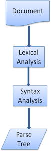

- [High Level Structure of Browsers](#high-level-structure-of-browsers)
- [Rendering Engine](#rendering-engine)
  - [Flow](#flow)
      - [Webkit Main Flow](#webkit-main-flow)
      - [Mozilla Gecko Main Flow](#mozilla-gecko-main-flow)
  - [Parsing](#parsing)
    - [Formal definitions for vocabulary and syntax](#formal-definitions-for-vocabulary-and-syntax)
    - [Generating parsers](#generating-parsers)
- [HTML Parser](#html-parser)
  - [HTML DTD](#html-dtd)
  - [DOM](#dom)
  - [Parsing Algorithm](#parsing-algorithm)
  - [The Tokenization Algorithm](#the-tokenization-algorithm)
  - [Tree Construction Algorithm](#tree-construction-algorithm)
  - [Actions After Parsing](#actions-after-parsing)
  - [Browsers Error Tolerance](#browsers-error-tolerance)
- [CSS Parsing](#css-parsing)
  - [WebKit CSS Parser](#webkit-css-parser)
- [Processing Order of Scripts and Stylesheets](#processing-order-of-scripts-and-stylesheets)
  - [Scripts](#scripts)
  - [Speculative parsing](#speculative-parsing)
  - [Stylesheets](#stylesheets)
- [Render Tree](#render-tree)
  - [Relation with DOM Tree](#relation-with-dom-tree)
  - [Style Computation](#style-computation)

<br>
<br>
<br>
<br>

# High Level Structure of Browsers


The browser's main components are:

1. **The user interface:** this includes the address bar, back/forward button, bookmarking menu, etc. Every part of the browser display except the window where you see the requested page.
2. **The browser engine:** marshals actions between the UI and the rendering engine.
3. **The rendering engine:** responsible for displaying requested content. For example if the requested content is HTML, the rendering engine parses HTML and CSS, and displays the parsed content on the screen.
4. **Networking:** for network calls such as HTTP requests, using different implementations for different platform behind a platform-independent interface.
5. **UI backend:** used for drawing basic widgets like combo boxes and windows. This backend exposes a generic interface that is not platform specific. Underneath it uses operating system user interface methods.
6. **JavaScript interpreter:** Used to parse and execute JavaScript code.
7. **Data storage:** This is a persistence layer. The browser may need to save all sorts of data locally, such as cookies. Browsers also support storage mechanisms such as localStorage, IndexedDB, WebSQL and FileSystem.

> It is important to note that browsers such as Chrome run multiple instances of the rendering engine: one for each tab. Each tab runs in a separate process.

# Rendering Engine

- The responsibility of the rendering engine is rendering, that is display of the requested contents on the browser screen.
- By default the rendering engine can display HTML and XML documents and images.
- It can display other types of data via plug-ins or extension; for example, displaying PDF documents using a PDF viewer plug-in.
- Different browsers use different rendering engines:
  - Internet Explorer uses `Trident`
  - Firefox uses `Gecko`
  - Safari uses `WebKit`
  - Chrome and Opera (from version 15) use `Blink`, a fork of **WebKit**.

## Flow

- Once a user requests a particular document, the rendering engine starts fetching the content of the requested document.
- This is done via the networking layer.
- The rendering engine starts receiving the content of that specific document in chunks of 8 KBs from the networking layer.
- After this, the basic flow of the rendering engine begins.


The four basic steps include:

1. The requested HTML page is parsed in chunks, including the external CSS files and in style elements, by the rendering engine. The HTML elements are then converted into DOM nodes to form a “**content tree**” or “**DOM tree**”
2. Simultaneously, the browser also creates a **render tree**. This tree includes both:
   1. the **styling** information like color and dimensions
   2. and the visual instructions that **define the order** in which the elements will be displayed. The render tree ensures that the content is displayed in the desired order.
3. Further, the render tree goes through the **layout process**.
   1. When a render tree is created, the **position or size values are not assigned**.
   2. The entire process of calculating values for evaluating the desired position is called a **layout process**.
   3. In this process, every node is assigned the exact coordinates. This ensures that every node appears at an accurate position on the screen.
4. The final step is to **painting**, wherein the render tree is traversed, and the renderer’s paint() method is invoked, which paints each node on the screen using the **UI backend layer**.

> It's important to understand that this is a **gradual process**. For better user experience, the rendering engine will try to display contents on the screen **as soon as possible**.
>
> It will not wait until all HTML is parsed before starting to build and layout the render tree.
>
> Parts of the content will be parsed and displayed, while the process continues with the rest of the contents that keeps coming from the network.

#### Webkit Main Flow


#### Mozilla Gecko Main Flow


- Gecko calls the tree of visually formatted elements a "**Frame tree**". Each element is a frame. WebKit uses the term "**Render Tree**" and it consists of "Render Objects".
- WebKit uses the term "**layout**" for the placing of elements, while Gecko calls it "**Reflow**".
- "**Attachment**" is WebKit's term for connecting DOM nodes and visual information to create the render tree.
- A minor non-semantic difference is that Gecko has an extra layer between the HTML and the DOM tree. It is called the "**content sink**" and is a factory for making DOM elements.

## Parsing

- Parsing a document means translating it to a structure the code can use.
- The result of parsing is usually a tree of nodes that represent the structure of the document. This is called a **parse tree** or a **syntax tree**.
- Parsing can be separated into two sub processes:
  - **lexical analysis**
  - and **syntax analysis**
- **Lexical analysis:**
  - is the process of breaking the input into tokens.
  - Tokens are the language vocabulary: the collection of valid building blocks.
  - In human language it will consist of all the words that appear in the dictionary for that language.
- **Syntax analysis:** is the applying of the language syntax rules.
- Parsers usually divide the work between two components:
  - **the lexer** (sometimes called tokenizer) that is responsible for breaking the input into valid tokens
  - and **the parser** that is responsible for constructing the parse tree by analyzing the document structure according to the language syntax rules.
- **The lexer** knows how to strip irrelevant characters like white spaces and line breaks.



- The parsing process is **iterative**.
- The parser will usually ask the **lexer** for a new token and try to match the token with one of the syntax rules.
- If a rule is matched, a node corresponding to the token will be added to the **parse tree** and the parser will ask for another token.
- If no rule matches, the parser will store the token internally, and keep asking for tokens until a rule matching all the internally stored tokens is found.
- If no rule is found then the parser will **raise an exception**. This means the document was not valid and contained syntax errors.

---

**Parsing example:**

- Syntax:
  1. The language syntax building blocks are **expressions**, **terms** and **operations**.
  2. Our language can include any number of expressions.
  3. An expression is defined as a "**term**" followed by an "**operation**" followed by another "**term**"
  4. An operation is a **plus token** or a **minus token**
  5. A term is an integer token or an expression
- Let's analyze the input `2 + 3 - 1`
  - The first substring that matches a rule is `2`: according to rule #5 it is a term.
  - The second match is `2 + 3`: this matches the third rule: a term followed by an operation followed by another term.
  - The next match will only be hit at the end of the input.
  - `2 + 3 - 1` is an expression because we already know that `2 + 3` is a term, so we have a term followed by an operation followed by another term.
  - `2 + +` will not match any rule and therefore is an invalid input.

### Formal definitions for vocabulary and syntax

- **Vocabulary** is usually expressed by **regular expressions**.
  - For example our language will be defined as:

```
INTEGER: 0|[1-9][0-9]*
PLUS: +
MINUS: -
```

- **Syntax** is usually defined in a format called **BNF**. Our language will be defined as:

```
expression :=  term  operation  term
operation :=  PLUS | MINUS
term := INTEGER | expression
```

> **A language can be parsed by regular parsers if its grammar is a context free grammar.** An intuitive definition of a context free grammar is a grammar that can be entirely expressed in BNF.

### Generating parsers

- There are tools that can generate a parser.
- You feed them the grammar of your language - its vocabulary and syntax rules - and they generate a working parser.
- Creating a parser requires a deep understanding of parsing and it's not easy to create an optimized parser by hand, so parser generators can be very useful.
- `WebKit` uses two well known parser generators: `Flex` for creating a lexer and `Bison` for creating a parser (you might run into them with the names Lex and Yacc).
- `Flex` input is a file containing regular expression definitions of the tokens.
- `Bison`'s input is the language syntax rules in BNF format.

# HTML Parser

- The vocabulary and syntax of HTML are defined in specifications created by the **W3C** organization.
- As we have seen in the parsing section, grammar syntax can be defined formally using formats like **BNF**.
- Unfortunately all the conventional parser topics do not apply to HTML.
- **HTML cannot easily be defined by a context free grammar that parsers need.**
- There is a formal format for defining HTML - DTD (Document Type Definition) - but it is not a context free grammar.
- This appears strange at first sight; HTML is rather close to XML. There are lots of available XML parsers. There is an XML variation of HTML - XHTML - so what's the big difference?
  - The difference is that the HTML approach is more "**forgiving**"
  - it lets you **omit certain tags** (which are then added implicitly),
  - or sometimes **omit start or end tags**, and so on.
  - On the whole it's a "**soft**" syntax, as opposed to XML's stiff and demanding syntax.
- On one hand this is the main reason why HTML is so popular: **it forgives your mistakes and makes life easy for the web author**.
- On the other hand, it makes it difficult to write a formal grammar.
- So to summarize, HTML cannot be parsed easily by conventional parsers, since its grammar is not context free. **HTML cannot be parsed by XML parsers.**

## HTML DTD

- HTML definition is in a **DTD** format.
- This format is used to define languages of the SGML family.
- The format contains definitions for all allowed elements, their attributes and hierarchy.
- As we saw earlier, the HTML DTD doesn't form a context free grammar.
- There are a few variations of the DTD.
- The strict mode conforms solely to the specifications but other modes contain support for markup used by browsers in the past.
- The current strict DTD is here: [www.w3.org/TR/html4/strict.dtd](www.w3.org/TR/html4/strict.dtd)

## DOM

- The output tree (the "parse tree") is **a tree of DOM element and attribute nodes**.
- DOM is short for Document Object Model.
- It is the object presentation of the HTML document and the interface of HTML elements to the outside world like JavaScript.
- Like HTML, DOM is specified by the **W3C** organization.
- It is a generic specification for manipulating documents.
- A specific module describes HTML specific elements.
- The HTML definitions can be found here: [www.w3.org/TR/2003/REC-DOM-Level-2-HTML-20030109/idl-definitions.html](www.w3.org/TR/2003/REC-DOM-Level-2-HTML-20030109/idl-definitions.html)

---

- The tree contains DOM nodes, I mean the tree is constructed of elements that **implement one of the DOM interfaces**.
- Browsers use concrete implementations that have other attributes used by the browser internally.

**Example:**

```html
<html>
  <body>
    <p>Hello World</p>
    <div></div>
  </body>
</html>
```


## Parsing Algorithm

- As we saw in the previous sections, HTML cannot be parsed using the regular top down or bottom up parsers.
- The reasons are:
  - The **forgiving** nature of the language.
  - The fact that browsers have **traditional error tolerance** to support well known cases of invalid HTML.
  - The parsing process is **reentrant**. For other languages, the source doesn't change during parsing, but in HTML, dynamic code (such as script elements containing `document.write()` calls) can add extra tokens, **so the parsing process actually modifies the input.**

---

- Unable to use the regular parsing techniques, browsers **create custom parsers** for parsing HTML.
- The parsing algorithm is described in detail by the HTML5 specification. [http://www.whatwg.org/specs/web-apps/current-work/multipage/parsing.html](http://www.whatwg.org/specs/web-apps/current-work/multipage/parsing.html)
- The algorithm consists of two stages: **tokenization** and **tree construction**.
  - Tokenization is the **lexical analysis**, parsing the input into tokens. Among HTML tokens are start tags, end tags, attribute names and attribute values.
  - The tokenizer recognizes the token, gives it to the **tree constructor**, and consumes the next character for recognizing the next token, and so on until the end of the input.


## The Tokenization Algorithm

- The algorithm's output is an HTML token.
- The algorithm is expressed as a state machine.
- Each state consumes one or more characters of the input stream and updates the next state according to those characters.
- The decision is influenced by the current tokenization state and by the tree construction state.
- This means the same consumed character will produce different results for the correct next state, depending on the current state.
- The algorithm is too complex to describe fully, so let's see a simple example that will help us understand the principle.

**Basic example - tokenizing the following HTML:**

```html
<html>
  <body>
    Hello world
  </body>
</html>
```

- The initial state is the `Data state`.
  - When the `<` character is encountered, the state is changed to `Tag open state`.
  - Consuming an `a-z` character causes creation of a "Start tag token", the state is changed to `Tag name state`.
  - We stay in this state until the `>` character is consumed.
  - Each character is appended to the new token name.
  - In our case the created token is an `html` token.
- When the `>` tag is reached, the current **token is emitted** and the state changes back to the `Data state`.
- The `<body>` tag will be treated by the same steps.
- So far the html and body tags were emitted.
- We are now back at the `Data state`.
- Consuming the `H` character of "Hello world" will cause creation and emitting of a **character token**
  - this goes on until the `<` of `</body>` is reached.
  - We will emit a character token **for each character** of Hello world.
- We are now back at the `Tag open state`.
- Consuming the next input `/` will cause creation of an **end tag token** and a move to the `Tag name state`.
  - Again we stay in this state until we reach `>`.
  - Then the new tag token will be emitted and we go back to the `Data state`.
- The `</html>` input will be treated like the previous case.

## Tree Construction Algorithm

- During the tree construction stage the DOM tree with the Document in its root will be modified and elements will be added to it.
- Each node emitted by the **tokenizer** will be processed by the **tree constructor**.
- For each token the specification defines which DOM element is relevant to it and will be created for this token.
- **The element is added to the DOM tree, and also the stack of open elements**.
- This stack is used to correct nesting mismatches and unclosed tags.
- The algorithm is also described as a state machine.
- The states are called "**insertion modes**".
- Let's see the tree construction process for the example input:

```html
<html>
  <body>
    Hello world
  </body>
</html>
```

- The input to the tree construction stage is a sequence of tokens from the tokenization stage.
- The first mode is the "**initial mode**".
- Receiving the `html token` will cause a move to the "**before html**" mode and a reprocessing of the token in that mode.
- This will cause creation of the `HTMLHtmlElement` element, which will be appended to the root `Document` object.
- The state will be changed to "**before head**".
- The `body token` is then received.
- An `HTMLHeadElement` will be created implicitly although we don't have a `head token` and it will be added to the tree.
- We now move to the "**in head**" mode and then to "**after head**".
- The `body token` is reprocessed, an `HTMLBodyElement` is created and inserted and the mode is transferred to "**in body**".
- The `character tokens` of the "Hello world" string are now received.
- The first one will cause creation and insertion of a `Text` node and the other characters will be appended to that node.
- The receiving of the `body end token` will cause a transfer to "**after body**" mode.
- We will now receive the `html end token` which will move us to "**after after body**" mode.
- Receiving the `end of file token` will end the parsing.

## Actions After Parsing

- At this stage the browser will mark the document as **interactive**
- Then start parsing scripts that are in "**deferred**" mode: those that should be executed after the document is parsed.
- The document state will be then set to "**complete**" and a "**load**" event will be fired.

## Browsers Error Tolerance

- You never get an "Invalid Syntax" error on an HTML page. Browsers fix any invalid content and go on.
- Example:

```html
<html>
  <mytag>
  </mytag>
  <div>
  <p>
  </div>
    Really lousy HTML
  </p>
</html>
```

- `mytag` is not a standard tag, wrong nesting of the `p` and `div` elements and more, but the browser still shows it correctly and doesn't complain.
- So a lot of the parser code is fixing the HTML author mistakes.
- There are known invalid HTML constructs repeated on many sites, and the browsers try to fix them in a way conformant with other browsers.
- Let's see some **WebKit** error tolerance examples:
  - **`</br>` instead of `<br\>`**: Some sites use `</br>` instead of `<br>`. In order to be compatible with IE and Firefox, WebKit treats this like `<br>`.
  - A **stray table** is a table inside another table, but not inside a table cell.
  - **Nested form elements**: In case the user puts a form inside another form, the second form is ignored.
  - A too deep tag hierarchy
  - Misplaced html or body end tags

# CSS Parsing

- Unlike HTML, CSS is a context free grammar and can be parsed using the types of parsers described in the introduction.
- In fact the [CSS specification](https://www.w3.org/TR/CSS2/grammar.html) defines CSS lexical and syntax grammar.
- The lexical grammar (vocabulary) is defined by regular expressions for each token:

```
comment   \/\*[^*]*\*+([^/*][^*]*\*+)*\/
num       [0-9]+|[0-9]*"."[0-9]+
nonascii  [\200-\377]
nmstart   [_a-z]|{nonascii}|{escape}
nmchar    [_a-z0-9-]|{nonascii}|{escape}
name      {nmchar}+
ident     {nmstart}{nmchar}*
```

- `ident` is short for identifier, like a class name.
- `name` is an element id (that is referred by "#" )
- The syntax grammar is described in BNF:

```
ruleset
  : selector [ ',' S* selector ]*
    '{' S* declaration [ ';' S* declaration ]* '}' S*
  ;
selector
  : simple_selector [ combinator selector | S+ [ combinator? selector ]? ]?
  ;
simple_selector
  : element_name [ HASH | class | attrib | pseudo ]*
  | [ HASH | class | attrib | pseudo ]+
  ;
class
  : '.' IDENT
  ;
element_name
  : IDENT | '*'
  ;
attrib
  : '[' S* IDENT S* [ [ '=' | INCLUDES | DASHMATCH ] S*
    [ IDENT | STRING ] S* ] ']'
  ;
pseudo
  : ':' [ IDENT | FUNCTION S* [IDENT S*] ')' ]
  ;
```

## WebKit CSS Parser

- WebKit uses Flex and Bison parser generators to create parsers automatically from the CSS grammar files.
- As you recall from the parser introduction, Bison creates a bottom up shift-reduce parser.
- Firefox uses a top down parser written manually.
- In both cases each CSS file is parsed into a `StyleSheet` object.
- Each object contains `CSS rules`.
- The CSS rule objects contain `selector` and `declaration objects` and other objects corresponding to CSS grammar.


# Processing Order of Scripts and Stylesheets

## Scripts

- The model of the web is synchronous.
- Authors expect scripts to be parsed and executed immediately when the parser reaches a `<script>` tag.
- The parsing of the document **halts** until the script has been executed.
- If the script is external then the resource must first be fetched from the network - this is also done synchronously, and parsing **halts** until the resource is fetched.
- This was the model for many years and is also specified in HTML4 and 5 specifications.
- Authors can add the `defer` attribute to a script, in which case it will not halt document parsing and will execute after the document is parsed.
- HTML5 adds an option to mark the script as asynchronous so it will be parsed and executed by a different thread.

## Speculative parsing

- Both WebKit and Firefox do this optimization.
- While executing scripts, another thread parses the rest of the document and finds out what other resources need to be loaded from the network and loads them.
- In this way, resources can be loaded on parallel connections and overall speed is improved.
- Note: the speculative parser only parses references to external resources like external scripts, style sheets and images: it doesn't modify the DOM tree - that is left to the main parser.

## Stylesheets

- Style sheets on the other hand have a different model.
- Conceptually it seems that since style sheets don't change the DOM tree, there is no reason to wait for them and stop the document parsing.
- There is an issue, though, of scripts asking for style information during the document parsing stage.
- If the style is not loaded and parsed yet, the script will get wrong answers and apparently this caused lots of problems.
- It seems to be an edge case but is quite common.
- Firefox blocks all scripts when there is a style sheet that is still being loaded and parsed.
- WebKit blocks scripts only when they try to access certain style properties that may be affected by unloaded style sheets.

# Render Tree

- While the DOM tree is being constructed, the browser constructs another tree, the **render tree**.
- This tree is of visual elements in the order in which they will be displayed.
- It is the visual representation of the document.
- The purpose of this tree is to enable painting the contents in their **correct order**.
  >
- Firefox calls the elements in the render tree `frames`. WebKit uses the term `renderer` or `render object`.
- A renderer knows how to lay out and paint itself and its children.
- Each renderer represents a **rectangular area** usually corresponding to a node's CSS box, as described by the CSS2 spec. It includes **geometric information** like width, height and position.
- The box type is affected by the `display` value of the style attribute that is relevant to the node.
- The **element type** is also considered: for example, **form controls and tables have special frames.**

## Relation with DOM Tree

- The renderers correspond to DOM elements, but the relation is **not one to one**.
- **Non-visual DOM elements** will not be inserted in the render tree.
- An example is the `head` element.
- Also elements whose `display` value was assigned to `none` **will not **appear in the tree.
- Whereas elements with `hidden` visibility **will** appear in the tree.

---

- There are DOM elements which correspond to several visual objects.
- These are usually elements with complex structure that cannot be described by a single rectangle.
- For example, the `select` element has three renderers:
  - one for the display area,
  - one for the drop down list box
  - and one for the button
- Also when text is broken into multiple lines because the width is not sufficient for one line, the new lines will be added as extra renderers.

---

- Some render objects correspond to a DOM node but not in the same place in the tree.
- **Floats** and **absolutely positioned elements** are out of flow, placed in a different part of the tree, and mapped to the real frame.
- A placeholder frame is where they should have been.

---

- Processing the `html` and `body` tags results in the construction of the render tree root.
- The root render object corresponds to what the CSS spec calls the containing block: the top most block that contains all other blocks.
- Its dimensions are the `viewport`: the browser window display area dimensions.
- Firefox calls it `ViewPortFrame` and WebKit calls it `RenderView`.
- This is the render object that the `document` points to.
- The rest of the tree is constructed as a DOM nodes insertion.

## Style Computation

- Building the render tree requires calculating the visual properties of **each** render object.
- This is done by calculating the style properties of each element.
- The style includes **style sheets** of various origins, **inline style** elements and **visual properties** in the HTML (like the "bgcolor" property).
- The later is translated to matching CSS style properties.
- The origins of style sheets are:
  - the browser's default style sheets,
  - the style sheets provided by the page author
  - and user style sheets - these are style sheets provided by the browser user (browsers let you define your favorite styles. In Firefox, for instance, this is done by placing a style sheet in the "Firefox Profile" folder).

Style computation brings up a few difficulties:

1. **Memory**: Style data is a very large construct, holding the numerous style properties, this can cause memory problems.
2. **Performance**:
   1. Finding the matching rules for each element can cause performance issues if it's not optimized.
   2. Traversing the entire rule list for each element to find matches is a heavy task.
   3. Selectors can have complex structure that can cause the matching process to start on a seemingly promising path that is proven to be futile and another path has to be tried.
3. **Cascading**: Applying the rules involves quite complex cascade rules that define the hierarchy of the rules.
