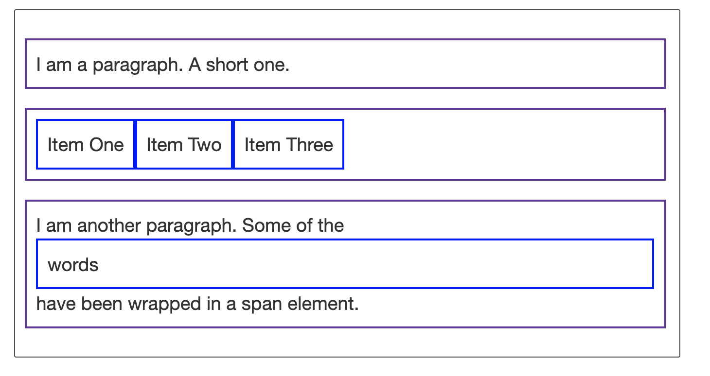
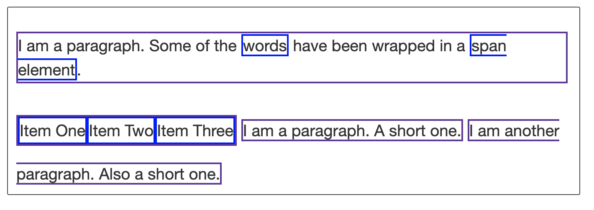
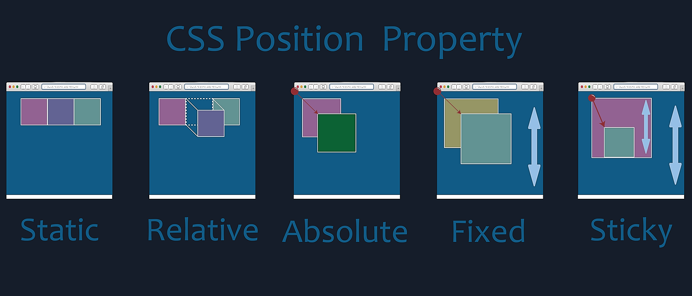

- [Box Model](#box-model)
  - [Display Types](#display-types)
    - [Outer Display Type](#outer-display-type)
    - [Inner Display Type](#inner-display-type)
    - [Examples](#examples)
  - [CSS Box Model](#css-box-model)
    - [Content Box](#content-box)
    - [Border Box](#border-box)
- [CSS Layout](#css-layout)
  - [Positioning](#positioning)
    - [Static](#static)
    - [Relative](#relative)
    - [Absolute](#absolute)
    - [Fixed](#fixed)
    - [Sticky](#sticky)
  - [Flexbox](#flexbox)
  - [Grid](#grid)
  - [Float](#float)
- [Size Units](#size-units)

# Box Model

- Everything displayed by CSS is a box.
- Understanding these boxes is the key to being able to create more complex layouts with CSS, or to align items with other items.
- In CSS we broadly have two types of boxes — **block boxes** and **inline boxes**.

## Display Types

- The type refers to how the box behaves in terms of **page flow** and in **relation to other boxes** on the page.
- Boxes have an **inner display type** and an **outer display type**

### Outer Display Type

- If a box has an outer display type of `block`, then:
  - The box will break onto a new line.
  - The `width` and `height` properties **will be applied.**
  - Padding, margin and border will cause other elements to be pushed away from the box.
  - The box will extend in the inline direction to fill the space available in its container.
  - In most cases, the box will become as wide as its container, filling up 100% of the space available.
- If a box has an outer display type of `inline`, then:
  - The box **will not** break onto a new line.
  - The width and height properties **will not apply**.
  - Vertical padding, margins, and borders will apply but will not cause other inline boxes to move away from the box.
  - Horizontal padding, margins, and borders will apply and will cause other inline boxes to move away from the box.

### Inner Display Type

- Boxes also have an **inner display type**, which dictates how elements inside that box are laid out.
- Block and inline layout is the default way things behave on the web.
- By default, the elements inside a box are also laid out in **normal flow** and behave as block or inline boxes.
- You can change the inner display type for example by setting `display: flex;`.
- The element will still use the outer display type `block` but this changes the inner display type to `flex`.
- Any direct children of this box will become **flex items** and behave according to the **Flexbox** specification.

### Examples

**Block display type example**

```html
<style>
  p,
  ul {
    border: 2px solid rebeccapurple;
    padding: 0.5em;
  }

  .block,
  li {
    border: 2px solid blue;
    padding: 0.5em;
  }

  ul {
    display: flex;
    list-style: none;
  }

  .block {
    display: block;
  }
</style>

<p>I am a paragraph. A short one.</p>
<ul>
  <li>Item One</li>
  <li>Item Two</li>
  <li>Item Three</li>
</ul>
<p>
  I am another paragraph. Some of the <span class="block">words</span> have been
  wrapped in a <span>span element</span>.
</p>
```



- A paragraph:
  - with a border added in CSS.
  - The browser renders this as a **block box**.
  - The paragraph starts on a new line and extends the entire available width.
- A list:
  - which is laid out using `display: flex`.
  - This establishes flex layout for the children of the container, which are flex items.
  - The list itself is a **block box** and expands to the full container width and breaks onto a new line.
- A block-level paragraph:
  - inside which are two `<span>` elements.
  - These elements would normally be `inline`, however, one of the elements has a class of **"block"** which gets set to `display: block`.

---

**Inline display type example**

```html
<style>
  p,
  ul {
    border: 2px solid rebeccapurple;
  }

  span,
  li {
    border: 2px solid blue;
  }

  ul {
    display: inline-flex;
    list-style: none;
    padding: 0;
  }

  .inline {
    display: inline;
  }
</style>

<p>
  I am a paragraph. Some of the
  <span>words</span> have been wrapped in a <span>span element</span>.
</p>
<ul>
  <li>Item One</li>
  <li>Item Two</li>
  <li>Item Three</li>
</ul>
<p class="inline">I am a paragraph. A short one.</p>
<p class="inline">I am another paragraph. Also a short one.</p>
```



- The `<span>` elements in the first paragraph are `inline` by default and so do not force line breaks.
- The `<ul>` element that is set to `display: inline-flex` creates an inline box containing some flex items.
- The two paragraphs are both set to `display: inline`. The inline flex container and paragraphs all run together on one line rather than breaking onto new lines (as they would do if they were displaying as block-level elements).

## CSS Box Model

- The CSS box model defines how the different parts of a box — `margin`, `border`, `padding`, and `content` — work together to create a box that you see on a page.
- **Inline boxes use just some of the behavior defined in the box model.**
- Making up a block box in CSS we have the:
  - **Content box:** The area where your content is displayed; size it using properties like `width` and `height`.
  - **Padding box:** The padding sits around the content as white space
  - **Border box:** The border box wraps the content and padding
  - **Margin box:** The margin is the outermost layer, wrapping the content, padding, and border as whitespace between this box and other elements;


### Content Box

- This is standard CSS box model.
- In the standard box model, if you give a box a `width` and a `height` attributes, this defines the **inline-size** and **block-size** of the **content box**.
- Any padding and border is then added to those dimensions to get the total size taken up by the box.
- In the example below, the actual size will be **410px** (=`350 + (2 * 25) + (2 * 5)`) wide and **210px** (=`150 + (2 * 25) + (2 * 5)`) high.

```css
.box {
  width: 350px;
  height: 150px;
  margin: 10px;
  padding: 25px;
  border: 5px solid black;
  /* box-sizing: content-box; */
}
```


### Border Box

- This is alternative CSS box model.
- In the alternative box model, any width is the width of the visible box on the page.
- The **content area** width is that `width` minus the width for the `padding` and `border`.
- No need to add up the `border` and `padding` to get the real size of the box.
- In the example below, the actual size will be **350px** wide and **150px** high.

```css
.box {
  width: 350px;
  height: 150px;
  margin: 10px;
  padding: 25px;
  border: 5px solid black;
  box-sizing: border-box;
}
```


<br />
<br />
<br />

# CSS Layout

## Positioning



- An important concept to understand first is that every single element on a web page is a **block**.
- Literally a **rectangle** of pixels.
- Elements that are `display: inline;`, like a `<span>` by default, are also rectangles.

### Static

- This is the **default** for every single page element.
- Different elements don’t have different default values for positioning, they all start out as `static`.
- `Static` doesn’t mean much; it just means that the element will flow into the page as it normally would.

### Relative

- It means “**relative to itself**”.
- If you set `position: relative;` on an element but no other positioning attributes (`top`, `left`, `bottom` or `right`), it will have **no effect on it’s positioning** at all, it will be exactly as it would be static
- But if you do give it some other positioning attribute, like, `top: 10px;`, it will shift its position 10 pixels down from where it would normally be.
- It introduces the ability to use `z-index` on that element, which doesn’t work with statically positioned elements.
- Even if you don’t set a `z-index` value, this element will now **appear on top of any other statically positioned element**.
- It **limits the scope of absolutely positioned child elements**.
- Any element that is a child of the relatively positioned element can be absolutely positioned **within that block**.

### Absolute

- It allows you to literally place any page element exactly where you want it.
- You use the positioning attributes `top`, `left`, `bottom`, and `right` to set the location.
- Remember that these values will be **relative to the next parent element** with `relative` (or `absolute`) positioning.
- If there is no such parent, it will default all the way back up to the `<html>` element itself meaning it will be placed relative to the page itself.
- These elements are **removed from the flow of elements on the page**.
- An element with this type of positioning is not affected by other elements and it doesn’t affect other elements.

### Fixed

- A `fixed` position element is positioned relative to the `viewport`, or the browser `window` itself.
- The viewport doesn’t change when the window is scrolled, so a fixed positioned element will stay right where it is when the page is scrolled.
- This might be used for something like a **navigation bar** that you want to remain visible at all times regardless of the pages scroll position.
- The concern with fixed positioning is that it can cause situations where the fixed element **overlaps content** such that is is inaccessible.

### Sticky

- A `sticky` element will just sit there like a `static` element, but as you scroll past it, if it’s parent element has room, the sticky element will behave as if it’s `fixed` until that parent element is out of room.

<br />
<br />

## Flexbox

<br />
<br />

## Grid

<br />
<br />

## Float

<br />
<br />
<br />

# Size Units

https://developer.mozilla.org/en-US/docs/Learn/CSS/Building_blocks/Values_and_units
