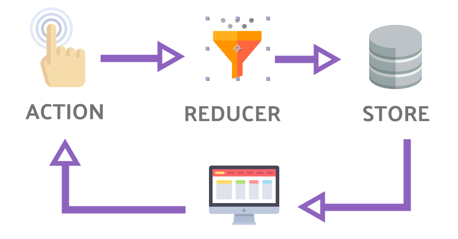

- [Overview](#overview)
  - [Data Flow](#data-flow)
- [Actions](#actions)
  - [Action Creators](#action-creators)
  - [Dispatching Actions](#dispatching-actions)
- [Reducers](#reducers)
  - [Reducer Composition - combineReducers()](#reducer-composition---combinereducers)
- [Store](#store)
  - [Subscribing to Store](#subscribing-to-store)
  - [Selectors](#selectors)
- [Middleware](#middleware)
  - [Redux-Thunk Middleware (Async Operations)](#redux-thunk-middleware-async-operations)
- [Async](#async)
  - [Async Actions](#async-actions)
- [Usage with React](#usage-with-react)
  - [Install](#install)
  - [Provide Store to Components](#provide-store-to-components)
  - [Presentational and Container Components](#presentational-and-container-components)
  - [Connect Store with Component](#connect-store-with-component)
  - [Usage with Hooks](#usage-with-hooks)
    - [useSelector()](#useselector)
    - [useDispatch()](#usedispatch)
    - [useStore()](#usestore)
  - [Usage with Typescript](#usage-with-typescript)
- [Redux Toolkit - RTK (Your New Savior)](#redux-toolkit---rtk-your-new-savior)
  - [Store Setup - **configureStore()**](#store-setup---configurestore)
  - [Creating Action - **createAction()**](#creating-action---createaction)
  - [Creating Reducer - **createReducer()**](#creating-reducer---createreducer)
  - [Creating Slice - **createSlice()**](#creating-slice---createslice)
  - [Immutablity](#immutablity)
  - [Additional Logic for Action Creators](#additional-logic-for-action-creators)
  - [Thunk](#thunk)
- [FAQ](#faq)


# Overview


## Data Flow
* The data lifecycle in any Redux app follows these 4 steps:
  * **You** call ```store.dispatch(action)```
    * An action is a plain object describing what happened.
    * You can call dispatch from **anywhere** in your app, including components and XHR callbacks, or even at scheduled intervals.
  * **The Redux store** calls the **reducer function** you gave it
    * With two argument; **current state** and the **action**
  * **The root reducer** may combine the output of multiple reducers into a single state tree
  * **The Redux store** saves the complete state tree returned by the root reducer
    * Every listener registered with ```store.subscribe(listener)``` will now be invoked


# Actions
  ```ts
  type Action = { 
    type: string, 
    [key: string]: any 
  }
  ```

* Describes **"what happened?"**
* Plain objects
* You can think of an action as an event
* "**type**" field is required

```js
{ type: 'counter/increment', payload: 6 }
{ type: 'ADD_TODO', text: 'Task to be done' }
{ type: 'TOGGLE_TODO', index: 1 }
```

## Action Creators
* Used for creating the right action

```js
const increment = (val = 1) => ({ type: 'counter/increment', payload: val });
const addTodo = (text) => ({ type: 'ADD_TODO', text });
const toggleTodo = (index) => ({ type: 'TOGGLE_TODO', index });
```

## Dispatching Actions
* The only way to update the state is to call ```store.dispatch()``` and pass an action object to it.
* You can think of dispatching actions as "**triggering an event**"

```ts
store.dispatch(increment());
store.dispatch(increment(3));
store.dispatch(addTodo('Learn about actions'));
store.dispatch(toggleTodo(0));
```

# Reducers
* Reducers specify how the application's state changes according to the actions.


  ```ts
  type Reducer<S, A> = (state: S, action: A) => S
  ```
* Pure functions
* Does not mutate the input state, returns next state

```js
function counter(state = 0, action) {
  switch (action.type) {
    case 'INCREMENT':
      return state + 1
    case 'DECREMENT':
      return state - 1
    default:
      return state
  }
}

let store = createStore(counter);
```

* Things you should never do inside a reducer:
  * Mutate its arguments
  * Perform side effects like API calls and routing transitions
  * Call non-pure functions, e.g. ```Date.now()``` or ```Math.random()```
* Given the same arguments, it should calculate the next state and return it. 
  * No surprises. 
  * No side effects. 
  * No API calls.
  * No mutations. 
  * Just a calculation.

## Reducer Composition - combineReducers()
```js 
// splitted reducers by business logic, feature, functionality etc...
// merge them into a single reducer while creating store

// Reducer for "visibilityFilter" feature
const initialState = 'SHOW_ALL';

function visibilityFilter(state = initialState, action) {
  if (action.type === 'SET_VISIBILITY_FILTER') {
    return action.filter
  } else {
    return state
  }
}

// Reducer for "todos" feature
const initialState = [];

function todos(state = initialState, action) {
  switch (action.type) {
    case 'ADD_TODO': { return state.concat([{ text: action.text, completed: false }]); }
    case 'TOGGLE_TODO':
      return state.map((todo, i) => action.index === i ? { text: todo.text, completed: !todo.completed } : todo)
    default:
      return state
  }
}

// merged reducer for store as a root reducer
const initialState = {};

function todoApp(state = initialState, action) {
  return {
    todos: todos(state.todos, action),
    visibilityFilter: visibilityFilter(state.visibilityFilter, action)
  }
}

const store = createStore(todoApp);
```

```js
// better way to merge/combine reducers (combineReducer method):
import { combineReducers, createStore } from 'redux';
const todoApp = combineReducers({ visibilityFilter, todos });
const store = createStore(todoApp);
```

* Note that each of these reducers is managing its **own part** of the global state
* Each reducer is **independent** from other
> All **combineReducers()** does is **generate a function** that calls your reducers **with the slices of state** selected according to their keys, and **combines their results into a single object** again.


# Store
* Creates singleton store instance with using root reducer
* The store has the following responsibilities:
  * Holds application state
  * Allows access to state via ```getState()```
  * Allows state to be updated via ```dispatch(action)```
  * Registers listeners via ```subscribe(listener)```
  * Handles unregistering of listeners via the function returned by ```subscribe(listener)```


```js
// FILE: src/store/reducers/todo/index.js
import { combineReducers } from 'redux';

export default const todoApp = combineReducers({ visibilityFilter, todos });
```

```js
// FILE: src/store/store.js
import { createStore } from 'redux';
import todoApp from './reducers'

const store = createStore(todoApp);
```

* You may optionally specify the **initial state** as the second argument to ```createStore()```

```js
createStore(todoApp, window.STATE_FROM_SERVER);
```


## Subscribing to Store
* Subscribe method returns a function which you can use while unsubscribing

```ts
const unsubscribe = store.subscribe(() => console.log(store.getState()));

// ... do some fancy stuff

unsubscribe(); // Stop listening to state updates
```

```ts
// RxJS way
const store$ = new Observable(subscriber => {
  subscriber.next(store.getState()); // call once
  return store.subscribe(() => subscriber.next(store.getState()));
});


const subscription = store$.subscribe(state => console.log(state));

// ... do some fancy stuff

subscription.unsubscribe();
```

## Selectors
* Selectors are functions that know how to extract specific **pieces of information** from a store state value.

```ts
const selectNestedValue = state => state.nested.app.value
const currentValue = selectNestedValue(store.getState())
```


# Middleware
* With a plain basic Redux store, you can only do simple synchronous updates by dispatching an action.
* Middleware **extend** the store's abilities, and let you write **async** logic that interacts with the store.
* Without middleware, Redux store only supports **synchronous** data flow.
* Any middleware you use can then intercept anything you dispatch, and in turn, can pass actions to the next middleware in the chain.
* When the last middleware in the chain dispatches an action, it has to be a **plain object**.
* It provides a third-party extension point **between dispatching an action, and the moment it reaches the reducer**
* Middlewares can be used for:
  * logging
  * crash reporting
  * talking to an asynchronous API
  * routing
  * and more...

## Redux-Thunk Middleware (Async Operations)
* Redux Thunk middleware allows you to write action creators that return a **function** instead of an action object.
* When an action creator returns a **function**, that function will get executed by the Redux Thunk middleware. 
* This function **doesn't need to be pure**; it is thus allowed to have side effects.
* The thunk can be used
  * to delay the dispatch of an action
  * to dispatch only if a certain condition is met
* The inner function receives the store methods **dispatch** and **getState** as parameters.
* Github Link: [Redux-Thunk](https://github.com/reduxjs/redux-thunk)

```ts
const INCREMENT_COUNTER = 'INCREMENT_COUNTER';

function increment() {
  return { type: INCREMENT_COUNTER };
}

function incrementAsync() {
  return (dispatch) => {
    setTimeout(() => dispatch(increment()), 1000);
  };
}

// ...

import thunk from 'redux-thunk';
const store = createStore(rootReducer, applyMiddleware(thunk));

// ...
```

# Async

## Async Actions
* We have to use middlewares to handle async operations [Redux-Thunk Middleware (Async Operations)](#redux-thunk-middleware-async-operations)
* We need to create **synchronous** actions to be used
  * before the async operation is started (to inform user - like showing loading spinner)
  * after the async operation is finished (to save the results and to inform user)
  * if the error occurs during the async operation (to inform user)
* We need to create **asynchronous** action which returns a **function** instead of an action object
  * See an example on the [Redux-Thunk Middleware (Async Operations)](#redux-thunk-middleware-async-operations) part


# Usage with React

## Install
```sh
npm i react-redux
npm i -D @types/react-redux
```

## Provide Store to Components
* React Redux provides ```<Provider />```, which makes the Redux store available to the rest of your app.

```tsx
// @FILE: index.jsx

import React from 'react'
import ReactDOM from 'react-dom'
import { Provider } from 'react-redux'
import store from './store'
import App from './App'

ReactDOM.render(
  <Provider store={store}>
    <App />
  </Provider>,
  document.getElementById('root')
)
```

## Presentational and Container Components

|                | Presentational Components        | Container Components |
| ---            | ---                              | ---                                            |
| Purpose        | How things look (markup, styles) | How things work (data fetching, state updates) |
| Aware of Redux | No                               | Yes                                            |
| To read data   | Read data from props             | Subscribe to Redux state                       |
| To change data | Invoke callbacks from props      | Dispatch Redux actions       

* You can see below how these are connecting each other
* If you migrate your **Presentational Components** from Redux to something else, you'll be able to keep all these components **exactly the same**. They have no dependency on Redux.

## Connect Store with Component
* React Redux provides a ```connect()``` function for you to connect your component to the store.
* You need to define a special function called ```mapStateToProps(state, ownProps?)``` that describes how to transform the current Redux store state into the props you want to pass to a presentational component.
* Container components can dispatch actions. 
* ```mapDispatchToProps```: this parameter can either be a function, or an object.
  * If it’s a function, ```mapDispatchToProps(dispatch, ownProps?)``` that receives the ```dispatch()``` method and returns callback props that you want to inject into the presentational component. Allows more customization, gains access to ```dispatch``` and optionally ```ownProps```

  * If it’s an object with **action creators**, each action creator will be turned into a **prop function** that automatically dispatches its action when called. 

```tsx
import { connect } from 'react-redux'
import { increment, decrement, reset } from './actionCreators'
import Counter from './Counter'; // Presentational Component 

const mapStateToProps = (state) => ({counter: state.counter});

// Action creators object form
const mapDispatchToProps = { increment, decrement, reset }

// Function form
const mapDispatchToProps = (dispatch) => {
  return {
    onIncrement: () => { dispatch(increment()); },
    onDecrement: () => { dispatch(decrement()); },
    onReset: (hard) => { dispatch(reset(hard)); }
  }
}

// returns Container Components
export default connect(mapStateToProps, mapDispatchToProps)(Counter); 
```

* You can use connect with **class components** as well.

```tsx
import { connect } from 'react-redux'

class Counter extends React.Component {
  // ... component implementation

  onIncrementClicked = () => {
    this.props.increment();
  };
}

const mapStateToProps = (state) => ({ counter: state.counter });
const mapDispatchToProps = { increment, decrement, reset }

export default connect(mapStateToProps, mapDispatchToProps)(Counter); 
```

* You may define the ```mapStateToProps(state, ownProps?)``` function with a second argument, **ownProps**, if your component needs the data from its own props to retrieve data from the store. 
* This argument will contain all of the props given to the wrapper component that was generated by connect.
> **You do not need to include values from ownProps in the object returned from mapStateToProps. connect will automatically merge those different prop sources into a final set of props**

```tsx
function mapStateToProps(state, ownProps) {
  const { visibilityFilter } = state
  const { id } = ownProps
  const todo = getTodoById(state, id)

  // component receives additionally:
  return { todo, visibilityFilter }
}

// Later, in your application, a parent component renders:
<ConnectedTodo id={123} />
// and your component receives props.id, props.todo, and props.visibilityFilter
```

* React Redux gives you two ways to let components **dispatch actions**:
  * By default, a connected component receives ```props.dispatch``` and can dispatch actions **itself**.
  * connect can accept an argument called ```mapDispatchToProps```, which lets you create functions that dispatch when called, and **pass those functions as props to your component**.
  * If you send the ```mapDispatchToProps``` argument to connect function, a connected component **does not receive** ```props.dispatch``` anymore.
  * The return of the ```mapDispatchToProps``` function will be **merged** to your connected component **as props**
  > **If you define your own mapDispatchToProps, the connected component will no longer receive dispatch**


## Usage with Hooks
* React Redux offers a set of hook APIs as an **alternative to the connect()** Higher Order Component. 
* These APIs allow you to subscribe to the Redux store and dispatch actions, **without** having to wrap your components in connect()
* To using Hooks in a React Redux App, you should start by **wrapping your entire application** in a ```<Provider>``` component to make the store available throughout the component tree

```tsx
// @FILE: index.jsx

import React from 'react'
import ReactDOM from 'react-dom'
import { Provider } from 'react-redux'
import store from './store'
import App from './App'

ReactDOM.render(
  <Provider store={store}>
    <App />
  </Provider>,
  document.getElementById('root')
)
```

### useSelector()
```ts
const result: any = useSelector(selector: Function, equalityFn?: Function);
```

* Allows you to **extract data** from the Redux store state, using a selector function
* The selector will be **called with the entire store state** as its only argument
* > uses **strict === reference equality checks** by default, **not shallow equality**
* The selector will be run **whenever the function component renders** 
* ```useSelector()``` will also subscribe to store, and run your selector **whenever an action is dispatched**.
* With ```useSelector()```, returning a new object every time will **always force a re-render** by default
  * If you want to retrieve multiple values from the store, you can:
    * Call ```useSelector()``` **multiple times**, with each call **returning a single field** value
    * Use the shallow equal function as the ```equalityFn``` argument to useSelector(). For ex: 
      * ```shallowEqual``` from **React-Redux**
      * ```_.isEqual()``` from **Lodash**
* Recipe for useSelector hook which does shallow equal comparison:

```ts 
import { useSelector, shallowEqual } from 'react-redux'

export function useShallowEqualSelector(selector) {
  return useSelector(selector, shallowEqual)
}
```

* Example:
```tsx
import React from 'react'
import { shallowEqual, useSelector } from 'react-redux'

export const TodoListItem = props => {
  const todo = useSelector(state => state.todos[props.id], shallowEqual)
  return <div>{todo.text}</div>
}
```

* > Don't rely on props in your selector function for extracting data. [See this link for more information.](https://react-redux.js.org/api/hooks#stale-props-and-zombie-children)


### useDispatch()
```ts
const dispatch = useDispatch();
```
* Returns a reference to the **dispatch function**. You may use it to dispatch actions as needed.


### useStore()
```ts
const store = useStore();
```
* Returns a reference to the store that was passed in to the ```<Provider>``` component.
* This hook should probably not be used frequently. 
* However, this may be useful for less common scenarios that do require access to the store, such as replacing reducers.


## Usage with Typescript
* The **hooks API** is generally simpler to use with static types. 
* If you're looking for the easiest solution for using static types with React-Redux, use the hooks API.

```tsx
// rootReducer.ts
export const rootReducer = combineReducers({
  posts: postsReducer,
  comments: commentsReducer,
  users: usersReducer
})

export type RootState = ReturnType<typeof rootReducer>
// {posts: PostsState, comments: CommentsState, users: UsersState}
```

# Redux Toolkit - RTK (Your New Savior)

* The Redux Toolkit package is intended to be the **standard way to write Redux logic**. 
* It was originally created to help address three common concerns about Redux:
  * "Configuring a Redux store is too complicated"
  * "I have to add a lot of packages to get Redux to do anything useful"
  * "Redux requires too much boilerplate code"

## Store Setup - **configureStore()**

* Normally, you create a Redux store by calling ```createStore()``` and passing in your **root reducer function**. 
* RTK has a ```configureStore()``` function that wraps ```createStore()``` to do the same thing, but also sets up some useful development tools for you as part of the store creation process.
* Having an options object with "**named**" parameters, which can be easier to read.
* Letting you provide arrays of **middleware** and **enhancers** you want to add to the store, and calling `applyMiddleware()` and `compose()` for you automatically.
* Enabling the **Redux DevTools Extension** automatically

```ts
// configure store with reducers object
import { configureStore } from '@reduxjs/toolkit';

const store = configureStore({
  reducer: { counter }
});

export default store;
```

```ts
// configure store with root reducer
import { configureStore } from '@reduxjs/toolkit';
import rootReducer from './reducers';

const store = configureStore({
  reducer: rootReducer
});

export default store;
```

* If you provide the middleware argument, `configureStore()` will only use whatever middleware you've listed. 
* If you want to have some **custom middleware and the defaults all together**, you can call `getDefaultMiddleware()` and include the results in the middleware array you provide.

```ts
import { configureStore, getDefaultMiddleware } from '@reduxjs/toolkit';

import monitorReducersEnhancer from './enhancers/monitorReducers';
import loggerMiddleware from './middleware/logger';
import rootReducer from './reducers';

export default function configureAppStore(preloadedState) {
  return configureStore({
    reducer: rootReducer,
    middleware: [loggerMiddleware, ...getDefaultMiddleware()],
    preloadedState,
    enhancers: [monitorReducersEnhancer]
  });
}
```

## Creating Action - **createAction()**

* ```createAction()``` accepts an action **type** string as an argument, and **returns an action creator function** that uses that type string.
* The action creator's ```toString()``` method has been overridden, and will return the action type string. 
* The type string is also available as a ```.type``` field on the function

```ts
import { createAction } from '@reduxjs/toolkit';

const increment = createAction('INCREMENT');

console.log(increment()); // prints: { type: "INCREMENT" }
console.log(increment(5)); // prints: { type: "INCREMENT", payload: 5 }
console.log(increment.toString()); // prints: INCREMENT
console.log(increment.type); // prints: INCREMENT
```

## Creating Reducer - **createReducer()**

* While you can use any conditional logic you want in a Redux reducer, including if statements and loops, the most common approach is to check the ```action.type``` field and do some specific logic for each action type. 
* A reducer will also provide an **initial state** value, and return the existing state if the action isn't something it cares about.
* ```createReducer()``` function that lets you write reducers using a **"lookup table" object**, where each key in the object is a Redux action type string, and the values are reducer functions.
* It uses the **Immer library** internally, which lets you write code that "**mutates**" some data, but actually applies the updates immutably.

```ts
import { createAction, createReducer } from '@reduxjs/toolkit';

const increment = createAction('INCREMENT');
const decrement = createAction('DECREMENT');

const counter = createReducer(0, {
  [increment]: (state) => state + 1,
  [decrement]: (state) => state - 1
});
```


## Creating Slice - **createSlice()**

* A standart Redux application has a JS object at the top of its state tree, and that object is the result of calling the Redux ```combineReducers()``` function to join **multiple reducer functions into one "root reducer"**. 
* We refer to **one** key/value section of that object as a "**slice**"
* We use the term "**slice reducer**" to describe the reducer function responsible for updating that slice of the state.
* It uses ```createReducer()``` and ```createAction()``` internally, so in most apps, **you won't need to use them yourself** - **createSlice is all you need**.
* ```createSlice()``` function allows us to provide **an object with the reducer functions**, and belows will automatically be generated based on the names of the reducers;
  * **the action type strings**
  * **action creator functions**
* ```createSlice()``` returns a "slice" object that contains;
  * the generated **reducer function** as a field named ```reducer```
  * and the generated **action creators** inside an object called ```actions```
* ```createSlice()``` takes an options object as its argument, with these options:
  * **name**: a string that is used as the **prefix for action types**
  * **initialState**: the initial state value for the reducer
  * **reducers**: an object, where ;
    * the **keys** will become **action type strings**, 
    * and the **functions are reducers** that will be run when that action type is dispatched
* There's no default handler here. The reducer generated by ```createSlice()``` will automatically handle all other action types by returning the current state.

```ts
// File: features/counter/counterSlice.ts
import { createSlice } from '@reduxjs/toolkit';

const counterSlice = createSlice({
  name: 'counter',
  initialState: 0,
  reducers: {
    increment: (state, action) => state + 1,
    decrement: (state, action) => state - 1
  }
});

export default counterSlice.reducer;
export const { increment, decrement } = counterSlice.actions;
```


```ts
// File: app/store.js
import { configureStore } from '@reduxjs/toolkit';
import counterReducer from '../features/counter/counterSlice';

export default configureStore({
  reducer: {
    counter: counterReducer
  }
});
```

## Immutablity
* `createSlice()` and `createReducer()` wrap your function with [produce from the Immer library](https://immerjs.github.io/immer/docs/introduction). 
* This means **you can write code that "mutates" the state inside the reducer**, and Immer will safely return a correct immutably updated result.


## Additional Logic for Action Creators
* RTK allows you to customize how the payload field is created in your action objects.
* You may want to add extra field for actions inside the action creators. 
* **For ex**: auto-incremented ID, etc... 
* If you are using `createAction()` by itself, you can pass a "prepare callback" as the second argument.
* > **Note that the "prepare callback" must return an object with a field called "*payload*" inside!**

```ts
let nextTodoId = 0;

export const addTodo = createAction('ADD_TODO', text => {
  return {
    payload: { id: nextTodoId++, text }
  };
});
```

* If you're using `createSlice()`, it automatically calls `createAction()` for you. 
* If you need to customize the payload there, you can do so by passing **an object containing `reducer` and `prepare` functions** to the reducers object, instead of just the reducer function by itself.

```ts
let nextTodoId = 0;

const todosSlice = createSlice({
  name: 'todos',
  initialState: [],
  reducers: {
    addTodo: {
      reducer(state, action) {
        const { id, text } = action.payload
        state.push({ id, text, completed: false })
      },
      prepare(text) {
        return { payload: { text, id: nextTodoId++ } }
      }
    }
  }
};
```


## Thunk 
* Redux Toolkit's `configureStore()` function adds **redux-thunk middleware** automatically to the store as part of the setup process.
* Redux Toolkit does not provide any special functions or syntax for writing thunk functions.
* Async operation is defined in a standart function which dispatches several actions according to your needs.

```ts
// FILE: api/user
export class User {
  constructor(public name: string, public surname: string, public email: string, public age: number);
}

export async function getUsers(): User[] {
  return fetch('http://example.com/users')
    .then(resp => resp.json())
    .then(users => users.map(u => new User(u.name, u.surname, u.email, u.age)));
}
```


```ts
// FILE: app/rootReducer.ts
import { combineReducers } from '@reduxjs/toolkit';

const rootReducer = combineReducers({ ... });

export type RootState = ReturnType<typeof rootReducer>;
export default rootReducer;
```


```ts
// FILE: app/store.ts
import { configureStore, Action } from '@reduxjs/toolkit';
import { ThunkAction } from 'redux-thunk';
import rootReducer, { RootState } from './rootReducer';

const store = configureStore({
  reducer: rootReducer
});

if (process.env.NODE_ENV === 'development' && module.hot) {
  module.hot.accept('./rootReducer', () => {
    store.replaceReducer(require('./rootReducer').default)
  });
}

export type AppDispatch = typeof store.dispatch;
export type AppThunk = ThunkAction<void, RootState, unknown, Action<string>>
export default store;
```


```ts
// FILE: features/users/usersSlice

import { createSlice, PayloadAction } from '@reduxjs/toolkit';
import { User, getUsers as getUsersApiCall } from 'api/user';
import { AppThunk, AppDispatch } from 'app/store';

interface UsersState {
  users: User[];
  error: string | null
};

const initialState: UsersState = {
  users: [],
  error: null
};

const usersSlice = createSlice({
  name: 'users',
  initialState,
  reducers: {
    getUsersSuccess: (state: UsersState, action: PayloadAction<Users[]>) => {
      state.users = action.payload;
      state.error = null;
    },
    getUsersError: (state: UsersState, action: PayloadAction<string>) => {
      state.users = [];
      state.error = action.payload;
    }
  }
});

export const { getUsersSuccess, getUsersError } = usersSlice.actions;
export default usersSlice.reducer;

export function getUsers(): AppThunk {
  return async (dispatch: AppDispatch) => {
    try {
      dispatch(getUsersSuccess(await getUsersApiCall()));
    } catch (err) {
      dispatch(getUsersError(err.toString()));
    }
  }
}
```

* We have our first data fetching thunk. The important things to notice here are:
  * **The thunk is defined separately from the slice,** since RTK currently has no special syntax for defining thunks as part of a slice.
  * **Inside the thunk, we dispatch the plain action creators** that were generated by the `createSlice()` call.


# FAQ

**Q: What kind of data should I store in global state?**

**A:** In a React + Redux app, your global state should go in the Redux store, and your local state should stay in React components.If you're not sure where to put something, here are some common rules of thumb for determining what kind of data should be put into Redux:

* Do other parts of the application care about this data?
* Do you need to be able to create further derived data based on this original data?
* Is the same data being used to drive multiple components?
* Is there value to you in being able to restore this state to a given point in time (ie, time travel debugging)?
* Do you want to cache the data (ie, use what's in state if it's already there instead of re-requesting it)?
* Do you want to keep this data consistent while hot-reloading UI components (which may lose their internal state when swapped)?

---

**Q:**

**A:**

---