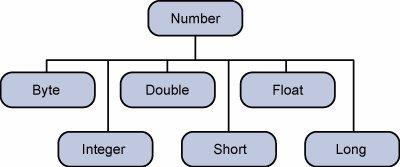

# Source File Declaration Rules

These rules are applied for:
* declaring classes
* import statements and 
* package statements in a source file.

Rules:

* One public class per source file.
* Can have multiple non-public classes.
* Public class name and source file name have to be matched.
  * Class name: Employee
  * File name: Employee.java
* Package statement must be the first statement in the source file.
* Import statement must be written between the package statement and the class declaration.
* Import and package statements affect to all source file (for ex. multiple classes)


# Data Types

## Primitive
type | storing | min | max | default | example
--- | --- | --- | --- | --- | ---
byte | 8 bit signed | -128 |  127 | 0 | byte b = 5
short | 16 bit signed | -32768 |  32767 | 0 | short s = 6
int | 32 bit signed | -2 ^ 31  |  (2 ^ 31) - 1 | 0 | int i = 7
long | 64 bit signed | -2 ^ 63  |  (2 ^ 63) - 1 | 0 | long l = 8
float | 32 bit floating point | - |  - | 0.0f | float f = 9.10
double | 64 bit floating point | - |  - | 0.0d | double d = 11.12
boolean | single bit | 0 |  1 | false | boolean b = true;
char | 16 bit character | '\u0000'  | '\uffff' | - | char c = 'a'

## Reference
* Class objects
* Default is **null**
* Some of them is like below:

### String
* String class is immutable, so it cannot be changed.
* If you want to do make changes on string you should use:
  * StringBuffer
    * Thread-safe
  * StringBuilder
    * Not thread-safe
    * Fast
* See Also:
  *  [https://docs.oracle.com/javase/7/docs/api/java/lang/String.html](https://docs.oracle.com/javase/7/docs/api/java/lang/String.html)
  *  [https://docs.oracle.com/javase/7/docs/api/java/lang/StringBuilder.html](https://docs.oracle.com/javase/7/docs/api/java/lang/StringBuilder.html)
  *  [https://docs.oracle.com/javase/7/docs/api/java/lang/StringBuffer.html](https://docs.oracle.com/javase/7/docs/api/java/lang/StringBuffer.html)

### Array
* definition:

```java
Integer[] varName = {1, 2, ...};
```

```java
Integer[] varName = new Integer[10];
```

* has length property
```java
for (int i = 0; i < varName.length; i++0) {
    System.out.println(varName[i] + " ");
}
```


# Wrapper Classes for Data Types

## Number


* All the wrapper classes (Integer, Long, Byte, Double, Float, Short) are subclasses of the abstract class Number.
* See Also [https://docs.oracle.com/javase/7/docs/api/java/lang/Number.html](https://docs.oracle.com/javase/7/docs/api/java/lang/Number.html)

## Character
* See Also [https://docs.oracle.com/javase/7/docs/api/java/lang/Character.html](https://docs.oracle.com/javase/7/docs/api/java/lang/Character.html)


# Variable Types
* Local variables
* Instance variables
  * Value can be assigned during the declaration.
* Class/Static variables
  * define with **static** keyword
  * Access with **class name**, not instance
  * <pre> public static int name = 1; </pre>
* Constant variables
  * define with **static final** keywork 
  * Access with **class name**, not instance
  * <pre> public static final int NAME = 1; </pre>


# Modifiers
## Access Modifiers
* **Private** can be accessible only within the **class**.
* **Default**(empty modifier) can be accessible only within the **same package**.
* **Public** can be accesible from **everywhere**.
* Access Table:


- | default | private | protected | public |
--- | --- | --- | --- | --- |
Same Pkg | Yes | No | Yes | Yes
Different Pkg & Subclass | No | No | Yes | Yes
Different Pkg & Non-Subclass | No | No | No | Yes

## Non-Access Modifiers
* static
  * Local variables cannot be declared static
  * Method/Variable of the instance that static method belongs to can not be used within the static method.
* final
  * final variable means its value can not be changed
  * final method cannot be overrided at subclasses
  * final class cannot be a parent class
* abstract
  * abstract class connot be initialized
  * class cannot be both abstract and final
  * abstract method is just definition, must be implemented at subclass.
* synchronized
  * synchronized method can be accessible from just one thread at a time
* transient
* volatile


# Methods
* Can be overloaded. 
  * Same name same arg count with different type of args.
  * Same name different arg count.
* JDK 1.5 enables you to pass a variable number of arguments of the same type to a method.

```java
void printInt (int... args) {
    for (int i = 0; i < args.length; i++) {
        System.out.print(args[i] + " ");
    }
}
```


# Package
* It is a way of categorizing the classes and interfaces. 
* It is like a **namespace** in C++;

```java
package workstation;
```


# Class
* Class can be public, private
* Constructor has to have same name with the class.

```java
// class definition
public class Employee {

    // class variable (static)
    private static int unique = 0;

    // instance variable
    private int id;
    private String name;

    // constructor
    public Employee (String name) {
        this.id = this.unique++;
        this.name = name;
    }

    // destructor
    protected finalize () {
        // do clean-up before object destruction
    }

    public int getId () {
        return this.id;
    }

    public String getName () {
        return this.name;
    }

    // file main function
    public static void main (String[] args) {
        // local variable
        Employee[] employees = {
            new Employee("Emp 0"),
            new Employee("Emp 1"),
            new Employee("Emp 2")
        };
        
        for (int i = 0; i < employees.length; i++) {
            System.out.println(employees[i].getId() + " - " + employees[i].getName());
        }
    }
}
```

## Nested Class

### Static Nested Class
* It is defined like a regular static class member.
* It can be accessed without instantiating the outer class.
* Does not have access to instance members of outer class.

```java
public class Outer {
    static class Nested_Demo {
        public void my_method() {
            System.out.println("This is my nested class");
        }
    }
   
    public static void main(String args[]) {
        Outer.Nested_Demo nested = new Outer.Nested_Demo();	 
        nested.my_method();
    }
}
```

### Non-static Nested Classes

#### Inner Class
* Normal class definition inside another class.
* Can be private
* Private inner class can be accessed from outer class.
* Inner class can access to outer class (even privates)

```java
class Outer_Demo {
    // inner class
    private class Inner_Demo {
        public void print() {
            System.out.println("This is an inner class");
        }
    }
   
    // Accessing he inner class from the method within
    void display_Inner() {
        Inner_Demo inner = new Inner_Demo();
        inner.print();
    }
}
```
#### Method-Local Inner Class
* Defined inside the method block scope.
* Can be only instantiated inside the method.

```java
public class Outerclass {
    // instance method of the outer class 
    void my_Method () {

        // method-local inner class
        class MethodInner_Demo {
            public void print() {
                System.out.println("This is method inner class ");	   
            }   
        }
	   
        MethodInner_Demo inner = new MethodInner_Demo();
        inner.print();
    }
   
    public static void main(String args[]) {
        Outerclass outer = new Outerclass();
        outer.my_Method();	   	   
    }
}
```

#### Anonymous Inner Class
* Generally used to override the method of an exist class.

```java
abstract class AnonymousInner {
    public abstract void mymethod();
}

public class Outer_class {

    public static void main(String args[]) {
        AnonymousInner inner = new AnonymousInner() {
            public void mymethod() {
                System.out.println("This is an example of anonymous inner class");
            }
        };
        inner.mymethod();	
    }
}
```


# Interface


# Inheritance


* Java **does not support** multiple ınheritance.
* Can be done with **extends** keyword for classes.
* Can be done with **implements** keyword for interfaces.

```java
class Base {
}

public class Derived extends Base {
}
```

## super keyword
* call base class constructor with **super()**
* access base class members with **super.memberName**

```java
class Base {
    Base (String msg) {
        System.out.println("This is base class constructor.");
        this.printMsg(msg);
    }

    public void printMsg (String msg) {
        System.out.println("Msg:" + msg);
    }
}

public class Derived extends Base {
    Derived () {
        super("Hello base.");
        System.out.println("This is derived class constructor");
    }

    protected finalize () {
        super.printMsg("Goodbye base.");
    }
}
```


## instanceof operator
* objects that instantiate from subclass are returns true of the below statements:

```java
Derived obj = new Derived();
System.out.println(obj instanceof Base); // true
System.out.println(obj instanceof DerivedBase); // true
```