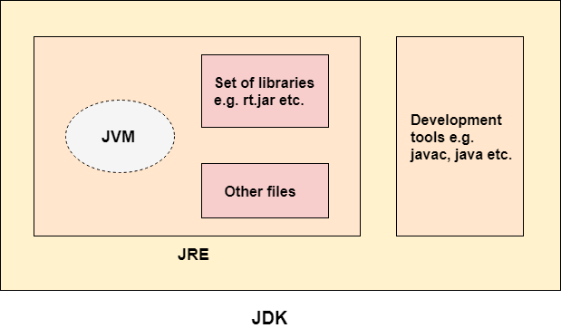

- [Source File Declaration Rules](#source-file-declaration-rules)
- [Data Types](#data-types)
  - [Primitive](#primitive)
  - [Reference](#reference)
    - [String](#string)
    - [Array](#array)
- [Variable Types](#variable-types)
- [Modifiers](#modifiers)
  - [Access Modifiers](#access-modifiers)
  - [Non-Access Modifiers](#non-access-modifiers)
- [Methods](#methods)
- [Classes](#classes)
  - [Nested Class](#nested-class)
    - [Static Nested Class](#static-nested-class)
    - [Non-static Nested Classes](#non-static-nested-classes)
      - [Inner Class](#inner-class)
      - [Method-Local Inner Class](#method-local-inner-class)
      - [Anonymous Inner Class](#anonymous-inner-class)
- [Interfaces](#interfaces)
- [Packages](#packages)
  - [import](#import)
  - [CLASSPATH](#classpath)
- [Annotation](#annotation)
- [Object Oriented Java](#object-oriented-java)
  - [Inheritance](#inheritance)
    - [super keyword](#super-keyword)
    - [instanceof operator](#instanceof-operator)
  - [Overriding](#overriding)
    - [Virtuality](#virtuality)
  - [Polymorphism](#polymorphism)
  - [Encapsulation](#encapsulation)
- [Wrapper Classes for Data Types](#wrapper-classes-for-data-types)
  - [Number](#number)
  - [Character](#character)
- [Exception Handling](#exception-handling)
- [File Operations](#file-operations)
- [Parallel Programming](#parallel-programming)
- [Socket Programming](#socket-programming)
- [Java Environment](#java-environment)
  - [Java Compiler (javac)](#java-compiler-javac)
  - [JVM (java)](#jvm-java)

# Source File Declaration Rules

These rules are applied for:
* declaring classes
* import statements and 
* package statements in a source file.

Rules:

* One public class per source file.
* Can have multiple non-public classes.
* Public class name and source file name have to be matched.
  * Class name: Employee
  * File name: Employee.java
* Package statement must be the first statement in the source file.
* Import statement must be written between the package statement and the class declaration.
* Import and package statements affect to all source file (for ex. multiple classes)


# Data Types

## Primitive
type | storing | min | max | default | example
--- | --- | --- | --- | --- | ---
byte | 8 bit signed | -128 |  127 | 0 | byte b = 5
short | 16 bit signed | -32768 |  32767 | 0 | short s = 6
int | 32 bit signed | -2 ^ 31  |  (2 ^ 31) - 1 | 0 | int i = 7
long | 64 bit signed | -2 ^ 63  |  (2 ^ 63) - 1 | 0 | long l = 8
float | 32 bit floating point | - |  - | 0.0f | float f = 9.10
double | 64 bit floating point | - |  - | 0.0d | double d = 11.12
boolean | single bit | 0 |  1 | false | boolean b = true;
char | 16 bit character | '\u0000'  | '\uffff' | - | char c = 'a'

## Reference
* Class objects
* Default is **null**
* Some of them is like below:

### String
* String class is immutable, so it cannot be changed.
* If you want to do make changes on string you should use:
  * StringBuffer
    * Thread-safe
  * StringBuilder
    * Not thread-safe
    * Fast
* See Also:
  *  [https://docs.oracle.com/javase/7/docs/api/java/lang/String.html](https://docs.oracle.com/javase/7/docs/api/java/lang/String.html)
  *  [https://docs.oracle.com/javase/7/docs/api/java/lang/StringBuilder.html](https://docs.oracle.com/javase/7/docs/api/java/lang/StringBuilder.html)
  *  [https://docs.oracle.com/javase/7/docs/api/java/lang/StringBuffer.html](https://docs.oracle.com/javase/7/docs/api/java/lang/StringBuffer.html)

### Array
* definition:

```java
Integer[] varName = {1, 2, ...};
```

```java
Integer[] varName = new Integer[10];
```

* has length property
```java
for (int i = 0; i < varName.length; i++0) {
    System.out.println(varName[i] + " ");
}
```


# Variable Types
* Local variables
* Instance variables
  * Value can be assigned during the declaration.
* Class/Static variables
  * define with **static** keyword
  * Access with **class name**, not instance
  * <pre> public static int name = 1; </pre>
* Constant variables
  * define with **static final** keywork 
  * Access with **class name**, not instance
  * <pre> public static final int NAME = 1; </pre>


# Modifiers
## Access Modifiers
* **Private** can be accessible only within the **class**.
* **Default**(empty modifier) can be accessible only within the **same package**.
* **Public** can be accesible from **everywhere**.
* Access Table:


. | default | private | protected | public
--- | --- | --- | --- | --- |
Same Pkg | Yes | No | Yes | Yes
Different Pkg & Subclass | No | No | Yes | Yes
Different Pkg & Non-Subclass | No | No | No | Yes

## Non-Access Modifiers
* static
  * Local variables cannot be declared static
  * Method/Variable of the instance that static method belongs to can not be used within the static method.
* final
  * final variable means its value can not be changed
  * final method cannot be overrided at subclasses
  * final class cannot be a parent class
* abstract
  * abstract class connot be initialized
  * class cannot be both abstract and final
  * abstract method is just definition, must be implemented at subclass.
* synchronized
  * synchronized method can be accessible from just one thread at a time
* transient
* volatile


# Methods
* Can be overloaded. 
  * Same name same arg count with different type of args.
  * Same name different arg count.
* JDK 1.5 enables you to pass a variable number of arguments of the same type to a method.

```java
void printInt (int... args) {
    for (int i = 0; i < args.length; i++) {
        System.out.print(args[i] + " ");
    }
}
```


# Classes
* Class can be public, private
* Constructor has to have same name with the class.

```java
// class definition
public class Employee {

    // class variable (static)
    private static int unique = 0;

    // instance variable
    private int id;
    private String name;

    // constructor
    public Employee (String name) {
        this.id = this.unique++;
        this.name = name;
    }

    // destructor
    protected finalize () {
        // do clean-up before object destruction
    }

    public int getId () {
        return this.id;
    }

    public String getName () {
        return this.name;
    }

    // file main function
    public static void main (String[] args) {
        // local variable
        Employee[] employees = {
            new Employee("Emp 0"),
            new Employee("Emp 1"),
            new Employee("Emp 2")
        };
        
        for (int i = 0; i < employees.length; i++) {
            System.out.println(employees[i].getId() + " - " + employees[i].getName());
        }
    }
}
```

## Nested Class

### Static Nested Class
* It is defined like a regular static class member.
* It can be accessed without instantiating the outer class.
* Does not have access to instance members of outer class.

```java
public class Outer {
    static class Nested_Demo {
        public void my_method() {
            System.out.println("This is my nested class");
        }
    }
   
    public static void main(String args[]) {
        Outer.Nested_Demo nested = new Outer.Nested_Demo();	 
        nested.my_method();
    }
}
```

### Non-static Nested Classes

#### Inner Class
* Normal class definition inside another class.
* Can be private
* Private inner class can be accessed from outer class.
* Inner class can access to outer class (even privates)

```java
class Outer_Demo {
    // inner class
    private class Inner_Demo {
        public void print() {
            System.out.println("This is an inner class");
        }
    }
   
    // Accessing he inner class from the method within
    void display_Inner() {
        Inner_Demo inner = new Inner_Demo();
        inner.print();
    }
}
```
#### Method-Local Inner Class
* Defined inside the method block scope.
* Can be only instantiated inside the method.

```java
public class Outerclass {
    // instance method of the outer class 
    void my_Method () {

        // method-local inner class
        class MethodInner_Demo {
            public void print() {
                System.out.println("This is method inner class ");	   
            }   
        }
	   
        MethodInner_Demo inner = new MethodInner_Demo();
        inner.print();
    }
   
    public static void main(String args[]) {
        Outerclass outer = new Outerclass();
        outer.my_Method();	   	   
    }
}
```

#### Anonymous Inner Class
* Generally used to override the method of an exist class.

```java
abstract class AnonymousInner {
    public abstract void mymethod();
}

public class Outer_class {

    public static void main(String args[]) {
        AnonymousInner inner = new AnonymousInner() {
            public void mymethod() {
                System.out.println("This is an example of anonymous inner class");
            }
        };
        inner.mymethod();	
    }
}
```


# Interfaces
* It is like an abstract class.
  * All methods are **implicitly** abstract.
  * Interface is **implicitly** abstract.
* Can contain:
  * constants (static final)
  * default methods with body
  * static methods with body
  * nested types
* Can not contain:
  * constuctor
  * instance fields
* File naming is same exactly with class files.
* Can not instatiate.
* Interfaces are **implement**ed by class, not extend.
* Can extend multiple interfaces.
* If interface that is implemented by class is not declare all methods that belongs the interface, the class must be defined as abstract.
* Method signatures have to be matched.
* A class can implement multiple interfaces at a time.
* An interface can extend another interface with using **extends** keyword.

```java
// Filename : Animal.java
interface Animal {
    public void eat();
    public void travel();
}

// Filename : FlyingAnimal.java
// extending interface
interface FlyingAnimal extends Animal {
    public void fly();
}

// Filename : Bird.java
// implementing multiple interface
class Bird implements FlyingAnimal, Event {
    Bird () {
    }

    public void eat() {
        System.out.println('Bird eats');
    }

    public void travel() {
        System.out.println('Bird travels');
    }

    public void fly () {
        System.out.println('Bird flies');
    }

    public static void main (String[] args) {
        Bird b = new Bird();
        b.eat();
        b.travel();
    }
}
```


# Packages

```java
package pkg;
package dir1.dir2.dir3; // dir1/dir2/dir3
package com.apple.phone; // com/apple/phone
```

* It is a way of categorizing the classes and interfaces. 
* It is like a **namespace** in C++;
* Prevents name conflicts.
* Groups related elements. (class, interface, enumaration and annotation)
* Package name should be lowercase to prevent conflict with class/interface
* To compile the Java programs with package statements, 
  * you have to use -d option
  * then a folder with the given package name is created in the specified destination
  * and the compiled class files will be placed in that folder

```bash
javac -d dest_dir classname.java
```

## import
* accessing class from another package with these:

```java
// Filename: Boss.java
package payroll;
public class Boss {
    public void payEmployee(Employee e) {
        e.mailCheck();
    }
}

// Filename: Example.java
package example;

// use one of these
import payroll.*;
import payroll.Boss;

public class Example {
    public static void main (String[] args) {
        Boss b2 = new Boss();

        // or that
        payroll.Boss b1 = new payroll.Boss();
    }
}
```

## CLASSPATH
* classpath is an system variable.
* may include multiple path
* the compiler and JVM will look for .class files in:
  * CLASSPATH/package_name_to_dir_path
  * Ex: 
    * CLASSPATH = /home/yigit/javatest/project1/classes
    * package_name_to_dir_path = com.yigityuce.project1
  * Result:
    * /home/yigit/javatest/project1/classes/com/yigityuce/project1


# Annotation
* TODO: write sth.


# Object Oriented Java
## Inheritance


* Java **does not support** multiple ınheritance.
* Can be done with **extends** keyword for classes.
* Can be done with **implements** keyword for interfaces.

```java
class Base {
}

public class Derived extends Base {
}
```

### super keyword
* call base class constructor with **super()**
* access base class members with **super.memberName**

```java
class Base {
    Base (String msg) {
        System.out.println("This is base class constructor.");
        this.printMsg(msg);
    }

    public void printMsg (String msg) {
        System.out.println("Msg:" + msg);
    }
}

public class Derived extends Base {
    Derived () {
        super("Hello base.");
        System.out.println("This is derived class constructor");
    }

    protected finalize () {
        super.printMsg("Goodbye base.");
    }
}
```


### instanceof operator
* objects that instantiate from subclass are returns true of the below statements:

```java
Derived obj = new Derived();
System.out.println(obj instanceof Base); // true
System.out.println(obj instanceof DerivedBase); // true
```


## Overriding
* Method signature must be same at child class.
  * Return type can be subtype of the original method's return type.
* Overridden method must not be static.
* Overridden method must not be final.
* Overridden method must not be private.
* Overridden method must not be constructor.
* Method accessiblity must not be more restrictive than the overriddn method.
* Original method can call with:

```java
...
@Override
public void methodName () {
    super.methodName();
    // do other stuff
}
...
```

### Virtuality
* Compile time: reference time will be checked
* Runtime: object type will be checked

```java
class Animal {
    public void walk () {
        System.out.println('Animal walks');
    }
}

class Dog extends Animal {
    @Override
    public void walk () {
        System.out.println('Dog walks');
    }

    public static void main (String[] args) {
        Dog d1 = new Dog();
        // this line is IMPORTANT!
        Animal d2 = new Dog();

        d1.walk(); // prints: Dog walks
        d2.walk(); // prints: Dog walks
    }
}
```

## Polymorphism
## Encapsulation


# Wrapper Classes for Data Types

## Number


* All the wrapper classes (Integer, Long, Byte, Double, Float, Short) are subclasses of the abstract class Number.
* See Also [https://docs.oracle.com/javase/7/docs/api/java/lang/Number.html](https://docs.oracle.com/javase/7/docs/api/java/lang/Number.html)

## Character
* See Also [https://docs.oracle.com/javase/7/docs/api/java/lang/Character.html](https://docs.oracle.com/javase/7/docs/api/java/lang/Character.html)


# Exception Handling

# File Operations

# Parallel Programming

# Socket Programming

# Java Environment
## Java Compiler (javac)
## JVM (java)

https://www.javatpoint.com/java-tutorial


