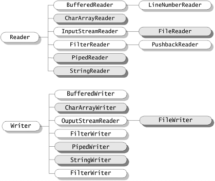

- [Source File Declaration Rules](#source-file-declaration-rules)
- [Data Types](#data-types)
  - [Primitive Types](#primitive-types)
    - [Enum](#enum)
      - [values()](#values)
  - [Non-Primitive (Reference) Types](#non-primitive-reference-types)
    - [String](#string)
      - [Concat](#concat)
      - [Comparison](#comparison)
      - [Converting to string](#converting-to-string)
    - [Array](#array)
    - [Number Wrapper Classes](#number-wrapper-classes)
    - [Character Wrapper Classes](#character-wrapper-classes)
- [Variable Types](#variable-types)
- [Modifiers](#modifiers)
  - [Access Modifiers](#access-modifiers)
  - [Non-Access Modifiers](#non-access-modifiers)
- [Methods](#methods)
  - [Anonymous Methods (Lambda Expressions)](#anonymous-methods-lambda-expressions)
- [Classes](#classes)
  - [Inheritance](#inheritance)
    - [super keyword](#super-keyword)
    - [instanceof operator](#instanceof-operator)
  - [Overriding](#overriding)
    - [Virtuality](#virtuality)
  - [Polymorphism](#polymorphism)
    - [Method Overloading](#method-overloading)
  - [Encapsulation](#encapsulation)
    - [Static Nested Class](#static-nested-class)
    - [Non-static Nested Classes](#non-static-nested-classes)
      - [Inner Class](#inner-class)
      - [Method-Local Inner Class](#method-local-inner-class)
      - [Anonymous Inner Class](#anonymous-inner-class)
- [Interfaces](#interfaces)
  - [Functional Interfaces](#functional-interfaces)
  - [Default Methods](#default-methods)
- [Generics](#generics)
  - [Bounded Generic Types](#bounded-generic-types)
- [Packages](#packages)
  - [import](#import)
  - [CLASSPATH](#classpath)
- [Handling Exception](#handling-exception)
  - [Try Catch Block](#try-catch-block)
  - [Try with Resource Statement](#try-with-resource-statement)
  - [Throwing Exception](#throwing-exception)
  - [User Defined Exceptions](#user-defined-exceptions)
- [Multithreading](#multithreading)
  - [Main Thread](#main-thread)
  - [Lifecycle](#lifecycle)
  - [Priority](#priority)
  - [Thread Class](#thread-class)
    - [Construct](#construct)
    - [Sleep](#sleep)
    - [Join](#join)
  - [Synchronization](#synchronization)
    - [Synchronized Method](#synchronized-method)
    - [Synchronized Block](#synchronized-block)
  - [Thread Communication](#thread-communication)
    - [Object.wait()](#objectwait)
    - [Object.notify()](#objectnotify)
    - [Object.notifyAll()](#objectnotifyall)
  - [Example](#example)
- [IO Operations](#io-operations)
  - [Byte Streams](#byte-streams)
  - [Character Streams](#character-streams)
- [Collections](#collections)
  - [Accessing Elements](#accessing-elements)
    - [Iterator](#iterator)
    - [ListIterator](#listiterator)
    - [for-each Loop](#for-each-loop)
- [Streams](#streams)
  - [Generating Streams](#generating-streams)
  - [Stream Methods](#stream-methods)
    - [forEach](#foreach)
    - [map](#map)
    - [filter](#filter)
    - [limit](#limit)
    - [sorted](#sorted)
    - [distinct](#distinct)
    - [count](#count)
    - [collect](#collect)
- [Optional](#optional)
  - [Generating Optional](#generating-optional)
  - [Methods](#methods-1)
- [Date](#date)
- [Helper Classes/Methods](#helper-classesmethods)
  - [Math](#math)
  - [Character](#character)

# Source File Declaration Rules

These rules are applied for:
* declaring classes
* import statements and 
* package statements in a source file.

Rules:

* One public class per source file.
* Can have multiple non-public classes.
* Public class name and source file name have to be matched.
  * Class name: Employee
  * File name: Employee.java
* Package statement must be the first statement in the source file.
* Import statement must be written between the package statement and the class declaration.
* Import and package statements affect to all source file (for ex. multiple classes)


# Data Types

## Primitive Types
type | storing | min | max | default | example
--- | --- | --- | --- | --- | ---
byte | 8 bit signed | -128 |  127 | 0 | byte b = 5
short | 16 bit signed | -32768 |  32767 | 0 | short s = 6
int | 32 bit signed | -2 ^ 31  |  (2 ^ 31) - 1 | 0 | int i = 7
long | 64 bit signed | -2 ^ 63  |  (2 ^ 63) - 1 | 0 | long l = 8
float | 32 bit floating point | - |  - | 0.0f | float f = 9.10
double | 64 bit floating point | - |  - | 0.0d | double d = 11.12
boolean | single bit | 0 |  1 | false | boolean b = true;
char | 16 bit character | '\u0000'  | '\uffff' | - | char c = 'a'

### Enum
* Java Enumerations can be thought as classes that have fixed set of constants.
* Enumerations can have:
  * instance variables
  * constructors
  * methods
* Each enumeration constant is public, static and final by default. 
* Enumerations may implement many interfaces
* Enumerations cannot extend any class because it internally extends **java.lang.Enum** class.
* Enumerations are not instantiated using new keyword.

// TODO: needs more info

```java
enum Season { WINTER, SPRING, SUMMER, FALL };

Season s = Season.SUMMER;
```

#### values()
* returns an array containing all the values of the enum.


## Non-Primitive (Reference) Types
* Class objects
* Default is **null**
* Some of them is like below:

### String
* String class is immutable, so it cannot be changed.
* If you want to do make changes on string you should use:
  * StringBuffer
    * It represents growable and writable character sequence.
    * Thread-safe
  * StringBuilder
    * Not thread-safe
    * Fast
* See Also:
  *  [https://docs.oracle.com/javase/7/docs/api/java/lang/String.html](https://docs.oracle.com/javase/7/docs/api/java/lang/String.html)
  *  [https://docs.oracle.com/javase/7/docs/api/java/lang/StringBuilder.html](https://docs.oracle.com/javase/7/docs/api/java/lang/StringBuilder.html)
  *  [https://docs.oracle.com/javase/7/docs/api/java/lang/StringBuffer.html](https://docs.oracle.com/javase/7/docs/api/java/lang/StringBuffer.html)


#### Concat
* **String.concat()** method
* **\+** operator

#### Comparison
* **String.equals()** method.

#### Converting to string
* **String.valueOf()** method.

```java
int x = 345;
String xStr = String.valueOf(x);
```

### Array
* definition:

```java
Integer[] varName = {1, 2, ...};
```

```java
Integer[] varName = new Integer[10];
```

* has length property
```java
for (int i = 0; i < varName.length; i++0) {
    System.out.println(varName[i] + " ");
}
```

### Number Wrapper Classes


* All the wrapper classes (Integer, Long, Byte, Double, Float, Short) are subclasses of the abstract class Number.
* All the wrapper classes are immutable. So it cannot be changed.
* See Also [https://docs.oracle.com/javase/7/docs/api/java/lang/Number.html](https://docs.oracle.com/javase/7/docs/api/java/lang/Number.html)

### Character Wrapper Classes
* All the wrapper classes are immutable. So it cannot be changed.
* See Also [https://docs.oracle.com/javase/7/docs/api/java/lang/Character.html](https://docs.oracle.com/javase/7/docs/api/java/lang/Character.html)


# Variable Types
* Local variables
* Instance variables
  * Value can be assigned during the declaration.
* Class/Static variables
  * define with **static** keyword
  * Access with **class name**, not instance
  * <pre> public static int name = 1; </pre>
* Constant variables
  * define with **static final** keywork 
  * Access with **class name**, not instance
  * <pre> public static final int NAME = 1; </pre>


# Modifiers
## Access Modifiers
* **Private** can be accessible only within the **class**.
* **Default**(empty modifier) can be accessible only within the **same package**.
* **Public** can be accesible from **everywhere**.
* Access Table:


. | default | private | protected | public
--- | --- | --- | --- | --- |
Same Pkg | Yes | No | Yes | Yes
Different Pkg & Subclass | No | No | Yes | Yes
Different Pkg & Non-Subclass | No | No | No | Yes

## Non-Access Modifiers
* static
  * Local variables cannot be declared static.
  * Method/Variable of the instance that static method belongs to can not be used within the static method.
* final
  * final variable means its value can not be changed.
  * final method cannot be overrided at subclasses.
  * final class cannot be a parent class.
* abstract
  * abstract class 
    * connot be instantiated.
    * cannot be final.
    * can contain method with body.
    * can contain constructor and static methods.
    * can contain overloaded abstract methods.
  * abstract method 
    * does not contain body, must be implemented at subclass.
    * connot be declared in non abstract class.
    * cannot be final, private, static.
* synchronized
  * synchronized method can be accessible from just one thread at a time.
* transient
  * transient variable value doesn't persist when an object is serialized.
* volatile
  * tells the compiler that the volatile variable can be changed unexpectedly by other parts of your program.


# Methods
* Can be overloaded. 
  * Same name same arg count with different type of args.
  * Same name different arg count.
* JDK 1.5 enables you to pass a variable number of arguments of the same type to a method.

```java
void printInt (int... args) {
    for (int i = 0; i < args.length; i++) {
        System.out.print(args[i] + " ");
    }
}
```

## Anonymous Methods (Lambda Expressions)
* Lambda expressions are introduced in Java 8.
```
parameter -> expression body
```
* Characteristics of lambda expressions:
  * **Optional type declaration**: 
    * No need to declare the type of a parameter.
  * **Optional parenthesis around parameter**: 
    * No need to declare a single parameter in parenthesis. 
    * For multiple parameters, parentheses are required.
  * **Optional curly braces**:
    * No need to use curly braces in expression body if the body contains a single statement.
  * **Optional return keyword**: 
    * The compiler automatically returns the value if the body has a single expression to return the value. 
    * Curly braces are required to indicate that expression returns a value.

```java
public class LambdaExp {

    // Define interfaces that contains lambda expressions
    interface MathOperation {
        int operation(int a, int b);
    }
        
    interface GreetingService {
        void sayMessage(String message);
    }

    private int operate(int a, int b, MathOperation mathOperation) {
        return mathOperation.operation(a, b);
    }

    public static void main(String args[]) {
		
        // with type declaration
        MathOperation addition = (int a, int b) -> a + b;
		
        // with out type declaration
        MathOperation subtraction = (a, b) -> a - b;
		
        // with return statement along with curly braces
        MathOperation multiplication = (int a, int b) -> { return a * b; };
		
        //without return statement and without curly braces
        MathOperation division = (int a, int b) -> a / b;
		
        //without parenthesis
        GreetingService greetService1 = message -> System.out.println("Hello " + message);
            
        //with parenthesis
        GreetingService greetService2 = (message) -> System.out.println("Hello " + message);

        LambdaExp tester = new LambdaExp();

        System.out.println("10 + 5 = " + tester.operate(10, 5, addition));
        System.out.println("10 - 5 = " + tester.operate(10, 5, subtraction));
        System.out.println("10 x 5 = " + tester.operate(10, 5, multiplication));
        System.out.println("10 / 5 = " + tester.operate(10, 5, division));
		
        greetService1.sayMessage("Mahesh");
        greetService2.sayMessage("Suresh");
    }
}
```

* Some [Functional Interfaces](#Functional-Interfaces) are predefined within Java 8. 


# Classes
* Class can be public, private.
* Class can be final, abstract.
* Can extend **just one** class.
* Can implement **any number** of interface.
* Each .java file can contain **just one** public class, **any number** private class.
* Source file name **must** match the public class name.
* Constructor has to have same name with the class.

```java
// class definition
public class Employee {

    // class variable (static)
    private static int unique = 0;

    // instance variable
    private int id;
    private String name;

    // constructor
    public Employee (String name) {
        this.id = this.unique++;
        this.name = name;
    }

    // constructor chaining
    public Employee () {
        this("unnamed");
    }

    // destructor
    protected finalize () {
        // do clean-up before object destruction
    }

    public int getId () {
        return this.id;
    }

    public String getName () {
        return this.name;
    }

    // file main function
    public static void main (String[] args) {
        // local variable
        Employee[] employees = {
            new Employee("Emp 0"),
            new Employee("Emp 1"),
            new Employee("Emp 2")
        };
        
        for (int i = 0; i < employees.length; i++) {
            System.out.println(employees[i].getId() + " - " + employees[i].getName());
        }
    }
}
```


## Inheritance


* Java **does not support** multiple inheritance.
* Can be done with **extends** keyword for classes.
* Can be done with **implements** keyword for interfaces.

```java
class Base {
}

public class Derived extends Base {
}
```

### super keyword
* call base class constructor with **super()**
* access base class members with **super.memberName**

```java
class Base {
    Base (String msg) {
        System.out.println("This is base class constructor.");
        this.printMsg(msg);
    }

    public void printMsg (String msg) {
        System.out.println("Msg:" + msg);
    }
}

public class Derived extends Base {
    Derived () {
        super("Hello base.");
        System.out.println("This is derived class constructor");
    }

    protected finalize () {
        super.printMsg("Goodbye base.");
    }
}
```


### instanceof operator
* objects that instantiate from subclass are returns true of the below statements:

```java
Derived obj = new Derived();
System.out.println(obj instanceof Base); // true
System.out.println(obj instanceof DerivedBase); // true
```


## Overriding
* Method signature must be same at child class.
  * Return type can be subtype of the original method's return type.
* Overridden method must not be static.
* Overridden method must not be final.
* Overridden method must not be private.
* Overridden method must not be constructor.
* Method accessiblity must not be more restrictive than the overridden method.
* Original method can call with:

```java
...
@Override
public void methodName () {
    super.methodName();
    // do other stuff
}
...
```

### Virtuality
* Compile time: reference time will be checked
* Runtime: object type will be checked

```java
class Animal {
    public void walk () {
        System.out.println('Animal walks');
    }
}

class Dog extends Animal {
    @Override
    public void walk () {
        System.out.println('Dog walks');
    }

    public static void main (String[] args) {
        Dog d1 = new Dog();
        // this line is IMPORTANT!
        Animal d2 = new Dog();

        d1.walk(); // prints: Dog walks
        d2.walk(); // prints: Dog walks
    }
}
```

## Polymorphism

### Method Overloading
* Same method name, different argument types or count.

```java
class Math {
    public Integer sum (Integer a, Integer b) {
        return a + b;
    }
    public Float sum (Float a, Float b) {
        return a + b;
    }
}

```

## Encapsulation

### Static Nested Class
* It is defined like a regular static class member.
* It can be accessed without instantiating the outer class.
* Does not have access to instance members of outer class.

```java
public class Outer {
    static class Nested_Demo {
        public void my_method() {
            System.out.println("This is my nested class");
        }
    }
   
    public static void main(String args[]) {
        Outer.Nested_Demo nested = new Outer.Nested_Demo();	 
        nested.my_method();
    }
}
```

### Non-static Nested Classes

#### Inner Class
* Normal class definition inside another class.
* Can be private
* Private inner class can be accessed from outer class.
* Inner class can access to outer class (even privates)

```java
class Outer_Demo {
    // inner class
    private class Inner_Demo {
        public void print() {
            System.out.println("This is an inner class");
        }
    }
   
    // Accessing he inner class from the method within
    void display_Inner() {
        Inner_Demo inner = new Inner_Demo();
        inner.print();
    }
}
```
#### Method-Local Inner Class
* Defined inside the method block scope.
* Can be only instantiated inside the method.

```java
public class Outerclass {
    // instance method of the outer class 
    void my_Method () {

        // method-local inner class
        class MethodInner_Demo {
            public void print() {
                System.out.println("This is method inner class ");	   
            }   
        }
	   
        MethodInner_Demo inner = new MethodInner_Demo();
        inner.print();
    }
   
    public static void main(String args[]) {
        Outerclass outer = new Outerclass();
        outer.my_Method();	   	   
    }
}
```

#### Anonymous Inner Class
* Generally used to override the method of an exist class.

```java
abstract class AnonymousInner {
    public abstract void mymethod();
}

public class Outer_class {

    public static void main(String args[]) {
        AnonymousInner inner = new AnonymousInner() {
            public void mymethod() {
                System.out.println("This is an example of anonymous inner class");
            }
        };
        inner.mymethod();	
    }
}
```


# Interfaces
* It is like an abstract class.
  * All methods are **implicitly** abstract.
  * Interface is **implicitly** abstract.
* Can contain:
  * static final variables
  * default methods with body
  * static methods with body
  * nested types
* Can not contain:
  * constuctor
  * instance variables
  * public abstract methods
* File naming is same exactly with class files.
* Can not instatiate.
* Interfaces are **implement**ed by class, not extend.
* Can extend multiple interfaces.
* If interface that is implemented by class is not declare all methods that belongs the interface, the class must be defined as abstract.
* Method signatures have to be matched.
* A class can implement multiple interfaces at a time.
* An interface can extend another interface with using **extends** keyword.

```java
// Filename : Animal.java
interface Animal {
    public void eat();
    public void travel();
}

// Filename : FlyingAnimal.java
// extending interface
interface FlyingAnimal extends Animal {
    public void fly();
}

// Filename : Bird.java
// implementing multiple interface
class Bird implements FlyingAnimal, Event {
    Bird () {
    }

    public void eat() {
        System.out.println('Bird eats');
    }

    public void travel() {
        System.out.println('Bird travels');
    }

    public void fly () {
        System.out.println('Bird flies');
    }

    public static void main (String[] args) {
        Bird b = new Bird();
        b.eat();
        b.travel();
    }
}
```

## Functional Interfaces
* Functional Interfaces are introduced in Java 8.
* Java 8 has defined a lot of functional interfaces to be used extensively in **lambda expressions**.


---
* Some of them with a **single type** are like below:
  * <code>Consumer\<T\></code>
    * accepts a single input argument and returns no result.
  * <code>Function<T,R></code>
    * accepts one argument and produces a result.
  * <code>Predicate\<T\></code>
    *  a predicate (Boolean-valued function) of one argument.
  * <code>Supplier\<T\></code>
    * a supplier of results.
  * <code>UnaryOperator\<T\></code>
    * a single operand that produces a result of the same type as its operand.
  * <code>BinaryOperator\<T\></code>
    * two operands of the same type, producing a result of the same type as the operands.
---
* Some of them with a **multi type** are like below:
  * <code>BiConsumer<T,U></code>
    * two input arguments with no return
  * <code>BiFunction<T,U,R></code>
    * two input arguments with return value
  * <code>BiPredicate<T,U></code>
    * a predicate (Boolean-valued function) of two arguments.

---
* Some of them with a **predefined type** like double, int, long etc. are like below:
  * <code>DoubleConsumer</code>
    * accepts a single double-valued argument and returns no result.
  * <code>DoubleFunction\<R\></code>
    * accepts a double-valued argument and produces a result.
  * <code>DoublePredicate</code>
    * a predicate (Boolean-valued function) of one double-valued argument.
  * <code>DoubleSupplier</code>
    * a supplier of double-valued results.
  * <code>DoubleUnaryOperator</code>
    * a single double-valued operand that produces a double-valued result.
  * <code>DoubleBinaryOperator</code>
    * two double-valued operands and producing a double-valued result.
  * <code>DoubleToIntFunction</code>
    * accepts a double-valued argument and produces an int-valued result.
  * <code>DoubleToLongFunction</code>
    * accepts a double-valued argument and produces a long-valued result.

```java

public class App
{
    public static void main(String[] args) throws Exception
    {
        ArrayList<String> list = new ArrayList<>(
            Arrays.asList(
                "Yigit",
                "Yuce",
                "ygtyce@gmail.com"
            )
        );

        Consumer<String> c = (String a) -> System.out.println(a);

        list.forEach(c);
        list.forEach((item) -> System.out.println("Item is: " + item));
    }
}
```

## Default Methods
* It is used in interfaces.
* It is used to backcompability reasons mostly.

```java
interface IPrintable {
    default void print() {
        System.out.println("I am a printable!");
    }
}

class Test1 implements IPrintable {
}

class Test2 implements IPrintable {
    public void print() {
        System.out.println("Implemented print function!");
    }
}

public class App {
    public static void main(String[] args) {
        Test1 t1 = new Test1();
        Test2 t2 = new Test2();
        t1.print(); // prints: I am a printable!
        t2.print(); // prints: Implemented print function!
    }
}
```


# Generics
* Same as C++ template classes.
* Generics work **only with object types**. Primitive types are not allowed.
  * You can use Integer, Char etc. classes instead of primitive data types.
* Generics work with interface.
* Generic typed array is not allowed.
* Generic data type can be more than one.
* Generic class example:

```java
// Filename: CustomCollection.java
import java.util.ArrayList;

public class CustomCollection <T> {
    private ArrayList<T> _storage = new ArrayList<>();

    public CustomCollection() {
    }

    public CustomCollection<T> add (T element) {
        this._storage.add(element);
        return this;
    }

    public int size () {
        return this._storage.size();
    }
}

// Filename: App.java
public class App
{
    public static void main(String[] args)
    {
        CustomCollection<Integer> myList = new CustomCollection<>();
        myList.add(1).add(2).add(3);

        System.out.println(myList.size());
    }
}
```

* Generic method example:

```java
// Filename: App.java
public class App
{
    public static <T> void print(T msg) {
        System.out.println("[" + (new Date()).toString() + "] " + msg);
    }

    public static void main(String[] args)
    {
        App.print("Custom print");
    }
}
```

## Bounded Generic Types
* Specify the parameter type.
* Generic type can be extended class of the bounded type.
* use **extends** keyword.

```java
// Filename: App.java
public class App
{
    public static <T extends String> void print(T msg) {
        System.out.println("[" + (new Date()).toString() + "] " + msg);
    }

    public static void main(String[] args)
    {
        App.print("Custom print"); // valid
        App.print(5); // invalid
    }
}
```

# Packages

```java
package pkg;
package dir1.dir2.dir3; // dir1/dir2/dir3
package com.apple.phone; // com/apple/phone
```

* It is a way of categorizing the classes and interfaces. 
* It is like a **namespace** in C++;
* Prevents name conflicts.
* Groups related elements. (class, interface, enumaration and annotation)
* Package name should be lowercase to prevent conflict with class/interface.
* Package name structure and package directory structure must be matched.
* All classes within the package must have the package statement as its first line

## import
* accessing class from another package with these:

```java
// Filename: Boss.java
package payroll;
public class Boss {
    public void payEmployee(Employee e) {
        e.mailCheck();
    }
}

// Filename: Example.java
package example;

// use one of these
import payroll.*;
import payroll.Boss;

public class Example {
    public static void main (String[] args) {
        Boss b2 = new Boss();

        // or that
        payroll.Boss b1 = new payroll.Boss();
    }
}
```

## CLASSPATH
* classpath is an system variable.
* may include multiple path
* the compiler and JVM will look for .class files in:
  * CLASSPATH/package_name_to_dir_path
  * Ex: 
    * CLASSPATH = /home/yigit/javatest/project1/src/main/java
    * package_name_to_dir_path = com.yigityuce.project1
  * Result:
    * /home/yigit/javatest/project1/src/main/java/com/yigityuce/project1


# Handling Exception


* **Exception** class is for exceptional conditions that program should catch. This class can be extended to create **user specific** exception classes.
* **RuntimeException** is a subclass of Exception. Exceptions under this class are automatically defined for programs.
* **Exceptions of type Error** are used by the Java run-time system to indicate errors having to do with the run-time environment, itself. Stack overflow is an example of such an error.


## Try Catch Block

```java
class ExceptionTutorial
{
    public static void main (String args[])
    {
        try {
            int a = 0;
            int b = 10;
            int c = b/a;
        }
        catch (ArithmeticException e) {
            System.out.println("Divided by zero");
        }
    }
}
```

## Try with Resource Statement
* Since JDK 7.
* Referred as **automatic resource management**.
* A resource is an object that is used in program and must be **closed after the program** is finished.
* Any object that implements **java.lang.AutoCloseable** or **java.io.Closeable**, can be passed as a parameter to try statement.

```java
class Test
{
    public static void main(String[] args)
    {
        try (BufferedReader br = new BufferedReader(new FileReader("./myfile.txt")))
        {
            String str;
            while ((str = br.readLine()) != null) {
                System.out.println(str);
            }
        }
        catch (IOException ioe) { System.out.println("exception");  }
    }
}
```

## Throwing Exception

* Exceptions can be thrown with **throw \<exception-instance\>** 
* Thrown exceptions must be defined in function signature with **throws** keyword.

```java
class Test
{
    static void test () throws Exception {
        try {
            throw new Exception("demo");
        }
        catch (Exception e) {
            System.out.println("Exception caught");
        }
    }

    public static void main (String args[]) {
        test();
    }
}
```

## User Defined Exceptions
* You don't have to implement anything inside it, no methods are required.
* Override the toString() function, to display customized message.

```java
class ExceptionWithCode extends Exception
{
    private int errorCode;

    ExceptionWithCode (int c) {
        errorCode = c;
    }

    public String toString () {
        return "Error occured. Code: " + this.errorCode;
    }
}
```

# Multithreading

## Main Thread
* Main thread can be obtained with **Thread.currentThread()**

```java
class Example
{
    public static void main(String[] args)
    {
        Thread t = Thread.currentThread();
        t.setName("Example Main");
        System.out.println("Name of thread is " + t);
    }
}
```

## Lifecycle


* **New**: A thread begins its life cycle in the new state. It remains in this state until the start() method is called on it.
* **Runnable**: After invocation of start() method on new thread, the thread becomes runnable.
* **Running**: A thread is in running state if the thread scheduler has selected it.
* **Waiting**: A thread is in waiting state if it waits for another thread to perform a task. In this stage the thread is still alive.
* **Terminated**: A thread enter the terminated state when it complete its task.


## Priority
* It is used to help the operating system to determine which threads are scheduled for execution.
* Thread priority ranges between 1 to 10.


## Thread Class

### Construct
* You can create new thread:
  * extending **Thread class** or 
  * implementing **Runnable interface**

```java
// constructors
Thread ()
Thread (String str)
Thread (Runnable r)
Thread (Runnable r, String str)
```

### Sleep
* While using **sleep()** method, always handle the exception it throws.

```java
static void sleep(long milliseconds) throws InterruptedException
```

### Join
* Using **join()** method, we tell our thread to wait until the specified thread completes its execution.

```java
final void join() throws InterruptedException;

final void join(long milliseconds) throws InterruptedException;
```


## Synchronization
* It is like Mutex in C++.
* When more than one thread try to access a shared resource, we need to ensure that resource will be used by only one thread at a time.

### Synchronized Method
```java
public synchronized void writeToResource (String msg);
```

### Synchronized Block
* Way more efficent compared to synchronized method.
```java
public void writeToResource (String msg) {
    System.out.println("Writing is started");
    String resourcePath = "./example.txt";
    // ... do something else

    synchronized (resourceObj) {
        // ... do something critical with resourceObj
    }
}
```

## Thread Communication

### Object.wait()
* The wait() method causes the current thread to wait indefinitely until another thread either invokes **notify()** for this object or **notifyAll()**.
* Can be called only inside:
  * synchronized blocks
  * synchronized methods
* The current thread must own this object's monitor. (synchronized block's scope)
* When wait is called, the thread **releases ownership** of this monitor and waits until another thread notifies threads waiting on this object's monitor.
* After notify() or notifyAll() called the thread can **re-obtain ownership** of the monitor and resumes execution.

```java
final void wait() throws InterruptedException;

final void wait(long timeout) throws InterruptedException;

final void wait(long timeout, int nanos) throws InterruptedException;
```

### Object.notify()
* Wakes up a single thread that is waiting on this object's monitor. 
* If any threads are waiting on this object, one of them is chosen to be awakened. 
* The choice is arbitrary and depends to the implementation.
* The awakened thread will not be able to proceed until the current thread relinquishes the lock on this object. 


### Object.notifyAll()
* Wakes up all threads that are waiting on this object's monitor.


## Example
* If you try to start same thread more than once, **IllegalThreadStateException** will be thrown.

```java
class Job1 implements Runnable {
    private int counter = 0;
    
    public void run() {
        while (this.counter++ < 5) {
            System.out.println("Job1.counter is " + this.counter);
            try { Thread.sleep(1000); }
            catch (InterruptedException e) {}
        }
    }
}


class Job2 extends Thread {
    private int counter = 0;
    
    public void run() {
        while (this.counter++ < 1000) {
            System.out.println("Job2.counter is " + this.counter);
            try { Thread.sleep(1000); }
            catch (InterruptedException e) {}
        }
    }
}

class Example
{
    public static void main( String args[] )
    {
        Thread t1 = new Thread(new Job1());
        Job2 t2 = new Job2();
        t1.start();

        try {
  			t1.join();	//Waiting for t1 to finish
		}
        catch (InterruptedException ie) {}

        // then start t2
        t2.start();
    }
}
```


# IO Operations
* Java performs I/O through **Streams**. 
* A Stream is linked to a physical layer by java I/O system to make input and output operations.
* Java defines two types of streams:
  * **Byte Stream**
    * handles input and output as an 8-bits **byte**.
    * Java classes are ends with **Stream** (ex. FileInputStream, BufferedOutputStream etc.)
  * **Character Stream**
    * handles input and output as a 16-bits **char**.
    * can be internationalized.
    * Java classes are ends with **Writer/Reader** (ex. FileReader, BufferedWriter etc.)
* There are some important methods to know.
  * <code>read()</code>
  * <code>close()</code>
  * <code>write()</code>

## Byte Streams


## Character Streams



# Collections


* List
  * Elements can be duplicated.
  * Random access and insertions based on a position.
* Set
  * Elements are unique.
* Queue
  * It is a FIFO. (first in first out)
* Map
  * Stores data in key and value association.
  * Both key and values are objects. 
  * Key must be unique.
* Vector
  * synchronized
  * contains many legacy methods that ArrayList does not have
  * Iterable with for-each loop
* Stack
  * Extends vector class.
  * LIFO (Last in first out)

## Accessing Elements
* You can access all elements of all type of collection by these methods.
  * Iterator
  * ListIterator
  * for-each Loop

### Iterator
* Iterate over one direction (next)
* Usage:
  * Call collection's **iterator()** method.
  * Set up a loop that checks the **hasNext()** method
  * Within the loop, obtain each element by calling **next()** method.
  * If needed you can call to **remove()** method to remove current element from collection.

```java

class Test_Iterator
{
    public static void main(String[] args)
    {
        ArrayList<String> ar = new ArrayList<String>();
        ar.add("ab");
        ar.add("bc");
        ar.add("cd");
        ar.add("de");
        Iterator it = ar.iterator();

        while (it.hasNext()) System.out.print(it.next() + " ");
    }
}
```
  

### ListIterator
* ListIterator Interface is used to traverse a list in both **forward** and **backward** direction. 
* It is available to only those collections that implements the **List** Interface.

```java
class Test_Iterator
{
    public static void main(String[] args)
    {
        ArrayList<String> ar = new ArrayList<String>();
        ar.add("ab");
        ar.add("bc");
        ar.add("cd");
        ar.add("de");
        ListIterator litr = ar.listIterator();
        while(litr.hasNext()) System.out.print(litr.next() + " ");
        while(litr.hasPrevious()) System.out.print(litr.previous() + " ");
    }
}
```

### for-each Loop 
* This can only be used if we don't want to **modify** the contents of a collection and we don't want any **reverse access**.

```java
class ForEachDemo
{
    public static void main(String[] args)
    {
        LinkedList<String> ls = new LinkedList<String>();
        ls.add("a");
        ls.add("b");
        ls.add("c");
        ls.add("d");

        for(String str : ls) System.out.print(str + " ");
    }
}
```

# Streams
* Stream represents a sequence of objects from a source, which supports aggregate operations.
* Following are the characteristics of a Stream:
  * **Sequence of elements**
    * A stream provides a set of elements of specific type in a sequential manner. 
    * A stream gets/computes elements on demand. 
    * It never stores the elements.
  * **Source**
    * Stream takes Collections, Arrays, or I/O resources as input source.
  * **Aggregate operations**
    * Stream supports aggregate operations like filter, map, limit, reduce, find, match, and so on.
  * **Pipelining**
    * Most of the stream operations return stream itself so that their result can be pipelined. 
    * <code>collect()</code> method is a terminal operation which is normally present at the end of the pipelining operation to mark the end of the stream.


## Generating Streams
* With Java 8, Collection interface has two methods to generate a Stream:
  * **stream()**
    * Returns a sequential stream considering collection as its source.
  * **parallelStream()** 
    * Returns a parallel Stream considering collection as its source.
* Stream class has some static methods also to create stream:
  * **of()**
    * Returns a stream whose elements are the specified values at variadic arg list.
  * **generate()**
    * Returns a stream where each element is generated by the provided Supplier.
  * **empty()**
    * Returns an empty stream.

```java
List<String> strings = Arrays.asList("ab", "", "bc", "efg", "abcd", "", "jkl");
List<String> filtered = strings.stream().filter(s -> !s.isEmpty()).collect(Collectors.toList());

List<Integer> ints = Stream.of(1, 2, 3, 4).collect(Collectors.toList());
List<Integer> same = Stream.generate(() -> 5).limit(10).collect(Collectors.toList());
```

* See also:
  * [Stream Documentation](https://docs.oracle.com/javase/8/docs/api/?java/util/stream/Stream.html)

## Stream Methods

### forEach
* Returns void.
```java
Random random = new Random();
random.ints().limit(10).forEach(System.out::println);
```
### map

```java
List<Integer> numbers = Arrays.asList(1, 2, 3, 4);
numbers.stream().map(i -> i*i).forEach(System.out::println);
// Prints: 1 4 9 16
```

### filter
```java
List<String> strings = Arrays.asList("abc", "", "bc", "efg", "abcd","", "jkl");
int count = strings.stream().filter(s -> s.isEmpty()).count();
```

### limit
```java
List<Integer> same = Stream.generate(() -> 5).limit(10).collect(Collectors.toList());
```

### sorted
```java
Random random = new Random();
random.ints().limit(10).sorted().forEach(System.out::println);
```

### distinct
```java
Stream.of(1, 2, 2, 3, 7, 3, 5).distinct().forEach(System.out::println);
// Prints: 1 2 3 7 5
```

### count
```java
List<String> strings = Arrays.asList("abc", "", "bc", "efg", "abcd","", "jkl");
int count = strings.stream().filter(s -> s.isEmpty()).count();
```

### collect
```java
List<String> strings = Arrays.asList("abc", "", "bc", "efg", "abcd","", "jkl");
Stream<String> stream = strings.stream().filter(s -> !s.isEmpty());

List<String> filteredList = stream.collect(Collectors.toList());
String mergedString = stream.collect(Collectors.joining(", "));
```

# Optional
* It is introduced in Java 8.
* Optional is a container object used to contain not-null objects. 
* This class has various utility methods to facilitate code to handle values as **‘available’** or **‘not available’** instead of checking null values. 

## Generating Optional
* Optional class has some static methods to create optional:
  * **of()**
    * The argument passed to the method can’t be null. 
    * Otherwise, we’ll get a NullPointerException.
  * **ofNullable()**
    * Returns an Optional describing the specified value, if non-null.
    * Otherwise returns an empty Optional.

## Methods
* **isPresent()**
  * Returns true if there is a value present, otherwise false.
```java

Optional<String> test = Optional.ofNullable("Yigit Yuce");
if (test.isPresent()) {
    System.out.println("Value exist");
}
```

* **orElse(T defaultValue)**
  * Returns true if there is a value present, otherwise false.
```java
Optional<String> test = Optional.ofNullable(null);
String notNullValue = test.orElse("Yigit Yuce");
```

* See also:
  * [https://docs.oracle.com/javase/8/docs/api/java/util/Optional.html](https://docs.oracle.com/javase/8/docs/api/java/util/Optional.html)
  * [https://www.tutorialspoint.com/java8/java8_optional_class.htm](https://www.tutorialspoint.com/java8/java8_optional_class.htm)


# Date
```java
import java.util.*;
import java.text.*;

public class DateDemo {
    public static void main(String args[]) {
        // Instantiate a Date object
        Date date = new Date();

        // display date and time
        System.out.println(date.toString());

        // display elapsed time in miliseconds
        System.out.println(date.getTime());

        // display custom formatted date and time
        SimpleDateFormat ft = new SimpleDateFormat ("yyyy.MM.dd hh:mm:ss");
        System.out.println("Current Date: " + ft.format(date));

        // display formatted date with printf
        System.out.printf("%s %tB %<te, %<tY", "Due date:", date);

        // parse date string to date object
        try {
            date = ft.parse("2018.07.18 23:08:04"); 
            System.out.println(date); 
        } 
        catch (ParseException e) { 
            System.out.println("Unparseable using " + ft);
        }
    }
}
```

* See also:
  * [Date and Time Conversion Characters](https://www.tutorialspoint.com/conversion-characters-for-time-in-java)


# Helper Classes/Methods

## Math
```java
Math.abs(-5);
Math.floor(1.5);
Math.ceil(1.5);
Math.round(1.5);
Math.min(-5, 3);
Math.max(-5, 3);
Math.random();

// etc...
```

## Character

```java
Character.isLetter('Y');
Character.isDigit('4');
Character.isUpperCase('M');
Character.toUpperCase('m');

// etc...
```