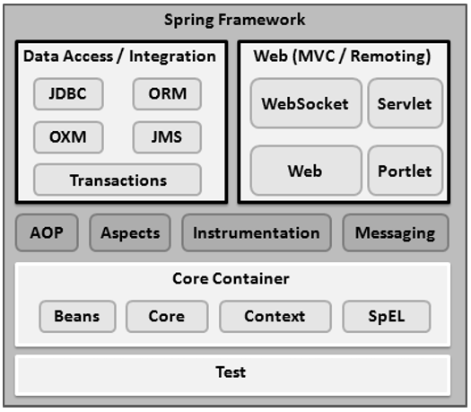

- [Introduction](#introduction)
- [Architecture](#architecture)
  - [Core Container](#core-container)
  - [Data Access/Integration](#data-accessintegration)
  - [Web](#web)
  - [Miscellaneous](#miscellaneous)
- [Basics](#basics)
  - [Spring IoC Container](#spring-ioc-container)
  - [Spring Bean](#spring-bean)
  - [Spring Bean Scopes](#spring-bean-scopes)
    - [singleton](#singleton)
    - [prototype](#prototype)
    - [request](#request)
    - [session](#session)
    - [global-session](#global-session)
  - [Spring Bean Configuration](#spring-bean-configuration)
    - [XML Based Configuration](#xml-based-configuration)
    - [Annotation Based Configuration](#annotation-based-configuration)
    - [Java Based Configuration](#java-based-configuration)
  - [Spring Bean Lifecycle](#spring-bean-lifecycle)
    - [@PostConstruct](#postconstruct)
    - [@PreDestroy](#predestroy)
- [Dependency Injection Example](#dependency-injection-example)
- [REST](#rest)
  - [Bootstrap with Spring Boot](#bootstrap-with-spring-boot)
  - [The Controller](#the-controller)
    - [@RestController](#restcontroller)
    - [Content Marshalling](#content-marshalling)

# Introduction

- This document written for **Spring**
- **Spring Framework** is a mature, powerful and highly flexible framework focused on building web applications in Java.

# Architecture

- Spring is modular, allowing you to pick and choose which modules are applicable to you, without having to bring in the rest.
- The Spring Framework provides about 20 modules which can be used based on an application requirement.



## Core Container

- **Core**
  - provides the fundamental parts of the framework, including the **IoC** and **Dependency Injection** features.
- **Bean**
  - provides **BeanFactory**, which is a sophisticated implementation of the factory pattern.
- **Context**
  - builds on the solid base provided by the Core and Beans modules and it is a medium to access any objects defined and configured.
  - The **ApplicationContext** interface is the focal point of the Context module.
- SpEL
  - provides a powerful expression language for querying and manipulating an object graph at runtime.

## Data Access/Integration

- **JDBC**
  - provides a JDBC-abstraction layer that removes the need for tedious JDBC related coding.
- **ORM**
  - provides integration layers for popular object-relational mapping APIs, including JPA, JDO, **Hibernate**.
- **OXM**
  - provides an abstraction layer that supports Object/XML mapping implementations for JAXB, Castor, XMLBeans, JiBX and XStream.
- **JMS**
  - Java Messaging Service
  - contains features for producing and consuming messages.
- **Transactions**
  - supports programmatic and declarative transaction management for classes that implement special interfaces and for all your POJOs.

## Web

- **Web**
  - provides basic web-oriented integration features such as multipart file-upload functionality and the initialization of the IoC container using servlet listeners and a web-oriented application context.
- **Web-MVC**
  - contains Spring's Model-View-Controller (MVC) implementation for web applications.
- **Web-Socket**
  - provides support for WebSocket-based, two-way communication between the client and the server in web applications.
- **Web-Portlet**
  - provides the MVC implementation to be used in a portlet environment and mirrors the functionality of Web-Servlet module.

## Miscellaneous

- **AOP**
  - provides an **aspect-oriented programming** implementation allowing you to define method-interceptors and pointcuts to cleanly decouple code that implements functionality that should be separated.
- **Aspects**
  - provides integration with AspectJ, which is again a powerful and mature AOP framework.
- **Instrumentation**
  - provides class instrumentation support and class loader implementations to be used in certain application servers.
- **Messaging**
  - provides support for STOMP as the WebSocket sub-protocol to use in applications.
  - It also supports an annotation programming model for routing and processing STOMP messages from WebSocket clients.
- **Test**
  - supports the testing of Spring components with JUnit or TestNG frameworks.

# Basics

## Spring IoC Container

- Spring IoC container is the program that **injects dependencies** into an object and make it ready for our use.
- Spring IoC is the mechanism to achieve loose-coupling between Objects dependencies.

## Spring Bean

- Spring Bean is nothing special.
- Any object in the Spring framework that we **initialize through Spring container** is called Spring Bean.
- Any normal Java POJO class can be a Spring Bean if it’s configured to be initialized via container by providing configuration metadata information.

## Spring Bean Scopes

### singleton

- Only one instance of the bean will be created for each container.
- This is the default scope for the spring beans.
- While using this scope, make sure bean doesn’t have shared instance variables(like static variables) otherwise it might lead to data inconsistency issues.

### prototype

- A new instance will be created every time the bean is requested.

### request

- This is same as prototype scope, however it’s meant to be used for web applications.
- A new instance of the bean will be created for each HTTP request.

### session

- A new bean will be created for each HTTP session by the container.

### global-session

- This is used to create global session beans for Portlet applications.

## Spring Bean Configuration

### XML Based Configuration

- By creating Spring Configuration XML file to configure the beans.
- If you are using Spring MVC framework, the xml based configuration can be loaded automatically by writing some boiler plate code in web.xml file.
- **NOT USED ANYMORE!**

### Annotation Based Configuration

- By using **@Service** or **@Component** annotations.
- Scope details can be provided with **@Scope** annotation.
- **@Component**
  - During the component scan, Spring Framework **automatically detects** classes annotated with @Component.
  - We can use @Component across the application to mark the beans as **Spring's managed components**
- **@Service**
  - The business logic of an application usually resides within the service layer.
  - We mark beans with @Service to indicate that it's holding the **business logic**.
  - Utility classes can be marked as Service classes
- **@Controller**
  - This is a class level annotation which tells the Spring Framework that this class serves as a controller in Spring MVC.
  - Mostly used with **web applications** or **REST web services** to specify that the class is a front controller and responsible to handle user request and return appropriate response.
- **@Repository**
  - DAO or Repository classes usually represent the database access layer in an application, and should be annotated with @Repository
- **@Autowired**
  - This annotation is used to let Spring know that autowiring is required.
  - This annotation allows us to implement constructor-based, field-based or method-based dependency injection in our components.
  - **@Qualifier** annotation is used in conjunction with Autowired to avoid confusion when we have two of more bean configured for same type.

### Java Based Configuration

- Starting from Spring 3.0, we can configure Spring beans using java programs.
- Some important annotations used for java based configuration are **@Configuration**, **@ComponentScan** and **@Bean**.
- **@Configuration**
  - Configuration classes can contain bean definition methods annotated with @Bean
  - Used to indicate that a class declares one or more @Bean methods.
- **@Bean**
  - Indicates that a method produces a bean to be managed by the Spring container.
  - Spring Bean annotation is usually declared in **@Configuration** classes methods
  - @Bean annotation also can be used with parameters
    - **name** – allows you give name for bean
    - **initMethod** – allows you to choose method which will be invoked on context register
    - **destroyMethod** – allows you to choose method which will be invoked on context shutdown
- **@ComponentScan**
  - Configures component scanning directives for use with @Configuration classes.
  - Here we can specify the base packages to scan for spring components.

```java
@Configuration
class VehicleFactoryConfig {

    @Bean
    Engine engine() {
        return new Engine();
    }
}
```

## Spring Bean Lifecycle

- Sometimes we want to initialize resources in the bean classes
- for example:
  - creating database connections
  - validating third party services at the time of initialization before any client request
  - etc.

### @PostConstruct

- Method annotation to execute method after bean is initialized.

### @PreDestroy

- Method annotation to execute method before bean is destroyed.

# Dependency Injection Example

```java
// File: src/main/java/com/yigityuce/spring/services/MessageService.java
package com.yigityuce.spring.services;

public interface MessageService {
	boolean sendMessage(String msg, String rec);
}
```

```java
// File: src/main/java/com/yigityuce/spring/services/EmailService.java
package com.yigityuce.spring.services;

public class EmailService implements MessageService {
	public boolean sendMessage(String msg, String rec) {
		System.out.println("Email Sent to " + rec + " with Message=" + msg);
        return true;
    }
}
```

```java
// File: src/main/java/com/yigityuce/spring/services/TwitterService.java
package com.yigityuce.spring.services;

public class TwitterService implements MessageService {
	public boolean sendMessage(String msg, String rec) {
		System.out.println("Tweet Sent to " + rec + " with Message=" + msg);
        return true;
    }
}
```

```java
// File: src/main/java/com/yigityuce/spring/consumer/MessageApp.java
package com.yigityuce.spring.consumer;

import org.springframework.beans.factory.annotation.Autowired;
import org.springframework.context.annotation.ComponentScan;
import org.springframework.stereotype.Component;

import com.yigityuce.spring.services.MessageService;

@Component
public class MessageApp {

	// field-based dependency injection
	@Autowired
	private MessageService service;

    // constructor-based dependency injection
	@Autowired
	public MessageApp(MessageService svc){
		this.service= svc;
	}

	// method-based dependency injection
    // name is important (setter) !!
	@Autowired
	public void setService(MessageService svc){
		this.service=svc;
	}

	public boolean processMessage(String msg, String rec){
		return this.service.sendMessage(msg, rec);
	}
}
```

```java
package com.yigityuce.spring.configuration;

import org.springframework.context.annotation.Bean;
import org.springframework.context.annotation.ComponentScan;
import org.springframework.context.annotation.Configuration;

import com.yigityuce.spring.services.MessageService;
import com.yigityuce.spring.services.EmailService;

@Configuration
@ComponentScan(value = {"com.yigityuce.spring.consumer"})
public class DIConfiguration {

	@Bean
	public MessageService getMessageService() {
		return new EmailService();
	}
}

```

```java
package com.yigityuce.spring;

import org.springframework.context.annotation.AnnotationConfigApplicationContext;

import com.yigityuce.spring.configuration.DIConfiguration;
import com.yigityuce.spring.consumer.MessageApp;

public class App {

	public static void main(String[] args) {
		AnnotationConfigApplicationContext context = new AnnotationConfigApplicationContext(DIConfiguration.class);
		MessageApp app = context.getBean(MessageApp.class);

		app.processMessage("Hi Yigit", "ygtyce@gmail.com");

		//close the context
		context.close();
	}
}
```

# REST

## Bootstrap with Spring Boot

- Add maven dependency:
  - This starter includes a Tomcat starter so that we can run our web application directly without explicitly installing any server.

```xml
<dependency>
    <groupId>org.springframework.boot</groupId>
    <artifactId>spring-boot-starter-web</artifactId>
    <version>2.1.1.RELEASE</version>
</dependency>
```

- Create spring boot application:
  - **@SpringBootApplication** annotation
  - By default, it will scan all the components in the same package or below.

```java
@SpringBootApplication
public class SpringBootRestApplication {

    public static void main(String[] args) {
        SpringApplication.run(SpringBootRestApplication.class, args);
    }
}
```

## The Controller

### @RestController

- This annotation is applied to a class to mark it as a request handler.
- Spring RestController annotation is used to create RESTful web services using Spring MVC.
- Spring RestController takes care of mapping request data to the defined request handler method.
- Once response body is generated from the handler method, it converts it to JSON or XML response.
- The @RestController is a shorthand to include both the **@ResponseBody** and the **@Controller** annotations in our class.

```java
@RestController
@RequestMapping("/foos")
class FooController {

    @Autowired
    private IFooService service;

    @GetMapping
    public List<Foo> findAll() {
        return service.findAll();
    }

    @GetMapping(value = "/{id}")
    public Foo findById(@PathVariable("id") Long id) {
        return service.findById(id);
    }

    @PostMapping
    @ResponseStatus(HttpStatus.CREATED)
    public Long create(@RequestBody Foo resource) {
        return service.create(resource);
    }

    @PutMapping(value = "/{id}")
    @ResponseStatus(HttpStatus.OK)
    public void update(@PathVariable( "id" ) Long id, @RequestBody Foo resource) {
        service.update(resource);
    }

    @DeleteMapping(value = "/{id}")
    @ResponseStatus(HttpStatus.OK)
    public void delete(@PathVariable("id") Long id) {
        service.deleteById(id);
    }

}

```

### Content Marshalling

- In addition to the spring-webmvc dependency required for the standard web application, we'll need to set up content marshalling and unmarshalling for the REST API.
- These are the libraries used to convert the representation of the REST resource to either JSON or XML

```xml
<dependencies>
   <dependency>
      <groupId>com.fasterxml.jackson.core</groupId>
      <artifactId>jackson-databind</artifactId>
      <version>2.9.8</version>
   </dependency>
   <dependency>
      <groupId>javax.xml.bind</groupId>
      <artifactId>jaxb-api</artifactId>
      <version>2.3.1</version>
      <scope>runtime</scope>
   </dependency>
</dependencies>
```
