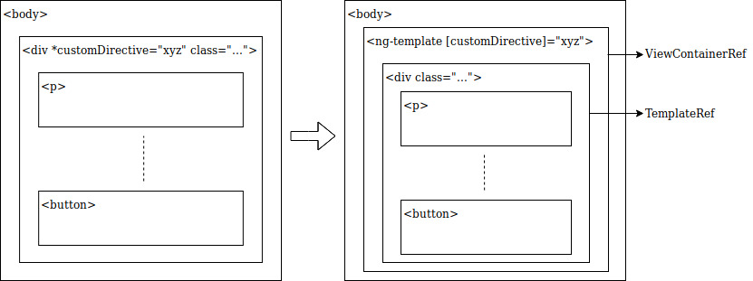
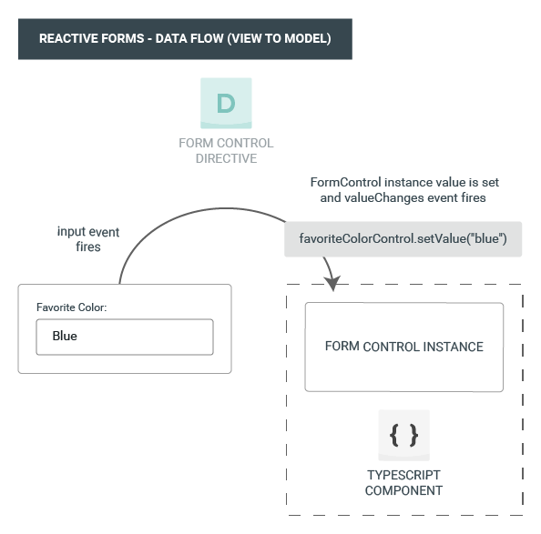
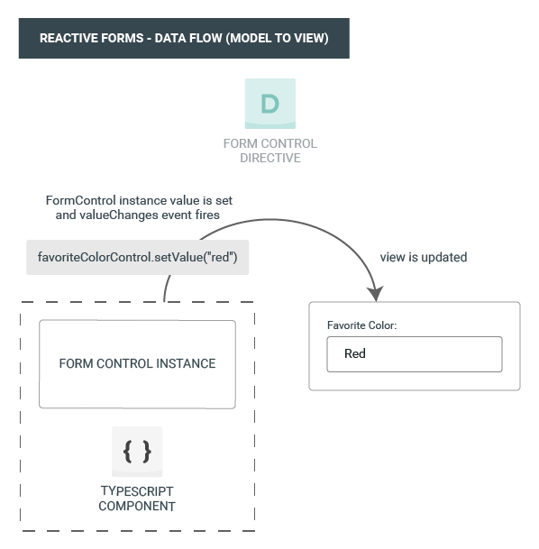

- [General](#general)
- [Architecture](#architecture)
  - [Modules](#modules)
    - [Frequently Used Modules](#frequently-used-modules)
  - [Components](#components)
    - [Entry Components](#entry-components)
    - [Dynamic Components](#dynamic-components)
  - [Services](#services)
- [Templating](#templating)
  - [Template References](#template-references)
  - [Data Binding](#data-binding)
    - [Attribute Binding](#attribute-binding)
    - [Class Binding](#class-binding)
    - [Style Binding](#style-binding)
    - [Event Binding](#event-binding)
    - [Two-way Binding](#two-way-binding)
  - [Pipes](#pipes)
  - [Safe Navigation Operator](#safe-navigation-operator)
  - [Non-Null Assertion Operator](#non-null-assertion-operator)
  - [Directives](#directives)
    - [ngFor](#ngfor)
    - [ngIf](#ngif)
    - [ngSwitch](#ngswitch)
    - [ngClass](#ngclass)
    - [ngStyle](#ngstyle)
    - [ngModel](#ngmodel)
  - [Predefined Template Tags](#predefined-template-tags)
    - [\<ng-template\>](#ng-template)
    - [\<ng-container\>](#ng-container)
- [Custom Events](#custom-events)
  - [EventEmitter](#eventemitter)
- [Input/Output](#inputoutput)
  - [Input](#input)
  - [Output](#output)
- [Lifecycle Hooks](#lifecycle-hooks)
  - [OnChanges](#onchanges)
  - [OnInit](#oninit)
  - [DoCheck](#docheck)
  - [AfterContentInit](#aftercontentinit)
  - [AfterContentChecked](#aftercontentchecked)
  - [AfterViewInit](#afterviewinit)
  - [AfterViewChecked](#afterviewchecked)
  - [OnDestroy](#ondestroy)
- [Styling](#styling)
  - [Component Styles Metadata](#component-styles-metadata)
  - [Component StyleUrls Metadata](#component-styleurls-metadata)
  - [Template Inline Styles](#template-inline-styles)
  - [Special Selectors](#special-selectors)
    - [:host](#host)
    - [:host-context](#host-context)
- [Dependency Injection (DI)](#dependency-injection-di)
  - [Creating an Injectable Service Class](#creating-an-injectable-service-class)
  - [Injector](#injector)
  - [Injecting Dependency](#injecting-dependency)
    - [Optional Dependency](#optional-dependency)
    - [Control Dependency Searching with @Self](#control-dependency-searching-with-self)
    - [Control Dependency Searching with @SkipSelf](#control-dependency-searching-with-skipself)
    - [Control Dependency Searching with @Host](#control-dependency-searching-with-host)
  - [Provider](#provider)
    - [Provider Configuration](#provider-configuration)
      - [Aliased Class Providers (useExisting)](#aliased-class-providers-useexisting)
      - [Value Providers (useValue)](#value-providers-usevalue)
      - [Factory Providers (useFactory)](#factory-providers-usefactory)
- [Custom Directives](#custom-directives)
  - [Custom Attribute Directive](#custom-attribute-directive)
  - [Custom Structural Directive](#custom-structural-directive)
    - [The Asterisk (*) Prefix](#the-asterisk--prefix)
    - [Microsyntax](#microsyntax)
    - [Example](#example)
  - [Directive Selectors](#directive-selectors)
- [Observables](#observables)
  - [Basic Usage and Terms](#basic-usage-and-terms)
  - [Naming Conventions for Observables](#naming-conventions-for-observables)
  - [Defining Observers](#defining-observers)
  - [Creating Observables](#creating-observables)
  - [Subscribing](#subscribing)
  - [RxJS](#rxjs)
    - [RxJS Observable Creation Functions](#rxjs-observable-creation-functions)
    - [RxJS Operators](#rxjs-operators)
      - [Error Handling with catchError](#error-handling-with-catcherror)
      - [Retry on Error](#retry-on-error)
    - [RxJS Subjects (Multicast)](#rxjs-subjects-multicast)
    - [Subject](#subject)
    - [ReplaySubject](#replaysubject)
    - [BehaviorSubject](#behaviorsubject)
    - [BehaviorSubject](#behaviorsubject-1)
- [Forms](#forms)
  - [Reactive Forms](#reactive-forms)
    - [Reactice Form Data Flow (View to Model)](#reactice-form-data-flow-view-to-model)
    - [Reactice Form Data Flow (Model to View)](#reactice-form-data-flow-model-to-view)
    - [Grouping Form Controls with FormGroup](#grouping-form-controls-with-formgroup)
    - [Grouping Form Controls with FormArray](#grouping-form-controls-with-formarray)
    - [Form Builder](#form-builder)
    - [Form Validation](#form-validation)
  - [Template-Driven Forms](#template-driven-forms)
    - [Template-Driven Form Data Flow (View to Model)](#template-driven-form-data-flow-view-to-model)
    - [Template-Driven Form Data Flow (Model to View)](#template-driven-form-data-flow-model-to-view)
    - [Form Validation](#form-validation-1)
    - [Example](#example-1)
  - [Form Validation](#form-validation-2)
    - [Custom Validators for Reactive Forms](#custom-validators-for-reactive-forms)
    - [Custom Validators for Template Driven Forms](#custom-validators-for-template-driven-forms)
    - [Cross Field Validation for Reactive Forms](#cross-field-validation-for-reactive-forms)
    - [Cross Field Validation for Template Driven Forms](#cross-field-validation-for-template-driven-forms)
- [Router and Navigation](#router-and-navigation)
  - [base href](#base-href)
  - [Router Import and Router Configuration](#router-import-and-router-configuration)
  - [Router Outlet](#router-outlet)
  - [Router Link](#router-link)
  - [Activated (Current) Route](#activated-current-route)
- [Best Practices](#best-practices)
  - [Feature Modules](#feature-modules)
    - [Example](#example-2)
  - [Bootstrapping Angular Application](#bootstrapping-angular-application)
  - [Accessing DOM Element](#accessing-dom-element)


# General

* This document written for **Angular version 7.2.14**
* Written with [**Typescript**](../../../Typescript/README.md)


# Architecture


## Modules
```ts
// Module decorator
@NgModule(metadata)
```

* **NgModule**
* Provides compilation context for components.
* Every angular app always has at least one **root module** that enables bootstrapping, and typically has many more feature modules.
* Can contain **components**, **services**, **directives** and **pipes**.
* NgModules can import functionality from other NgModules.
* NgModules allows their own functionality to be exported and used by other NgModules.
* The components that belong to an NgModule **share a compilation context**.
* Metadata is the options object that defines the module behaviour. Some of these options like below:
  * **declarations**
    * Components, pipes and directives that belong to this module.
    * You must declare every component in exactly one NgModule class.
    * You only need to declare them **once** in your app because you share them by importing the necessary **modules**.
  * **exports**
    * Makes some declarations of those components, directives, and pipes public so that other module's component templates can use them.
  * **imports**
    * Other **modules** that are needed by this module.
    * A component template **can reference** another component, directive, or pipe when the referenced item is declared in **this module** or another **imported module**
  * **providers**
    * An array of providers for services that the module requires.
    * Provides services that the other application components can use.
  * **bootstrap**
    * The main application view (**root component**)
    * Only the root NgModule should set the bootstrap property
    * Can be array
  * **entryComponents**
    * Components that are bootstrapped and dynamically loaded (like routed) components
    * Most of the time you won't have to explicitly set any entry components.
    * Because Angular adds components listed in
      * @NgModule.bootstrap
      * Router definitions components
* NgModules brings **components**, **directives**, and **pipes** together into cohesive blocks of functionality, each focused on a feature area, application business domain, workflow, or common collection of utilities.
* Modules can be loaded when the application starts or lazy loaded asynchronously by the router.

### Frequently Used Modules

| NgModule | Import it from | Why you use it |
| --- | --- | --- |
| BrowserModule | @angular/platform-browser | When you want to run your app in a browser
| CommonModule | @angular/common | When you want to use NgIf, NgFor
| FormsModule | @angular/forms | When you want to build template driven forms (includes NgModel)
| ReactiveFormsModule | @angular/forms | When you want to build reactive forms
| RouterModule | @angular/router | When you want to use RouterLink, .forRoot(), and .forChild()
| HttpClientModule | @angular/common/http | When you want to talk to a server


* **BrowserModule** imports **CommonModule**.
* Additionally, BrowserModule **re-exports** CommonModule making all of its directives available to any module that imports BrowserModule.
* For apps that **run in the browser**, import BrowserModule in the **root AppModule** because it provides services that are essential to launch and run a browser app. 
* BrowserModule’s providers are **for the whole app** so it should only be in the root module, not in feature modules. 
* Feature modules only need the common directives in CommonModule; they don’t need to re-install app-wide providers.


```ts
// @FILE: src/app/app.module.ts

import { NgModule } from '@angular/core';
import { BrowserModule } from '@angular/platform-browser';
@NgModule({
    imports: [ BrowserModule ], // includes common things
    providers: [ Logger ],
    declarations: [ AppComponent ],
    exports: [ AppComponent ],
    bootstrap: [ AppComponent ]
})
export class AppModule { }
```


## Components
```ts
// Component decorator
@Component(metadata)
```

* Defines and controls **views**.
* Uses **services** which provide specific functionality not directly related to views.
* The class interacts with the view through *properties* and *methods*.
* Service providers can be **injected** into components as *dependencies*.
* Every angular app always has at least one **root component**.
* Each component
  * defines a class that contains application data and logic.
  * is associated with an HTML template that defines a view.
* Metadata is the options object that defines the component behaviour. Some of these options like below:
  * **selector**
    * HTML tag that the component is inserted into.
  * **templateUrl**
    * address of this component's HTML template.
  * **styleUrls**
    * address of this component's styles.
  * **template**
    * inline HTML template of this component.
  * **providers**
    * An array of providers for services that the component requires.

```ts
// @FILE: src/app/hero-list.component.ts

@Component({
    selector: 'app-hero-list',
    templateUrl: './hero-list.component.html',
    styleUrls: [ './hero-list.component.css'],
    providers: [ HeroService ]
})
export class HeroListComponent implements OnInit {
/* ... */
}
```

* See also:
  * [Templating](#templating)
  

### Entry Components
* An entry component is any component that Angular loads imperatively.
* There are two main kinds of entry components:
  * The bootstrapped root component.
    * It is an entry component that Angular loads into the DOM during the bootstrap process (application launch)
  * Other entry components are loaded dynamically by other means, such as with the router (lazy-loading)


### Dynamic Components
* Component templates are not always fixed. 
* An application may need to load new components at runtime.
* Angular comes with its own API for loading components dynamically.

// TODO: this will be completed


## Services
```ts
// Service decorator
@Injectable()
```

* For data or logic that isn't associated with a specific view, and that you want to share across components.
* A service is typically a class with a narrow, well-defined purpose. 
* A component can delegate certain tasks to services, such as fetching data from the server, validating user input, or logging directly to the console.
* By defining such processing tasks in an injectable service class, you make those tasks available to any component. 
* @Injectable decorator makes class **singleton**.

```ts
// @FILE: src/app/logger.service.ts

export class Logger {
    log(msg: any) { console.log(msg); }
    error(msg: any) { console.error(msg); }
    warn(msg: any) { console.warn(msg); }
}
```

* Services can depend on other services.

```ts
// @FILE: src/app/hero.service.ts

export class HeroService {
    private heroes: Hero[] = [];

    constructor(
        private backend: BackendService,
        private logger: Logger
    ) {}

    getHeroes() {
        this.backend.getAll(Hero).then( (heroes: Hero[]) => {
            this.logger.log(`Fetched ${heroes.length} heroes.`);
            this.heroes.push(...heroes); // fill cache
        });
        return this.heroes;
    }
}
```

* See also:
  * [Dependency Injection (DI)](#dependency-injection-di)


# Templating
* A template combines HTML with Angular markup that can modify HTML.
* Templates can use:
  * *data binding* to coordinate the app and DOM data
  * *pipes* to transform data before it is displayed
  * *directives* to apply app logic to what gets displayed

## Template References
* It is like a **:ref="referenceName"** directive at the Vue.JS (**$refs**)
* A template reference variable is often a reference to a DOM element within a template. 
* It can also be a reference to:
  * Angular component
  * directive
  * web component.
* The scope of a reference variable is the entire template.

```html
<!-- @FILE: src/app/app.component.html -->

<input #phone placeholder="phone number">
<!-- OR -->
<input ref-email placeholder="email address">

<button (click)="callPhone(phone.value)">Call</button>
```


## Data Binding


* Binding can be 
  * interpolation
    ```html
    <div>{{ statement }}</div>
    ```
  * property binding
    ```html
    <div [target]="statement"> ... </div>
    <!-- OR -->
    <div bind-target="statement"> ... </div>
    ```
  * event binding
    ```html
    <div (target)="statement"> ... </div>
    <!-- OR -->
    <div on-target="statement"> ... </div>
    ```
  * two-way data binding with **model**
    ```html
    <div [(target)]="statement"> ... </div>
    <!-- OR -->
    <div bindon-target="statement"> ... </div>
    ```
* Angular processes all data bindings once for each JavaScript event cycle, from the root of the application component tree through all child components.
* Valid javascript statements can be used inside the interpolation syntax. (**template expressions**)
  * operators
  * function calls
  * ternary operator
  * etc.
* All data bound properties must be TypeScript **public** properties. Angular never binds to a TypeScript **private** property.

```html
<li>{{hero.name}}</li>
<app-hero-detail [hero]="selectedHero"></app-hero-detail>
<li (click)="selectHero(hero)"></li>
<input [(ngModel)]="hero.name">
```

### Attribute Binding
* Some of html attributes are not considered as html properties like:
  * colspan
  * aria
  * svg
* These kind of attributes can be bound to the element with using "**attr**" namespace.

```html
<button [attr.aria-label]="actionName">{{actionName}} with Aria</button>

<table border=1>
  <tr><td [attr.colspan]="1 + 1">One-Two</td></tr>
</table>
```

### Class Binding
* Overrides standart class property.
```html
<div class="bad curly special" [class]="badCurly"> ... </div>
```

* Specific class can be bound with "**class**" name space. Its statement must be truthy/falsy value.
```html
<div [class.special]="!isNormal"> ... </div>
```

* See Also: [ngClass](#ngclass)


### Style Binding
* You can set inline styles with a style binding
* All style bindings must be bound with namespace dot(.) notation.
* Style properties can be written in:
  * camelCase (ex: fontSize)
  * dash-case (ex: font-size)

```html
<button [style.color]="isSpecial ? 'red': 'green'">Red</button>
```

* See Also: [ngStyle](#ngstyle)


### Event Binding
```html
<a (click)="linkClicked()">Click Me!</a>
```

* Event binding statement can include data values such as an event object, string, or number with name special **$event** variable.
* The target event determines the shape of the $event object. 
* If the target event is a native DOM element event, then $event is a DOM event object.
  
```html
<a (click)="linkClicked($event)">Click Me!</a>

<input [value]="currentItem.name" (input)="currentItem.name=$event.target.value" />
```
* See also: [Custom Events](#custom-events)

### Two-way Binding
* Angular offers a special two-way data binding syntax for this purpose, **[(prop)]**
* The **[(prop)]** syntax combines the brackets of property binding, **[prop]**, with the parentheses of event binding, **(prop)**.
* The **[(prop)]** syntax means
  * the element has a settable property called **prop**
  * a corresponding event named **propChange**

```ts
// @FILE: src/app/size/sizer.component.ts

import { Component, EventEmitter, Input, Output } from '@angular/core';

@Component({
    selector: 'app-sizer',
    template: `
    <div>
        <button (click)="dec()" title="smaller">-</button>
        <button (click)="inc()" title="bigger">+</button>
        <label [style.font-size.px]="size">FontSize: {{size}}px</label>
    </div>`
})
export class SizerComponent {
    @Input() size: number | string;
    @Output() sizeChange = new EventEmitter<number>();
    
    dec() { this.resize(-1); }
    inc() { this.resize(+1); }
    
    resize(delta: number) {
        this.size = Math.min(40, Math.max(8, +this.size + delta));
        this.sizeChange.emit(this.size);
    }
}
```

```html
<!-- @FILE: src/app/app.component.html -->

<app-sizer [(size)]="fontSizePx"></app-sizer>
<div [style.font-size.px]="fontSizePx">Resizable Text</div>
```

* See Also: [ngModel](#ngmodel)


## Pipes
* Angular pipes let you declare display-value transformations in your template HTML
* A class with the decorator below defines a function that transforms input values to output values.

```ts
import { Pipe, PipeTransform } from '@angular/core';

@Pipe({ 
    name: 'filesize' 
})
export class FileSizePipe implements PipeTransform {
    transform(size: number, extension: string = 'MB', decimal: number = 2): string {
        return (size / (1024 * 1024)).toFixed(decimal) + extension;
    }
}
```

* To specify a value transformation in an HTML template, use the pipe operator (|).

```html
<span>{{ file.size | filesize:'MB' }}</span>
<span>{{ file.size | filesize:'megabyte':3 }}</span>
```

* Angular has various [pipes](https://angular.io/api?type=pipe).
* You can chain pipes, sending the output of one pipe function to be transformed by another pipe function. 


## Safe Navigation Operator
* Safe navigation operator (?.) is a fluent and convenient way to guard against null and undefined values in property paths. 

```html
<p> Value is: {{ a?.b?.c?.d }} </p>
```

## Non-Null Assertion Operator
* The non-null assertion operator does not guard against null or undefined.
* It tells the TypeScript type checker to suspend strict null checks for a specific property expression.

```html
<div *ngIf="a">
    <p> Value is: {{ a!.b }} </p>
</div>
```


## Directives
* Angular transforms the DOM according to the instructions given by directives.
* Angular defines a number of directives.
* You can define your own directives. See also: [Custom Directives](#custom-directives)
* In templates, directives typically appear within an element tag as attributes.
* There is two kind of directives:
  * **Structural directives** alter layout by adding, removing, and replacing elements in the DOM. 
  * Used with asteriks. (*)
  
    ```html
    <li *ngFor="let hero of heroes"></li>
    <app-hero-detail *ngIf="selectedHero"></app-hero-detail>
    ```

  * **Attribute directives**  alter the appearance or behavior of an existing element. 
  * Used inside brackets.
  
    ```html
    <div [ngClass]="currentClasses"></div>
    ```


### ngFor
* It renders a template for each item in a collection.

```html
<li *ngFor="let item of items;">
    <span> {{ item.name }}</span>
</li>
```

* Accessing iteration number with special **index** keyword.

```html
<li *ngFor="let item of items; let i = index;">
    <span> {{ i }}. {{ item.name }}</span>
</li>
```

* Some additioanl special keywords that can be used with *assignment* operator:
  * **even**: boolean
  * **odd**: boolean
  * **first**: boolean
  * **last**: boolean


### ngIf
* Conditional rendering.

```html
<div *ngIf="items.length">
    <li *ngFor="let item of items;">
        <span> {{ item.name }}</span>
    </li>
</div>
```


### ngSwitch
* NgSwitch is like the JavaScript switch statement. 
* It can display one element from among several possible elements, based on a switch condition.
* Works with these:
  * **ngSwitchCase**
  * **ngSwitchDefault**

```html
<div [ngSwitch]="emotion">
  <p *ngSwitchCase="'happy'">I am happy :) </p>
  <p *ngSwitchCase="'sad'">I am sad :( </p>
  <p *ngSwitchCase="'confused'">I am confused :| </p>
  <p *ngSwitchDefault>I fell nothing </p>
</div>
```


### ngClass
* You can bind to the ngClass to add or remove several classes simultaneously.
* Each key of the object is a CSS class name; its value is true if the class should be added, false if it should be removed.

```ts
// @FILE: src/app/app.component.ts
...
currentClasses: {};
setCurrentClasses () {
    this.currentClasses = {
        saveable: this.canSave,
        modified: !this.isUnchanged,
        special: this.isSpecial
    };
}
...
```

```html
<!-- @FILE: src/app/app.component.html -->
<div [ngClass]="currentClasses"></div>
```


### ngStyle
* You can set inline styles dynamically, based on the state of the component.
* Each key of the object is a style name; its value is whatever is appropriate for that style.

```ts
// @FILE: src/app/app.component.ts
...
currentStyles: {};
setCurrentStyles () {
    this.currentStyles = {
        'font-style': this.canSave ? 'italic' : 'normal',
        'font-weight': !this.isUnchanged ? 'bold' : 'normal',
        'font-size': this.isSpecial ? '24px' : '12px'
    };
}
...
```

```html
<!-- @FILE: src/app/app.component.html -->
<div [ngStyle]="currentStyles"></div>
```


### ngModel
* Easy way of the two-way data binding.
* FormsModule is required to use ngModel.
* You must **import** the FormsModule and add it to the NgModule's **imports list**.
* NgModel directive only works for an element supported by a **ControlValueAccessor** that adapts an element to this protocol.

```ts
// @FILE: src/app/app.module.ts

import { FormsModule } from '@angular/forms';

@NgModule({
    imports: [ FormsModule ],
})
export class AppModule {}
```

```html
<!-- @FILE: src/app/app.module.html -->
<input [(ngModel)]="inputDataHolder">
```

## Predefined Template Tags

### \<ng-template\>
* The \<ng-template\> is an Angular element for rendering HTML. 
* It is never displayed directly. 
* Before rendering the view, Angular replaces the \<ng-template\> and its contents with a comment.
* If there is no structural directive and you wrap some elements in a \<ng-template\>, those elements **disappear**. 

```html
<p>Hello</p>
<ng-template>
    <p>Angular</p>
</ng-template>
<p>World!</p>

<!-- Expected output: -->
Hello
World!
```

### \<ng-container\>
* The Angular \<ng-container\> is a grouping element that doesn't interfere with styles or layout because Angular doesn't put it in the DOM.


# Custom Events
* Can be done with EventEmitter.

```html
<!-- @FILE: src/app/subcomponent/subcomponent.component.html -->
<button (click)="delete()">Delete</button>
```

```ts
// @FILE: src/app/subcomponent/subcomponent.component.ts

...

@Output() deleteRequest = new EventEmitter<Item>();

delete() {
  this.deleteRequest.emit(this.item.name);
}

...
```

```html
<!-- @FILE: src/app/app.component.html -->
<subcomponent (deleteRequest)="deleteRequested($event)"></subcomponent>
```

## EventEmitter
// TODO: write down


# Input/Output
* You can always bind to a public property of a component in its own template. 
* It doesn't have to be an Input or Output property.
* The Angular compiler won't bind to properties of a different component unless they are Input or Output properties.

## Input
```ts
@Input(alias) propertyName: type;
```

* An Input property is a settable property annotated with an **@Input** decorator.
* It is used to descibe component properties.
* Can do some additional operations with using setter. For ex.:

```ts
@Input() 
set size(sz: number) {
  this._filesize = sz;
  if (sz < 100) {
    this.type = 'sm';
  }
  else if (sz < 250) {
    this.type = 'md';
  }
  else if (sz < 500) {
    this.type = 'lg';
  }
  else {
    this.type = 'xl';
  }
}
```

## Output
```ts
@Output(alias) propertyName = new EventEmitter<type>();
```

* An Output property is an observable property annotated with an **@Output** decorator. 
* The property almost always returns an Angular EventEmitter.
* It is used to descibe component events.


```ts
// FILE: src/app/some-component/some-component.component.ts
@Input() item: any;
@Output('accessed') itemAccessed = new EventEmitter<any>();
```

```ts
// FILE: src/app/some-component/some-component.component.ts
@Component({
    selector: 'some-component',
    inputs: ['item'],
    outputs: ['accessed:itemAccessed'],
})
export class SomeComponent {
}
```


# Lifecycle Hooks
* Directive and component instances have a lifecycle as Angular creates, updates, and destroys them.
* Lifecycles are defined with lifecycle hook **interfaces**.
* Components and directives must **implement** these interfaces to use hooks.
* Other Angular sub-systems may have their own lifecycle hooks apart from these component hooks.
* Each interface has a single hook method whose name is the interface name prefixed with ng.
  * Ex.: the **OnInit** interface has a hook method named **ngOnInit()**

```ts
export class Example implements OnInit {
    constructor () { }

    ngOnInit () { 
        console.log('onInit called.'); 
    }
}
```

## OnChanges
* A lifecycle hook that is called when any data-bound property of a directive changes.
* Receives a **SimpleChanges** object of current and previous property values. 
* Called before *OnInit* and data-bound input properties change.

## OnInit
* A lifecycle hook that is called after Angular has initialized all data-bound properties of a directive.
* Called once, after the first OnChanges.

## DoCheck
* A lifecycle hook that invokes a custom change-detection function for a directive, in addition to the check performed by the default change-detector.
* Called during every change detection run, immediately after OnChanges and OnInit.

## AfterContentInit
* A lifecycle hook that is called after Angular has fully initialized all content of a directive.
* Called once after the first DoCheck.

## AfterContentChecked
* A lifecycle hook that is called after the default change detector has completed checking all content of a directive.
* Called after the AfterContentInit and every subsequent DoCheck.

## AfterViewInit
* A lifecycle hook that is called after Angular has fully initialized a component's view.
* Called once after the first AfterContentChecked.

## AfterViewChecked
* A lifecycle hook that is called after the default change detector has completed checking a component's view for changes.
* Called after the AfterViewInit and every subsequent AfterContentChecked.

## OnDestroy
* A lifecycle hook that is called when a directive, pipe, or service is destroyed. 
* Use for any custom cleanup that needs to occur when the instance is destroyed.
* Unsubscribe Observables and detach event handlers to avoid memory leaks. 
* Called just before Angular destroys the directive/component.


# Styling

## Component Styles Metadata
* Used with **@Component** decorator's **style** metadata array.
* The styles specified in this method apply only within the template of that component.
* They are **not inherited** by any components nested within the template nor by any content projected into the component.
* They must be written in plain CSS.

```ts
/* @FILE: src/app/custom-element.component.ts */

@Component({
    selector: 'app-root',
    template: `
        <h1>Header Text</h1>
        <custom-element></custom-element>
    `,
    styles: [ 'h1 { font-weight: normal; }' ]
})
export class CustomElementComponent {
}
```

## Component StyleUrls Metadata
* Used with **@Component** decorator's **style** metadata array.
* The styles specified in this method apply only within the template of that component.
* They are **not inherited** by any components nested within the template nor by any content projected into the component.
* Non-CSS style files are valid also like:
  * sass/scss
  * less
  * stylus

```ts
/* @FILE: src/app/custom-element.component.ts */

@Component({
    selector: 'app-root',
    template: `
        <h1>Header Text</h1>
        <custom-element></custom-element>
    `,
    styleUrls: [ './custom-element.component.css' ]
})
export class CustomElementComponent {
}
```

## Template Inline Styles
* You can embed CSS styles directly into the HTML template by putting them inside **style** tags.

```ts
/* @FILE: src/app/custom-element.component.ts */

@Component({
    selector: 'app-root',
    template: `
        <style>
            h1 { font-weight: normal; }
        </style>
        <h1>Header Text</h1>
        <custom-element></custom-element>
    `,
})
export class CustomElementComponent {
}
```

## Special Selectors
* Component styles have a few special selectors

### :host
* Use the :host pseudo-class selector to target styles in the element that hosts the component (as opposed to targeting elements inside the component's template).
* It is the only way to target the host element.
* It has two forms:
  * pseudo-class
  * function
* Use the function form to apply host styles conditionally by including another selector inside parentheses.

```css
/* @FILE: src/app/custom-element.component.css */

:host(.active) {
    border-width: 3px;
}
```

### :host-context
* The :host-context() selector looks for a CSS class in any ancestor of the component host element, up to the document root. 
* The following example applies a background-color style to all <h2> elements inside the component, only if some ancestor element has the CSS class theme-light.

```ts
/* @FILE: src/app/custom-element.component.css */

:host-context(.theme-light) h2 {
    background-color: #eef;
}
```


# Dependency Injection (DI)


* Dependencies are services or objects that a class needs to perform its function.
* DI is a coding pattern which a class asks for dependencies from external sources rather than creating them itself.
* In Angular, the DI framework **provides** declared **dependencies** to a class when that class is **instantiated**.
* The DI framework lets you supply data to a component from an **injectable service class**, defined in its own file.


## Creating an Injectable Service Class
* To define a class as a **service** in Angular, use the **@Injectable()** decorator to allow Angular to inject it into a component as a dependency.

```ts
import { Injectable } from '@angular/core';

@Injectable({
    // we declare that this service should be created
    // by the root application injector.
    providedIn: 'root',
})
export class DataService {
    private _data: any[] = [];
    
    get (i: number) { return _data[i]; }
}
```

* The class we have created provides a service. 
* The **@Injectable()** decorator marks it as a service that can be injected, but Angular can't actually inject it anywhere until you configure a **dependency injector** with a **provider** of that service.


## Injector
* The **injector** is responsible for creating service instances and injecting them into classes.
* A provider tells an injector **how to create the service**.
* Injectors are **inherited**, which means that if a given injector can't resolve a dependency, it asks the **parent injector** to resolve it.
* A component can get services from 
  * its **own injector** 
  * or its **parent NgModule injector** 
  * or from the **root injector**
* You can **configure injectors** with **providers** at different levels of your app, by **setting a metadata** value with:
  * **@Injectable()** decorator at the service
    * It has the **providedIn** metadata option
    * You can specify the provider of the service with the:
       * root injector
       * specific NgModule
  * **@NgModule()** decorator at the module
    * It has the **provider** metadata option
  * **@Directive()** decorator at the directive
    * It has the **provider** metadata option.
  * **@Component()** decorator at the component
    * Components are a special type of directive, and the **providers** property of @Component() is **inherited from @Directive()**.
    * Each new instance of the component gets its own instance of the service. 
* There is **only one** root injector for an app.
* Child modules and component injectors are independent of each other, and create their own separate injector instances of the provided services.
* An internal **platform-level injector** is shared by all running apps. 
* The **root module injector** is the root of an app-wide injector hierarchy
* **NgModule, directive-level injectors** follow the structure of the component hierarchy.
* NgModule-level providers can be specified with 
  * @NgModule() **providers** metadata option
    * Use the @NgModule() providers option if a module is **lazy loaded**.
  * in the @Injectable() **providedIn** option
* The injector relies on the **provider configuration** to create instances of the dependencies that it injects into components, directives, pipes, and other services.


## Injecting Dependency
* You can tell Angular to inject a dependency in a component by specifying a **constructor parameter with the dependency type**.
* Dependency still needs to be provided in somewhere like parent module or root module or component's providers configuration.

```ts
// @ FILE: app/src/commons/services/DataService.service.ts
import { Injectable } from '@angular/core';

@Injectable({
    providedIn: 'root',
})
export class DataService {
    private _data: any[] = [];
    
    get (i: number) { return _data[i]; }
}
```

```ts
// @ FILE: app/src/app.component.ts
import { Component }   from '@angular/core';
import { DataService } from './commons/services/DataService.service';
     
@Component({
    selector: 'app',
    template: `...`,
    providers: [ DataService ]
})
export class Item {
    data: any;
    
    constructor (dataService: DataService) {
        this.data = dataService.get(0);
    }
}
```


* Services also follow same method to inject dependency to itself. For ex:

```ts
// @ FILE: app/src/commons/services/DataService/DataService.service.ts
import { Injectable } from '@angular/core';
import { Logger } from './Logger.service';

@Injectable({
    providedIn: 'root',
})
export class DataService {
    private _data: any[] = [];
    
    constructor (private _logger: Logger) {}

    get (i: number) {
        this._logger.log(`Date get from index ${i}`);
        return _data[i]; 
    }
}
```


### Optional Dependency
* Dependencies can be optional.
* A parameter decorator to be used on constructor parameters
* Marks the parameter as being an optional dependency. 
* The DI framework provides null if the dependency is not found.

```ts
import { Component }   from '@angular/core';
import { MyService } from './commons/MyService/MyService.service';

@Component({
    providers: []
})
export class MyComponent {
    constructor (
        @Optional() private myService: MyService
    ) {
    }
}
```


### Control Dependency Searching with @Self
* If we decorate the parameter with @Self(), it will be the only place allowed to find the injector is the component itself.
* It disables the bubbling dependency search.

```ts
import { Component }   from '@angular/core';
import { MyService } from './commons/MyService/MyService.service';

@Component({
    providers: [
        MyService // if it is not provided, it throws error
    ]
})
export class MyComponent {
    constructor (
        @Self() private myService: MyService
    ) {
    }
}
```

### Control Dependency Searching with @SkipSelf
* Start searching dependency from its parent at the hierarchy.
* Parent's dependency instance will be used.
* It won't be create new instance from dependency.

```ts
import { Component }   from '@angular/core';
import { MyService } from './commons/MyService/MyService.service';

@Component({
    providers: [
        MyService // this won't be used
    ]
})
export class MyComponent {
    constructor (
        @SkipSelf() private myService: MyService
    ) {
    }
}
```


### Control Dependency Searching with @Host
* Just searchs dependency at self and parent providers.

```ts
import { Component }   from '@angular/core';
import { MyService } from './commons/MyService/MyService.service';

@Component({
    providers: []
})
export class MyComponent {
    constructor (
        @Host() private myService: MyService
    ) {
    }
}
```


## Provider

* Provider configures an injector.
* The injector relies on the **provider configuration** to create instances of the dependencies that it injects into components, directives, pipes, and other services.
* You must **configure** an injector **with a provider**, or it won't know how to create the dependency.
* You can register providers:
  * in the service metadata (with @Injectable() decorator)
  * in the module metadata (with @NgModule() decorator)
  * in the component metadata (with @Component() decorator)


### Provider Configuration
* The class-provider syntax is a shorthand expression that expands into a **provider configuration**. 
* The following code snippets shows how a class that is given as the providers value is expanded into a full provider object.

```ts
// shorthand
providers: [ Logger ]

// expanded
[ { provide:Logger, useClass:Logger } ]
```

* The expanded provider configuration is an object literal with two properties.
* The **provide** property holds the token that serves as the **key** for both locating a dependency value and configuring the injector.
* The second property is a **provider definition** object, which tells the injector how to create the dependency value. 
* The provider-definition key can be:
    * useClass
    * useExisting
    * useValue
    * useFactory


#### Aliased Class Providers (useExisting)
* **useExisting** key can be useful when using an existing instance of the service.
* It won't create new instance.
```ts
providers: [ 
    NewLogger,
    // Alias OldLogger w/ reference to NewLogger
    { provide:OldLogger, useExisting:NewLogger }
]
```

#### Value Providers (useValue)
* Sometimes it's easier to provide a ready-made object rather than ask the injector to create it from a class. 
* To inject an object you have already created, configure the injector with the **useValue** option.

```ts
// An object in the shape of the logger service
const silentLogger = {
  logs: [],
  log: () => {}
};

providers: [ { provide:Logger, useValue:silentLogger } ]
```

* Not all dependencies are classes. Sometimes you want to inject a string, function, or object.
* The types that are not exist at **runtime** like interface, can not be used in **provide property** of provider configuration.
* These types of provide must be defined with creating **InjectionToken** **manually**.
* Manually created injections must be used with **@Inject()** decorator at **class constructor**.


```ts
interface Config {
    title: string;
    url: string;
}

const CFG: Config = {
    title: 'My Super Application',
    url: 'http://mysuperapplication.com'
}

// NOT VALID
// providers: [ { provide:Config, useValue:CFG } ]

// VALID
const ConfigProvider = new InjectionToken<Config>('My Config Description');
@Component({
    // ...
    providers: [ { provide:ConfigProvider, useValue:CFG } ],
    // ...
})
export class MyComponent {
    constructor(@Inject(ConfigProvider) config: Config) {
        console.log(config.title);
    }
}
```

#### Factory Providers (useFactory)
* Sometimes you need to create a dependent value **dynamically**, based on information you won't have until runtime.
* Factory providers can also be useful when creating an instance of a dependency from a **third-party library** that wasn't designed to work with DI.

```ts
// @FILE: app/src/commons/services/MySuperService/MySuperService.service.ts

import { Injectable } from '@angular/core';

@Injectable()
export class MySuperService {
    constructor (private arg: boolean) {}

    func () {
        if (this.arg) {
            // do something
        }
        else {
            // do another something
        }
    }
}
```

```ts
// @FILE: app/src/commons/services/MySuperService/MySuperService.service.provider.ts

import { MySuperService } from './MySuperService.service';
import { AnotherService } from '../AnotherService/AnotherService.service';

function factoryFunction (anotherService: AnotherService) {
    return new MySuperService(anotherService.isSomething);
}

export const MySuperServiceProvider = {
    provide: MySuperService,
    useFactory: factoryFunction,
    deps: [ AnotherService ]
}
```

```ts
import { MySuperServiceProvider } from 'commons/services/MySuperService/MySuperService.service.provider';
import { AnotherService } from 'commons/services/AnotherService/AnotherService.service';

@Component({
    // ...  
    providers: [ 
      AnotherService,
      MySuperServiceProvider
    ],
    // ...
})
export class MyComponent {
    constructor ()
}
```


# Custom Directives
* There are three kinds of directives in Angular:
  * Components
    * directives with a template.
  * Structural directives
    * change the DOM layout by adding and removing DOM elements.
    * used with asteriks(*) in template
  * Attribute directives
    * change the appearance or behavior of an element, component, or another directive.
    * used with square brackets([]) in template

## Custom Attribute Directive
* An attribute directive minimally requires building a controller class annotated with **@Directive()**
* The controller class implements the desired directive behavior.
* Directive selector and input variable name must be the same to bind directive argument at html template or input alias can be used.
* You can apply **many** attribute directives to one host element.

```ts
// @FILE: src/app/highlight.directive.ts

import { Directive, ElementRef, HostListener, Input, OnChanges, SimpleChanges } from '@angular/core';

@Directive({
    selector: '[highlight]'
})
export class HighlightDirective implements OnChanges{
    // BOTH VALID BELOW
    @Input('highlight') color: string|null = null; 
    // @Input() highlight: string = null; 

    @HostListener('mouseenter') 
    onMouseEnter() {
        this.highlight(this.color);
    }

    @HostListener('mouseleave') 
    onMouseLeave() {
        this.highlight(null);
    }

    ngOnChanges (changes: SimpleChanges) {
        // implement to respond bound parameter changes 
        // like input parameter, highlight
    }

    highlight(clr: string|null): void {
        this.el.nativeElement.style.backgroundColor = clr;
    }

    constructor(private el: ElementRef) {
        this.highlight(this.color);
    }
}
```

```html
<p [highlight]="'yellow'">Highlight me!</p>
```

* See also: 
  * [ElementRef](https://angular.io/api/core/ElementRef)
  * [HostListener](https://angular.io/api/core/HostListener)


## Custom Structural Directive
* The string is a microsyntax rather than the usual template expression
* Angular desugars this notation into a marked-up \<ng-template\> that surrounds the host element and its descendents.
* A **directive class** is spelled in UpperCamelCase (NgIf). 
* A directive's **attribute name** is spelled in lowerCamelCase (ngIf).
* You can **only apply one** structural directive to a host element.
  * For ex. if you try to put both *ngFor and *ngIf on the same host element, Angular won't let you.


### The Asterisk (*) Prefix
* The asterisk is "syntactic sugar" for something a bit more complicated.
* Internally, Angular translates the ***ngIf** attribute into a **\<ng-template\>** element, wrapped around the host element.

```html
<div *ngIf="hero" class="name">{{ hero.name }}</div>

<!-- SAME AS ABOVE -->
<ng-template [ngIf]="hero">
    <div class="name">{{ hero.name }}</div>
</ng-template>
```

* The *ngIf directive moved to the \<ng-template\> element where it became a **property binding**, [ngIf].
* The rest of the \<div\>, including its class attribute, **moved inside** the \<ng-template\> element.


### Microsyntax
```html
<div *ngFor="let item of items; let i=index; let odd=odd; trackBy: trackById">
    {{ hero.name }}
</div>

<!-- SAME AS ABOVE -->
<ng-template ngFor let-item [ngForOf]="items" let-i="index" let-odd="odd" [ngForTrackBy]="trackById">
    <div>{{ hero.name }}</div>
</ng-template>
```

* ngFor directive string is microsyntax.
* The microsyntax parser translates that string into attributes on the \<ng-template\>:
  * The **let** keyword declares a **template input variable** that you reference within the template.
  * Parser takes **of** and **trackBy** then prefixes them with the directive's attribute name (ngFor). Those are the names of two NgFor input properties (**ngForOf** and **ngForTrackBy**).


### Example
* Creating a directive is similar to creating a component.
  * Import the Directive decorator
  * Import the Input, TemplateRef, and ViewContainerRef symbols; you'll need them for any structural directive.
  * Apply the decorator to the directive class.
  * Set the CSS attribute selector that identifies the directive when applied to an element in a template.

```ts
import { Directive, Input, TemplateRef, ViewContainerRef } from '@angular/core';
  
/**
  * - `<div *appUnless="condition">...</div>`
  */
@Directive({ selector: '[appUnless]'})
export class UnlessDirective {
    private hasView = false;
  
    constructor(
        private templateRef: TemplateRef<any>,
        private viewContainer: ViewContainerRef) {
    }
  
    @Input() 
    set appUnless(condition: boolean) {
        if (!condition && !this.hasView) {
            this.viewContainer.createEmbeddedView(this.templateRef);
            this.hasView = true;
        } else if (condition && this.hasView) {
            this.viewContainer.clear();
            this.hasView = false;
        }
    }
}
```

```html
<div *appUnless="condition">...</div>
```

* See also: 
  * [TemplateRef](https://angular.io/api/core/TemplateRef)
  * [ViewContainerRef](https://angular.io/api/core/ViewContainerRef)




## Directive Selectors
* Declare as one of the following:
  * **element-name**: Select by element name.
  * **.class**: Select by class name.
  * **[attribute]**: Select by attribute name.
  * **[attribute=value]**: Select by attribute name and value.
  * **:not(sub_selector)**: Select only if the element does not match the sub_selector.
  * **selector1, selector2**: Select if either selector1 or selector2 matches.


# Observables
* Provides support for passing messages between publishers and subscribers in your application.
* An observable can deliver multiple values of any type like:
  * literals
  * messages
  * events
  * etc...
* Your application code only needs to worry about subscribing to consume values, and when done, unsubscribing.
* See also
  * [RxJS](https://www.learnrxjs.io/): It has a tons of predefined observables.

## Basic Usage and Terms

* As a **publisher**, you create an **Observable** instance that defines a *subscriber function*.
  * This is the function that is executed when a consumer calls the **subscribe()** method.
  * The *subscriber function* defines how to obtain or generate values or messages to be published.
* To execute the observable:
  * you have created and begin receiving notifications
  * you call its **subscribe()** method, passing an **observer**
  * This is a JavaScript object that defines the handlers for the notifications you receive. 
  * The **subscribe()** call returns a **Subscription** object that has an **unsubscribe()** method, which you call to stop receiving notifications.


## Naming Conventions for Observables
* You will often see observables named with a trailing “$” sign.
* This can be useful when scanning through code and looking for observable values. 
* Also, if you want a property to store the most recent value from an observable, it can be convenient to simply use the same name with or without the “$”.

```ts
import { Component } from '@angular/core';
import { Observable } from 'rxjs';
    
@Component({
    // ...
})
export class StopwatchComponent {
    stopwatchValue: number;
    stopwatchValue$: Observable<number>;
    
    start() {
        this.stopwatchValue$.subscribe((num) =>
            this.stopwatchValue = num;
        );
    }
}
```


## Defining Observers
* A handler for receiving observable notifications implements the Observer interface.
* **Observer interface** type is used
  * when creating Observable instance at its callback argument type
  * at **Observable.subscribe()** method's argument type

```ts
let observer: Observer = {
    next: function(val) {},
    error: function(msg) {}, // optional
    complete?: function() {} // optional
}
```


## Creating Observables
* Use the Observable constructor to create an observable stream of any type. 
* The constructor takes as its argument the subscriber function to run when the observable’s subscribe() method executes. 
* A subscriber function receives an [Observer](#defining-observers) object, and can **publish** values to the observer's **next()** method.

```ts
const _observable$ = new Observable((observer: Observer) => {
    // synchronously deliver 1, 2, and 3, then complete
    observer.next(1);
    observer.next(2);
    observer.next(3);
    observer.complete();
    
    return {
        unsubscribe() {
            // unsubscribe function doesn't need to do anything in this
            // because values are delivered synchronously
        }
    };
});
```

* Another example:

```ts
function eventStream (target, eventName) {
    return new Observable((observer: Observer) => {
        const handler = (e) => {
            observer.next(e);
        };

        target.addEventListener(eventName, handler);

        return {
            unsubscribe() {
                target.removeEventListener(eventName, handler);
            }
        };
    });
}

// Some Other File:
const btnElement = document.getElementById('btn') as HTMLInputElement;
const buttonSubscription = eventStream(btnElement, 'focus').subscribe((ev) => {
    btnElement.blur();
});
```


## Subscribing
* An Observable instance begins publishing values only when someone subscribes to it. 
* You subscribe by calling the 
  * **Observable.subscribe(observerObj)**
  * **Observable.subscribe(nectHandler, errorHandler, completeHandler)**

```ts
const _observable$ = new Observable((observer: Observer) => {
    // ...
    // do something and then call 
    // * observer.next() or
    // * observer.error() or
    // * observer.complete()
});

// subscribe(observer: Observer): any;
_observable$.subscribe({
    next (val) {},
    error (msg) {}, // optional
    complete () {}, // optional
});

// OR
_observable$.subscribe(
    (val) => {
        // next handler
    },
    (msg) => {
        // error handler / optional
    },
    () => {
        // complete handler / optional
    }
});
```


## RxJS
* RxJS (Reactive Extensions for JavaScript) is a library for **reactive programming** using **observables** that makes it easier to compose asynchronous or callback-based code
* RxJS provides an implementation of the Observable type
* The library also provides utility functions for creating and working with observables. 
* These utility functions can be used for:
  * Converting existing code for async operations into observables
  * Iterating through the values in a stream
  * Mapping values to different types
  * Filtering streams
  * Composing multiple streams
* Must see also:
  * [https://rxjs-dev.firebaseapp.com/api](https://rxjs-dev.firebaseapp.com/api)
  * [https://www.learnrxjs.io/](https://www.learnrxjs.io/)

### RxJS Observable Creation Functions
* RxJS offers a number of functions that can be used to create new observables
* These functions can simplify the process of creating observables from things such as events, timers, promises, and so on.

```ts
// Create an observable from a promise

import { from } from 'rxjs';

// Create an Observable out of a promise
const data$ = from(fetch('/api/endpoint'));

data$.subscribe({
    next(response) { console.log(response); },
    error(err) { console.error('Error: ' + err); },
    complete() { console.log('Completed'); }
});
```

```ts
// Create an observable from an event
import { fromEvent } from 'rxjs';
    
const el = document.getElementById('my-element');
const mouseMoves$ = fromEvent(el, 'mousemove');
const subscription = mouseMoves$.subscribe((evt: MouseEvent) => {
    // Log coords of mouse movements
    console.log(`Coords: ${evt.clientX} X ${evt.clientY}`);
    
    if (evt.clientX < 40 && evt.clientY < 40) {
        subscription.unsubscribe();
    }
});
```

* Some of these functions like below:
  * [ajax](https://www.learnrxjs.io/operators/creation/ajax.html)
    * Create an observable for an Ajax request with either a request object with url, headers, etc or a string for a URL.
  * [create](https://www.learnrxjs.io/operators/creation/create.html)
    * Create an observable with given subscription function.
  * [from](https://www.learnrxjs.io/operators/creation/from.html)
    * Turn an array, promise, or iterable into an observable.
  * [fromEvent](https://www.learnrxjs.io/operators/creation/fromevent.html)
    * Turn event into observable sequence.
  * [interval](https://www.learnrxjs.io/operators/creation/interval.html)
    * Emit numbers in sequence based on provided timeframe.
  * [of](https://www.learnrxjs.io/operators/creation/of.html)
    * Emit variable amount of values in a sequence.
  * [range](https://www.learnrxjs.io/operators/creation/range.html)
    * Emit numbers in provided range in sequence.
  * [throw](https://www.learnrxjs.io/operators/creation/throw.html)
    * Emit error on subscription.
  * [timer](https://www.learnrxjs.io/operators/creation/timer.html)
    * After given duration, emit numbers in sequence every specified duration.
* See also: [https://www.learnrxjs.io/operators/creation/](https://www.learnrxjs.io/operators/creation/)


### RxJS Operators
* Operators are functions that build on the observables to enable sophisticated manipulation of collections.
* You can use pipes to link operators together. 
* Pipes let you combine multiple functions into a single function.
* Pipe has two version:
  * Generic function
    * takes as its arguments the functions you want to combine, and returns a new function 
    * when executed, runs the composed functions in sequence
        ```ts
        import { filter, map } from 'rxjs/operators';
        const nums$ = of(1, 2, 3, 4, 5);

        // Creates a function that accepts an Observable.
        const squareOddVals = pipe(
            filter((n: number) => n % 2 !== 0),
            map(n => n * n)
        );
        
        // Create an Observable that will run the filter and map functions
        const squareOdd$ = squareOddVals(nums$);
        squareOdd$.subscribe(x => console.log(x));
        ```
  * Observable instance function
    ```ts
    import { filter, map } from 'rxjs/operators';

    const squareOdd$ = of(1, 2, 3, 4, 5).pipe(
        filter(n => n % 2 !== 0),
        map(n => n * n)
    );

    // Subscribe to get values
    squareOdd$.subscribe(x => console.log(x));
    ```

* See also: [https://www.learnrxjs.io/operators/](https://www.learnrxjs.io/operators/)


#### Error Handling with catchError
* In addition to the error() handler that you provide on subscription, RxJS provides the **catchError** operator that lets you handle known errors in the observable recipe.
* If you catch error and supply a default value, your stream continues to process values rather than erroring out.

```ts
import { ajax } from 'rxjs/ajax';
import { map, catchError } from 'rxjs/operators';
const apiData$ = ajax('/api/data').pipe(
    map((res) => {
        if (!res.response) throw new Error('Value expected!');
        return res.response;
    }),
    catchError((err) => of([]))
);

apiData$.subscribe({
    next(x) { console.log('data: ', x); },
    error(err) { console.log('errors already caught... will not run'); }
});
```

#### Retry on Error
* Where the catchError operator provides a simple path of recovery, the retry operator lets you retry a failed request.
* Use the retry operator before the catchError operator. 
* It resubscribes to the original source observable, which can then re-run the full sequence of actions that resulted in the error. 


```ts
import { ajax } from 'rxjs/ajax';
import { map, catchError, retry } from 'rxjs/operators';
const apiData$ = ajax('/api/data').pipe(
    retry(3),
    map((res) => {
        if (!res.response) throw new Error('Value expected!');
        return res.response;
    }),
    catchError((err) => of([]))
);

apiData$.subscribe({
    next(x) { console.log('data: ', x); },
    error(err) { console.log('errors already caught... will not run'); }
});
```

### RxJS Subjects (Multicast)
* A Subject is a special type of **Observable** which shares a single execution path among **observers**. (multicast)
* Typical observables are 1 to 1.
* There are 4 variants of subjects:
  * Subject
    * No intial value or replay behavior.
  * ReplaySubject
    * Emits specified number of last emitted values (a replay) to new subscribers.
  * AsyncSubject
    * Emits latest value to observers upon completion.
  * BehaviorSubject
    * Requires an initial value and emits its current value (last emitted item) to new subscribers.


### Subject
* A special type of Observable which shares a single execution path among observers.
* Basic multicast. (No history, no initial)

```ts
import { Subject } from 'rxjs';

const sub = new Subject();

sub.next(1);
sub.subscribe(console.log);

sub.next(2); // OUTPUT => 2
sub.subscribe(console.log);

sub.next(3); // OUTPUT => 3,3 (logged from both subscribers)
```


### ReplaySubject
* It is an extended version of the standar Subject.
* It buffers a set number of values and will emit those values immediately to any new subscribers.

```ts
import { ReplaySubject } from 'rxjs';
const sub = new ReplaySubject(3);

sub.next(1);
sub.next(2);
sub.subscribe(console.log); 
// OUTPUT => 1,2

sub.next(3); // OUTPUT => 3
sub.next(4); // OUTPUT => 4
sub.subscribe(console.log); 
// OUTPUT => 2,3,4 (log of last 3 values from new subscriber)

sub.next(5); // OUTPUT => 5,5 (log from both subscribers)
```


### BehaviorSubject
* A variant of Subject that requires an initial value and emits its current value whenever it is subscribed to.
* It emits:
  * **initial value** to new subscribers if it has no history yet (never called next)
  * Else **last value** to new subscribers

```ts
import { BehaviorSubject } from 'rxjs';
const subject = new BehaviorSubject(123);

//two new subscribers will get initial value => output: 123, 123
subject.subscribe(console.log);
subject.subscribe(console.log);

//two subscribers will get new value => output: 456, 456
subject.next(456);

//new subscriber will get latest value (456) => output: 456
subject.subscribe(console.log);

//all three subscribers will get new value => output: 789, 789, 789
subject.next(789);

```


### BehaviorSubject
* It only emits the **last value** to all subscriber when **completed**.

```ts
import { AsyncSubject } from 'rxjs';
const sub = new AsyncSubject();

sub.subscribe(console.log);
sub.next(123); //nothing logged

sub.subscribe(console.log);
sub.next(456); //nothing logged

sub.complete(); //456, 456 logged by both subscribers
```


# Forms
* Angular provides two different approaches to handling user input through forms: 
  * reactive 
  * template-driven. 
* Both:
  * capture user input events from the view
  * validate the user input
  * create a form model and data model to update
  * provide a way to track changes
* **Reactive forms:**
  * are more scalable, reusable, and testable. 
  * If forms are a key part of your application, or you're already using reactive patterns for building your application, use reactive forms.
* **Template-driven forms** 
  * are useful for adding a simple form to an app, such as an email list signup form. 
  * They're easy to add to an app, but they don't scale as well as reactive forms. 
  * If you have very basic form requirements and logic that can be managed solely in the template, use template-driven forms.
* Both reactive and template-driven forms share underlying building blocks:
  * **FormControl** 
    * tracks the value and validation status of an individual form control.
  * **FormGroup** 
    * tracks the same values and status for a collection of form controls.
  * **FormArray** 
    * tracks the same values and status for an array of form controls.
  * **ControlValueAccessor** 
    * creates a bridge between FormControl instances and native DOM elements.


See Also:
* [AbstractControl](https://angular.io/api/forms/AbstractControl)

## Reactive Forms
```ts
// @FILE: src/app/app.module.ts
import { ReactiveFormsModule } from '@angular/forms';
import { AppComponent } from './app.component';
import { ProfileEditorComponent } from './profile-editor/profile-editor.component';

@NgModule({
    imports: [ ReactiveFormsModule ],
    declarations: [ AppComponent, ProfileEditorComponent ],
    bootstrap: [ AppComponent ]
})
export class AppModule { }
```

```ts
// @FILE: src/app/name-editor/name-editor.component.ts
import { Component } from '@angular/core';
import { FormControl } from '@angular/forms';
    
@Component({
    selector: 'reactive-name-editor',
    template: `
        Name: <input type="text" [formControl]="name">
        <span>Current: {{ name.value }}</span>
        <button (click)="update()">Update</button>
    `
})
export class NameEditorComponent {
    name = new FormControl('initial value');
    update() { this.name.setValue('yigit'); }
}
```
* To use reactive forms, import **ReactiveFormsModule** and add it to your NgModule's imports array.
* In reactive forms each form element in the view is directly linked to a form model (**FormControl** instance)
* Updates from the view to the model and from the model to the view are **synchronous**.
* Define custom **validators as functions** that receive a control to validate.


### Reactice Form Data Flow (View to Model)

* User types something into input element.
* Input element emits an "**input**" event.
* Control value accessor listens form input element events to transfer value from event to FormControl instance.
* FormControl instance emits the new value through the **valueChanges observable**.


### Reactice Form Data Flow (Model to View)

* User invokes the favoriteColorControl.**setValue()** method
* FormControl instance emits the new value through the **valueChanges** observable.
* Control value accessor on the form input element updates the element with the new value.


### Grouping Form Controls with FormGroup
* Each control in a form group instance is tracked by name when creating the form group.
* Inputs must be wrapped with **form element** that marked with **formGroup** directive.
* Use **formControlName** directive instead of **formControl**.
* The FormGroup directive listens submit event emitted by the form and emits an **ngSubmit event**. 
* Nested form groups are valid.
  * Nested form groups must be marked with its name with using **formGroupName** directive in the template.
* Data updating can be done with
  * **setValue(fullObj)**
    * replaces the entire value for the control
  * **patchValue(patchObj)**
    * replace any properties defined in the object

```ts
// @FILE: src/app/profile-editor/profile-editor.component.ts
import { Component } from '@angular/core';
import { FormControl, FormGroup } from '@angular/forms';
    
@Component({
    selector: 'reactive-profile-editor',
    template: `
        <form [formGroup]="profileForm" (ngSubmit)="submitted()">
            Name: <input type="text" formControlName="name">
            Email: <input type="text" formControlName="email">

            <div formGroupName="physical">
                Height: <input type="text" formControlName="height">
                Weight: <input type="text" formControlName="weight">
            </div>

            <button type="submit" [disabled]="!profileForm.valid">Save</button>
        </form>

        <button (click)="update()">Update</button>
    `
})
export class ProfileEditorComponent {
    profileForm = new FormGroup({
        name: new FormControl('Yigit Yuce'),
        email: new FormControl('example@example.com'),
        physical: new FormGroup({
            height: new FormControl('180'),
            weight: new FormControl('80')
        })
    });

    submitted() {}

    update() { 
        this.profileForm.patchValue({
            name: 'Yuce Yigit'
            physical  {
                height: '179'
            }
        }); 
    }
}
```

### Grouping Form Controls with FormArray
* Groups **unnamed** and **unknown length** FormControls together.
* Inputs must be wrapped with **form element** that marked with **formGroup** directive.
* Use **formControlName** directive instead of **formControl**.
* Use **formArrayName** directive.


```ts
// @FILE: src/app/profile-editor/profile-editor.component.ts
import { Component } from '@angular/core';
import { FormControl, FormGroup, FormArray } from '@angular/forms';
    
@Component({
    selector: 'reactive-profile-editor',
    template: `
        <form [formGroup]="profileForm" (ngSubmit)="submitted()">
            Name: <input type="text" formControlName="name">
            Email: <input type="text" formControlName="email">

            <div formGroupName="physical">
                Height: <input type="text" formControlName="height">
                Weight: <input type="text" formControlName="weight">
            </div>

            <div formArrayName="notes">
                <ng-template *ngFor="let note of noteFields.controls; let i = index">
                    Note {{ i }}: <input type="text" formControlName="'note_' + i">
                </ng-template>

                <button (click)="addNote()">Add Note</button>
            </div>

            <button type="submit" [disabled]="!profileForm.valid">Save</button>
        </form>

        <button (click)="update()">Update</button>
    `
})
export class ProfileEditorComponent {
    profileForm = new FormGroup({
        name: new FormControl('Yigit Yuce'),
        email: new FormControl('example@example.com'),
        physical: new FormGroup({
            height: new FormControl('180'),
            weight: new FormControl('80')
        }),
        notes: new FormArray([
            new FormControl('')
        ])
    });

    submitted() {}

    update() { 
        this.profileForm.patchValue({
            name: 'Yuce Yigit'
            physical  {
                height: '179'
            }
        }); 
    }

    get noteFields () {
        return this.profileForm.get('notes') as FormArray;
    }

    addNote() {
        this.noteFields.push(new FormControl(''));
    }
}
```


### Form Builder
* FormBuilder is a shorthand version of FormControl, FormGroup and FormArray.
* FormBuilder is a service that must be injected at constructor.

```ts
// @FILE: src/app/profile-editor/profile-editor.component.ts
import { Component } from '@angular/core';
import { FormBuilder, FormArray } from '@angular/forms';
    
@Component({
    selector: 'reactive-profile-editor',
    template: `
        <form [formGroup]="profileForm" (ngSubmit)="submitted()">
            Name: <input type="text" formControlName="name">
            Email: <input type="text" formControlName="email">

            <div formGroupName="physical">
                Height: <input type="text" formControlName="height">
                Weight: <input type="text" formControlName="weight">
            </div>

            <div formArrayName="notes">
                <ng-template *ngFor="let note of noteFields.controls; let i = index">
                    Note {{ i }}: <input type="text" formControlName="'note_' + i">
                </ng-template>

                <button (click)="addNote()">Add Note</button>
            </div>

            <button type="submit" [disabled]="!profileForm.valid">Save</button>
        </form>

        <button (click)="update()">Update</button>
    `
})
export class ProfileEditorComponent {
    profileForm = this.fb.group({
        name: ['Yigit Yuce'], // Form control argument list
        email: ['example@example.com'],
        physical: this.fb.group({
            height: ['180'],
            weight: ['80']
        }),
        notes: this.fb.array([
            ['']
        ])
    });

    constructor (
        private fb: FormBuilder
    ) {}

    submitted() {}

    update() { 
        this.profileForm.patchValue({
            name: 'Yuce Yigit'
            physical  {
                height: '179'
            }
        }); 
    }

    get noteFields () {
        return this.profileForm.get('notes') as FormArray;
    }

    addNote() {
        this.noteFields.push(this.fb.control(''));
    }
}
```

### Form Validation
* Reactive forms include a set of validator functions for common use cases.
* These functions receive a control to validate against and return an error object or a null value.
* There are two types of validator functions:
  * **Sync validators** 
    * functions that take a control instance and immediately return either a set of validation errors or null. 
    * You can pass these in as the **second argument** when you instantiate a **FormControl**.
  * **Async validators** 
    * functions that take a control instance and return a **Promise** or **Observable** that later emits a set of validation errors or null. 
    * You can pass these in as the **third argument** when you instantiate a **FormControl**.


```ts
// @FILE: src/app/profile-editor/profile-editor.component.ts
import { Component } from '@angular/core';
import { FormBuilder, Validators } from '@angular/forms';

@Component({
    selector: 'reactive-profile-editor',
    template: `
        <form [formGroup]="profileForm" (ngSubmit)="submitted()">
            Name: <input type="text" formControlName="name" required>
            Email: <input type="text" formControlName="email">

            <div *ngIf="email.invalid && (email.dirty || email.touched)">
                <div *ngIf="email.errors.required">
                    Email is required.
                </div>
                <div *ngIf="email.errors.minlength">
                    Email must be at least 4 characters long.
                </div>
            </div>

            <div formGroupName="physical">
                Height: <input type="text" formControlName="height">
                Weight: <input type="text" formControlName="weight">
            </div>

            <button type="submit" [disabled]="!profileForm.valid">Save</button>
        </form>

        <span>Status: {{ profileForm.status }}</span>
        <button (click)="update()">Update</button>
    `
})
export class ProfileEditorComponent {
    profileForm = this.fb.group({
        name: ['Yigit Yuce', Validators.required], // Form control argument list
        email: ['example@example.com', [Validators.required, Validators.minLength(4)]],
        physical: this.fb.group({
            height: ['180'],
            weight: ['80']
        })
    });

    constructor (
        private fb: FormBuilder
    ) {}

    submitted() {}

    update() { 
        this.profileForm.patchValue({
            name: 'Yuce Yigit'
            physical  {
                height: '179'
            }
        }); 
    }

    get email () {
        return this.profileFrom.get('email');
    }
}

```


## Template-Driven Forms
```ts
import { Component } from '@angular/core';

@Component({
    selector: 'template-favorite-color',
    template: `
        Favorite Color: <input type="text" [(ngModel)]="favoriteColor">
    `
})
export class FavoriteColorComponent {
    favoriteColor = '';
}
```
* Updates from the view to the model and from the model to the view are **asynchronous** with nextTick.
* Template-driven forms must provide **custom validator directives** that wrap validation functions.
* **FormModule** must be imported into module imports at NgModule in dependency hierarchy.
* Must add form wrapper with template variable that its value is assigned to **ngForm**.
  * The NgForm directive supplements the form element with additional features. 
  * It holds the controls you created for the elements with an **ngModel** directive and **name attribute**, and monitors their properties, including their validity. 
  * It also has its own valid property which is true only if every contained control is valid.
  * Internally, Angular creates **FormControl** instances and registers them.
  * Each FormControl is registered under the name you assigned to the **name attribute**.
    ```html
    <form #mySuperForm="ngForm">
    ```
  * [See example](#example-1) 
* The **NgModel** directive doesn't just track state; it also updates the control with special Angular CSS classes that reflect the state. 

| State | True | False |
| --- | --- | --- |
| visited | ng-touched | ng-untouched |
| changed | ng-dirty | ng-pristine |
| valid | ng-valid | ng-invalid |

* You can inspect the control's state (input state) by exporting **ngModel** to a local **template variable**. [See example](#example-1)


### Template-Driven Form Data Flow (View to Model)

* User types something into input element.
* Input element emits an "**input**" event.
* Control value accessor attached to the input, **triggers the setValue()** method on the **FormControl instance**.
* The FormControl instance emits the new value through the **valueChanges** observable.
* Control value accessor also calls the **NgModel.viewToModelUpdate()** method which emits an **ngModelChange** event.
  * component template uses two-way data binding for the property
  * the property is updated to the value emitted by the ngModelChange event


### Template-Driven Form Data Flow (Model to View)

* Property value is updated in the component.
* ngOnChanges lifecycle hook is called because the value of one of its inputs has changed.
* The ngOnChanges() method **queues an async task** to set the value for the internal FormControl instance.
  * On the next tick, the task to set the FormControl instance value is executed.
* The FormControl instance emits the latest value through the **valueChanges** observable.
* Control value accessor updates the form input element in the view with the value.


### Form Validation
* To add validation to a template-driven form, you add the same validation attributes as mentioned above at reactive form's [Form Validation](#form-validation) section.
* Angular uses directives to match these attributes with validator functions in the framework.


### Example

```ts
// @FILE: src/app/app.module.ts
import { FormsModule } from '@angular/forms';
import { AppComponent } from './app.component';
import { ProfileEditorComponent } from './profile-editor/profile-editor.component';

@NgModule({
    imports: [ FormsModule ],
    declarations: [ AppComponent, ProfileEditorComponent ],
    bootstrap: [ AppComponent ]
})
export class AppModule { }
```

```ts
// @FILE: src/app/profile-editor/profile.class.ts

export class Profile {
    constructor(
        public name: string,
        public email: string,
        public gender?: string,
    ) {}
}
```

```ts
// @FILE: src/app/profile-editor/profile-editor.component.ts
import { Component } from '@angular/core';
import { Profile } from './profile.class';

import { FormControl, FormGroup, FormArray } from '@angular/forms';
    
@Component({
    selector: 'template-profile-editor',
    template: `
        <form #profileForm="ngForm" (ngSubmit)="submitted()" >
            Name: <input type="text" name="name" [(ngModel)]="model.name" required  #nameInput="ngModel">

            <div *ngIf="nameInput.invalid && (nameInput.dirty || nameInput.touched)">
                <div *ngIf="nameInput.errors.required">
                    Name is required.
                </div>
                <div *ngIf="nameInput.errors.minlength">
                    Name must be at least 4 characters long.
                </div>
                <div *ngIf="nameInput.errors.forbiddenName">
                    Name cannot be Bob.
                </div>
            </div>

            Email: <input type="text" name="email" [(ngModel)]="model.email" required>
            Gender: 
            <select name="gender" [(ngModel)]="model.gender">
                <option *ngFor="let gender of genders" [value]="gender">
                    {{ gender }}
                </option>
            </select>

            <button type="submit">Save</button>
        </form>

    `
})
export class ProfileEditorComponent {
    public genders: ['Male', 'Female', 'Not Important'];
    public model: Profile = new Profile('Yigit Yuce', 'ygtyce@gmail.com', 'Male');

    submitted() {}
}
```

* #nameInput="ngModel" exports NgModel into a local variable called nameInput.
* NgModel mirrors many of the properties of its underlying **FormControl** instance.
* So you can use this in the template to check for control states such as valid and dirty.


## Form Validation

### Custom Validators for Reactive Forms

```ts
// ...
ngOnInit(): void {
    this.userForm = new FormGroup({
        name: new FormControl(this.user.name, [
            Validators.required,
            Validators.minLength(4),
            startsWith('Y') // custom validator
        ]),
        email: new FormControl(this.user.email, Validators.required),
        age: new FormControl(this.user.age),
    });
}
// ...
```
```html
<!-- ... -->
<input id="name" formControlName="name">

<div *ngIf="name.invalid && (name.dirty || name.touched)">
    <div *ngIf="name.errors.required">
        Name is required.
    </div>
    <div *ngIf="name.errors.minlength">
        Name must be at least 4 characters long.
    </div>
    <div *ngIf="name.errors.startsWith">
        Name must be started with Y.
    </div>
</div>
<!-- ... -->
```

```ts
// @FILE: app/commons/validators/startsWith.validator.ts

export function startsWithValidator(str: string): ValidatorFn {
    return (control: AbstractControl): {[key: string]: any} | null => {
        return control.value.startsWith(str) 
            ? { startsWith:{ value:control.value } } 
            : null;
    };
}
```

* The function is actually a factory that returns a validator function.
* That function takes an control object and returns 
  * null if the control value is valid or
  * a validation error object
* The validation error object typically has a property whose name is the validation key.


### Custom Validators for Template Driven Forms
* Must be defined **directive** that 
  * implements **Validator interface**
  * provides itself to **NG_VALIDATORS** collection

```html
<!-- ... -->
<input id="name" #name="ngModel" startsWith="Y">

<div *ngIf="name.invalid && (name.dirty || name.touched)">
    <div *ngIf="name.errors.required">
        Name is required.
    </div>
    <div *ngIf="name.errors.minlength">
        Name must be at least 4 characters long.
    </div>
    <div *ngIf="name.errors.startsWith">
        Name must be started with Y.
    </div>
</div>
<!-- ... -->
```

```ts
// @FILE: app/commons/validators/startsWith.validator.ts

export function startsWithValidator(str: string): ValidatorFn {
    return (control: AbstractControl): {[key: string]: any} | null => {
        return control.value.startsWith(str) 
            ? { startsWith:{ value:control.value } } 
            : null;
    };
}
```

```ts
// @FILE: app/commons/directives/startsWith.directive.ts

// ... some other imports ...
import startsWithValidator from '../validators/startsWith.validator';

@Directive({
    selector: '[startsWith]',
    provides: [
        {provide:NG_VALIDATORS, useExisting: StartsWithDirective, multi:true}
    ]
})
export class StartsWithDirective implements Validator {
    @Input() startsWith: string;

    validate(control: AbstractControl): {[key: string]: any} | null {
        return startsWithValidator(this.startsWith)(control);
    }
}
```


### Cross Field Validation for Reactive Forms
```ts
//...
this.registerForm = new FormGroup(
    {
        email: new FormControl(),
        password: new FormControl(),
        passwordRepeated: new FormControl()
    },
    {
        validators: [ passwordValidator(8) ]
    }
);
//...
```
```ts
// @FILE: app/commons/validators/passwordValidator.validator.ts

export function passwordValidator(minLength: number): ValidatorFn {
    return (control: FormGroup): {[key: string]: any} | null => {
        const p1 = control.get('password');
        const p2 = control.get('passwordRepeated');
        let err = true;
        if (
            p1 && 
            p2 && 
            (p1.value.length >= minLength) && 
            (p2.value.length >= minLength) && 
            (p1.value === p2.value)
        ) {
            err = false;
        }
        return err ? { password:false } : null;
    };
}
```
```html
<!-- ... -->
<form [formGroup]="registerForm">
    <input formControlName="email">
    <input formControlName="password">
    <input formControlName="passwordRepeated">
</form>

<div *ngIf="registerForm.errors?.password && (registerForm.touched || registerForm.dirty)">
    Passwords is not matched or length is less than 8.
</div>
<!-- ... -->
```

* Validator factory must return validator function that accepts **FormGroup** parameter.
* Error will be set to the **FormGroup** instance.


### Cross Field Validation for Template Driven Forms
```ts
// @FILE: app/commons/validators/passwordValidator.validator.ts
export function passwordValidator(minLength: number): ValidatorFn {
    return (control: FormGroup): {[key: string]: any} | null => {
        const p1 = control.get('password');
        const p2 = control.get('passwordRepeated');
        let err = true;
        if (
            p1 && 
            p2 && 
            (p1.value.length >= minLength) && 
            (p2.value.length >= minLength) && 
            (p1.value === p2.value)
        ) {
            err = false;
        }
        return err ? { password:false } : null;
    };
}
```
```html
<!-- ... -->
<form #registerForm="ngForm" password="8">
    <input formControlName="email">
    <input formControlName="password">
    <input formControlName="passwordRepeated">

    <div *ngIf="registerForm.errors?.password && (registerForm.touched || registerForm.dirty)">
        Passwords is not matched or length is less than 8.
    </div>
</form>
<!-- ... -->
```
```ts
// @FILE: app/commons/directives/passwordValidator.directive.ts

// ... some other imports ...
import passwordValidator from '../validators/passwordValidator.validator';

@Directive({
    selector: '[password]',
    provides: [
        {provide:NG_VALIDATORS, useExisting: PasswordValidatorDirective, multi:true}
    ]
})
export class PasswordValidatorDirective implements Validator {
    @Input() password: number;

    validate(control: AbstractControl): ValidationErrors {
        return passwordValidator(this.password)(control);
    }
}
```


# Router and Navigation

## base href
* Most routing applications should add a **\<base\>** element to the index.html as the first child in the **\<head\>** tag to tell the router how to compose navigation URLs.

```html
<!-- @FILE: src/index.html -->
<head>
    <base href="/">
</head>
```


## Router Import and Router Configuration
* **RouterModule** must be imported to use router and must be added to some module's NgModule **imports** metadata. (for ex. root module)
* A routed application has one singleton instance of the **Router service**. 
* A router has no routes until you configure it.
* Configure the router via the **RouterModule.forRoot()** method, and add the result to the module's imports array.

```ts
// FILE: /src/app/app.routes.ts

import { HelpComponent } from './help'; // just component
import { PageNotFoundComponent } from './page-not-found'; // just component
import { UserDetailComponent } from './user/user-detail/user-detail.component'; // user module
import { UserListComponent } from './user/user-list/user-list.component'; // user module

export const appRoutes: Routes = [
    { 
        path: 'help', 
        component: HelpComponent 
    },
    { 
        path: 'user/:id', // router parameter
        component: UserDetailComponent 
    },
    {
        path: 'users',
        component: UserListComponent,
        data: { title: 'Users List' } // static, read-only data
    },
    { 
        path: '', // default route
        redirectTo: '/users',
        pathMatch: 'full'
    },
    { 
        path: '**', // not match any of route before in configuration
        component: PageNotFoundComponent 
    }
];
```

```ts
// FILE: /src/app/app.module.ts
import { BrowserModule } from '@angular/platform-browser';
import { NgModule } from '@angular/core';
import { RouterModule, Routes } from '@angular/router';

import { appRoutes } from './app.routes';
import { AppComponent } from './app.component';

@NgModule({
  declarations: [
      AppComponent
  ],
  imports: [
      BrowserModule,
      RouterModule.forRoot(
          appRoutes,
          { enableTracing: true } // for debugging
    )
  ],
  providers: [],
  bootstrap: [ AppComponent ]
})
export class AppModule { }
```

* Each route map has a **path** to component
  * no leading slashes in the path. 
  * router parses and builds the final URL
  * path can be both relative and absolute paths
* **:id** is a route parameter that can be accessible from target component
* **data** property in the third route is a place to store arbitrary data associated with this specific route. The data property is 
  * accessible within each activated route
  * used to store items such as page titles, breadcrumb text, and other **read-only**, **static** data
* The **empty path** in the fourth route represents the **default path** for the application.
* The **\*\*** path in the last route is a **wildcard**. 
  * The router will select this route if the requested URL doesn't match any paths for routes defined **earlier** in the configuration.
* The order of the routes in the configuration **matters**
  * The router uses a **first-match wins** strategy


## Router Outlet
* It is a placeholder that component defined at the router configuration renders into.

```html
<!-- FILE: /src/app/app.component.ts -->

<router-outlet></router-outlet>
```


## Router Link
* String:
```html
<!-- ... -->
<a routerLink="/users" routerLinkActive="active-class">Users</a>
<a routerLink="/help" routerLinkActive="active can-be multiple">Users</a>
<!-- ... -->
```
* Array
```html
<!-- ... -->
<a routerLink="['user', selectInput.value]">Users</a>
<!-- ... -->
```

* RouterLinkActive property value contains a **space-delimited** string of CSS classes that the router will add when this **link is active** and remove when the link is inactive


## Activated (Current) Route
* The route path and parameters are available through an injected router service called the ActivatedRoute.
* See also: [ActivatedRoute](https://angular.io/api/router/ActivatedRoute) 

| Property | Description |
| --- | --- |
| url | Observable route path(s) |
| data | Observable that contains the data object provided for the route. Also contains any resolved values from the resolve guard. |
| paramMap | Observable that contains the route parameters. |
| queryParamMap | Observable that contains the query parameters available to all routes. |
| fragment | Observable of the URL fragment available to all routes. |
| outlet | The name of the RouterOutlet used to render the route. For an unnamed outlet, the outlet name is primary. |
| routeConfig | The route configuration used for the route that contains the origin path. |
| parent | The route's parent **ActivatedRoute** |
| firstChild | Contains the first **ActivatedRoute** in the list of this route's child routes. |
| children | Contains all the child routes activated under the current route. |


# Best Practices

## Feature Modules
* Feature modules are NgModules for the purpose of organizing code.
* As your app grows, you can organize code relevant for a specific feature.
* With feature modules, you can keep code related to a specific functionality or feature separate from other code. 
* A feature module is an organizational best practice.
* There are five types of feature modules:
  * Domain feature modules.
  * Routed feature modules.
  * Routing modules.
  * Service feature modules.
  * Widget feature modules.


### Example
```
// directory structure

project
|-- src
    |-- app
        |-- app.module.ts
        |-- app.component.ts
        |-- app.component.html
        |-- app.component.scss
        |-- featureOne
            |-- featureOne.module.ts
            |-- featureOne.component.ts
            |-- featureOne.component.html
            |-- featureOne.component.scss

```

```ts
// FILE: /src/app/app.module.ts
import { BrowserModule } from '@angular/platform-browser';
import { NgModule } from '@angular/core';
import { HttpClientModule } from '@angular/common/http';
import { FormsModule } from '@angular/forms';

import { AppComponent } from './app.component';
import { FeatureOneModule } from './featureOne/featureOne.module';

@NgModule({
  declarations: [
    AppComponent
  ],
  imports: [
    BrowserModule,
    FormsModule,
    HttpClientModule,
    FeatureOneModule
  ],
  providers: [],
  bootstrap: [ AppComponent ]
})
export class AppModule { }
```

```ts
// FILE: /src/app/app.component.ts
import { CommonModule } from '@angular/common';
import { Component } from '@angular/core';

@Component({
  selector: 'app-root',
  templateUrl: './app.component.html',
  styleUrls: [ './app.component.scss' ]
  providers: [],
})
export class AppComponent { 
    constructor() {}
}
```

```html
<!-- FILE: /src/app/app.component.html -->
<h1> Welcome </p>
<feature-one [message]="This is my greeting message"></feature-one>
```


```ts
// FILE: /src/app/featureOne/featureOne.module.ts
import { CommonModule } from '@angular/common';
import { NgModule } from '@angular/core';

import { FeatureOneComponent } from './featureOne.component';

@NgModule({
  declarations: [
    FeatureOneComponent
  ],
  imports: [
    CommonModule,
  ],
  exports: [
    FeatureOneComponent, // IMPORTANT!
  ],
  providers: [],
})
export class FeatureOneModule { }
```

```ts
// FILE: /src/app/featureOne/featureOne.component.ts
import { CommonModule } from '@angular/common';
import { Component } from '@angular/core';


@Component({
  selector: 'feature-one',
  templateUrl: './featureOne.component.html',
  styleUrls: [ './featureOne.component.scss' ]
  providers: [],
})
export class FeatureOneComponent { 
    @Input() message: string = '';
    
    constructor() {}
}
```

```html
<!-- FILE: /src/app/featureOne/featureOne.component.html -->
<p>
  {{ message }}
</p>
```

## Bootstrapping Angular Application

```ts
// @FILE: src/main.ts
import { enableProdMode } from '@angular/core';
import { platformBrowserDynamic } from '@angular/platform-browser-dynamic';

import { AppModule } from './app/app.module';
import { environment } from './environments/environment';

if (environment.production) {
    enableProdMode();
}

platformBrowserDynamic()
.bootstrapModule(AppModule)
.catch(err => console.log(err));
```


## Accessing DOM Element
* This is implemented at [Custom Attribute Directive](#custom-attribute-directive) topic's example.
* Basically it can be done with injecting dependency of **ElementRef** service.


```ts
// @FILE: src/app/highlight.directive.ts

import { Component, ElementRef } from '@angular/core';

@Component({
    // ...
})
export class HighlightDirective {
    constructor(private el: ElementRef) {
        this.el.nativeElement; // points native DOM element
    }
}
```
