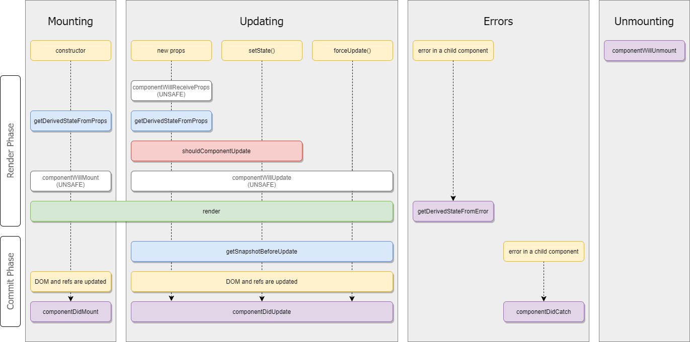

- [Version](#version)
- [Basics](#basics)
  - [Embedding JS into JSX](#embedding-js-into-jsx)
  - [Multiline JSX](#multiline-jsx)
  - [HTML Attributes at JSX](#html-attributes-at-jsx)
- [Components](#components)
  - [Props](#props)
  - [States](#states)
  - [Lifecycles](#lifecycles)
  - [Event Handling](#event-handling)
  - [Conditional Rendering](#conditional-rendering)
  - [List Rendering](#list-rendering)
  - [Fragments](#fragments)
  - [Special Props](#special-props)
    - [props.children](#propschildren)
    - [Render Props](#render-props)
  - [Styling](#styling)
    - [Inline CSS](#inline-css)
    - [CSS-in-JS](#css-in-js)
    - [Styled Components](#styled-components)
    - [CSS Modules](#css-modules)
- [Forms](#forms)
  - [Controlled Component](#controlled-component)
- [Lazy Loading](#lazy-loading)
- [Context](#context)
  - [Creating Context](#creating-context)
  - [Providing Context](#providing-context)
  - [Consuming Context](#consuming-context)
    - [From Class Components](#from-class-components)
    - [From Function Components](#from-function-components)
- [Error Handling (Error Boundary)](#error-handling-error-boundary)
- [Element Refs](#element-refs)
  - [Creating Refs](#creating-refs)
  - [Forwarding Refs](#forwarding-refs)
  - [Accessing Refs](#accessing-refs)
  - [Callback Refs](#callback-refs)
- [Hooks](#hooks)
  - [Rules of Hooks](#rules-of-hooks)
  - [useState](#usestate)
  - [useEffect](#useeffect)
  - [Custom Hooks](#custom-hooks)
- [React Redux](#react-redux)
  - [Install](#install)
- [Best Practices](#best-practices)
  - [Spread Operator](#spread-operator)
  - [Presentational and Container Components](#presentational-and-container-components)
  - [Wrapping a Component (Higher-Order Components)](#wrapping-a-component-higher-order-components)
  - [Project Initiation](#project-initiation)

# Version
* Document created for React version 16.13.1

# Basics

```tsx
// netiher HTML, nor string
// this is JSX
const element = <h1>Hello, Yigit</h1>;
const domElement = document.getElementById('root');

ReactDOM.render(element, domElement);
```

## Embedding JS into JSX
* can be any javascript expr.

```tsx
const name = 'Yigit YUCE';
const element = <h1>Hello, {name}</h1>;
```


## Multiline JSX
* do it with parantheses.

```tsx
const el = (
    <div>
        {content}
    </div>
);
```

## HTML Attributes at JSX
* do it with javascript style

```tsx
const el = (
    <div className="row" id={contentId}>
        {content}
    </div>
);
```

# Components
* Components can be defined as a function or aclass.
* Component names have to start with capital letter.


```tsx
function Welcome(props) {
    return <h1>Hello, {props.name}</h1>;
}
```

```tsx
export default class Welcome extends React.Component {
    public render(): ReactNode {
        return <h1>Hello, {this.props.name}</h1>;
    }
}
```

* use component like below:
```tsx
ReactDOM.render(
    <Welcome name="Yigit"/>, 
    document.getElementById('root')
);
```

## Props
* **Read-only**
* Components must **never modify** its own props.
* super() method should **always be called** with props argument at class constructor.
* Props will be set in the class with `this.props`

## States
* State is similar to props, but it is **private** and **fully controlled by the component**.
* States are defined at constructor.


```tsx
export default class Clock extends React.Component {
    constructor(props) {
        super(props);
        this.state = { date: new Date() };
    }

    public render(): ReactNode {
        return (
            <div>
                Time is {this.state.date.toLocaleTimeString()}
            </div>
        );
    }
}

ReactDOM.render(<Clock />, document.getElementById('root'));
```

* States have to be update with `setState()` function. 
* **Direct update is not valid.**
* New state will be **merged** the original one.

```tsx
this.setState({
    key: 'value'
});
```

* Props and states may be updated asynchronously, you should not rely on their values for calculating the next state.

```tsx
// WRONG
this.setState({
    key: this.state.key + this.props.key,
});
```

* To avoid that you can use function as parameter of setState.
* function's 
  * first argument is the previous state
  * second argument is the props at that time

```tsx
this.setState((state, props) => ({
    key: state.key + props.key,
}));
```


## Lifecycles

* Some of the component lifecycles are:
  * `componentDidMount()`
    * runs once after the component output has been rendered to the DOM
  * `componentWillUnmount()`
    * runs once before the component will be unmounted from the DOM


```tsx
export default class Clock extends React.Component {
    constructor(props) {
        super(props);
        this.state = { date:new Date() };
    }

    public componentDidMount(): void {
        this.timer = setInterval(() => {
            this.setState({ date: new Date() });
        }), 1000);
    }

    public componentWillUnmount(): void {
        clearInterval(this.timer);
    }

    public render(): ReactNode {
        return (
            <div>
                Time is {this.state.date.toLocaleTimeString()}
            </div>
        );
    }
}

ReactDOM.render(<Clock />, document.getElementById('root'));
```





## Event Handling
* Event names are **camelCase**.
* Must be binded this to handler.

```tsx
export default class Button extends Raect.Component {
    constructor (props) {
        super (props);
        this.buttonClicked = this.buttonClicked.bind(this);
    }

    public buttonClicked(ev): void {
        console.log(`${this.props.text} button clicked`);
    }

    
    public buttonMouseDown = (ev): void => {
        console.log(`${this.props.text} button mouse down`);
    }

    public render(): ReactNode {
        return (
            <button onClick={ this.buttonClicked } onMouseDown={ this.buttonMouseDown }>
                { this.props.text }
            </button>
        );
    }
}

ReactDOM.render(<Button text="Login"/>, document.getElementById('root'));
```


## Conditional Rendering
* Conditional rendering is handled at render function with plain javascript if else statements.
* Can be done with inline if statement.
* Component can be **hidden with returning null** at render function.
* You can use variables to store elements. This can help you conditionally render a **part of the component**.

```tsx
const UserGreeting = () => <h1>Welcome back!</h1>;
const GuestGreeting = () => <h1>Please sign up.</h1>;
const Greeting = (props) => props.isLoggedIn ? <UserGreeting /> : <GuestGreeting />;

function LoginButton(props) { return <button onClick={props.onClick}>Login</button>; }
function LogoutButton(props) { return <button onClick={props.onClick}>Logout</button>; }

export default class LoginControl extends React.Component {
    constructor (props) {
        super(props);
        this.handleLoginClick = this.handleLoginClick.bind(this);
        this.handleLogoutClick = this.handleLogoutClick.bind(this);
        this.state = { isLoggedIn: false };
    }

    public handleLoginClick(): void { 
        this.setState({isLoggedIn: true}); 
    }

    public handleLogoutClick(): void { 
        this.setState({isLoggedIn: false}); 
    }
    
    public render(): ReactNode {
        const isLoggedIn = this.state.isLoggedIn;
        let button;

        if (isLoggedIn) {
            button = <LogoutButton onClick={this.handleLogoutClick} />;
        } 
        else {
            button = <LoginButton onClick={this.handleLoginClick} />;
        }

        return (
            <div>
                <Greeting isLoggedIn={isLoggedIn} />
                {button}
            </div>
        );
    }
}

ReactDOM.render(<LoginControl />, document.getElementById('root'));
```


## List Rendering
* It is handled by plain javascript (like array.map, for loop etc.) inside the render function.
* **Key attribute** have to be set for each element.
* Keys should be unique among their **siblings**, don’t need to be **globally** unique.

```tsx
export default class List extends React.Component {
    constructor (props) {
        super(props);
    }

    public render(): ReactNode {
        const elements = (this.props.elements || []).map((el, i) => {
            return <li id={el.id} key={`item_${i}`}> {el.text} </li>;
        });

        return <ul> {elements} </ul>;
    }
}

let elements = [
    {
        id: 'el-1'
        text: 'First Element'
    },
    {
        id: 'el-2'
        text: 'Second Element'
    },
];

ReactDOM.render(<List elements={elements}/>, document.getElementById('root'));
```

* Keys serve as a hint to React but they **don’t get passed** to your components. 
* If you need the same value in your component, **pass it explicitly as a prop** with a different name.

```tsx
const content = posts.map((post) =>
  <Post
    key={post.id}
    id={post.id}
    title={post.title} />
);
```

## Fragments
* used to group sibling root level elements in the component
* it is like Angular's ```<ng-container> ... </ng-container>```
* Fragments declared with the explicit `<React.Fragment>` syntax may have **keys**.


```tsx
export default class Columns extends React.Component {
    public render(): ReactNode {
        return (
            <React.Fragment>
                <td>Hello</td>
                <td>World</td>
            </React.Fragment>
        );
    }
}


// short syntax
export default class Columns extends React.Component {
    public render(): ReactNode {
        return (
            <>
                <td>Hello</td>
                <td>World</td>
            </>
        );
    }
}
```


## Special Props

### props.children
* Some components don’t know their children ahead of time.
* Use the special ```children``` prop to pass children elements directly into their output

```tsx
export const FancyBorder: FC<IFancyBorderProps> = (props) => {
    return (
        <div className={'FancyBorder FancyBorder-' + props.color}>
            { props.children }
        </div>
    );
}

export const WelcomeDialog: FC<IWelcomeDialogProps> = (props) => {
    return (
        <FancyBorder color="blue">
            <h1>Welcome</h1>
            <p> Good to see you again!</p>
        </FancyBorder>
    );
}
```

* Sometimes you might need **multiple “holes”** in a component. 
* In such cases you may come up with **your own convention** instead of using `children`

```tsx
export const Card: FC<ICardProps> = (props) => {
    return (
        <div className={'Card Card-' + props.color}>
            <div className="Title">
                {props.title}
            </div>
            <div className="Content">
                {props.children}
            </div>
            <div className="Footer">
                {props.footer}
            </div>
        </div>
    );
}

export const UserCard: FC<IUserCardProps> = ({user}) => {
    const title = <h1>Dear {user?.name}</h1>;
    const footer = <span>Last seen: {user?.lastSeen?.toString()}</span>;

    return (
        <Card color="blue" title={title} footer={footer}>
            <span>Welcome again!</span>
        </Card>
    );
}
```

* Expressions as Children
```tsx
export const Item: FC<IItemProps> = ({message}) => {
    return <li>{message}</li>;
}

export const Todo: FC<{}> = (props) => {
    const todos = ['finish doc', 'submit pr', 'nag dan to review'];
    return (
        <ul>
            {todos.map(m => <Item key={m} message={m} />)}
        </ul>
    );
}
```

* Functions as Children
  * **props.children** works just like any other prop.
  * It can pass any sort of data, not just the sorts that React knows how to render.

```tsx
function Repeat(props) {
    let items = [];
    for (let i = 0; i < props.numTimes; i++) {
        items.push(props.children(i));
    }
    return <div>{items}</div>;
}

function ListOfTenThings() {
    return (
        <Repeat numTimes={ 10 }>
            {(i) => <div key={i}>This is item {i} in the list</div>}
        </Repeat>
    );
}
```

* Ignored Expressions
  * ```false```, ```null```, ```undefined```, and ```true``` are valid children. 
  * They simply **don’t render**. 
  * Those below are same:

```tsx
<div />

<div></div>

<div>{false}</div>

<div>{null}</div>

<div>{undefined}</div>

<div>{true}</div>
```

### Render Props
* It is a **technique** for sharing code between React components using a **prop whose value is a function**.
* A component with a render prop takes a function that returns a React element and calls it **instead of implementing its own render logic**.
* a render prop is a function that a component uses to know what to render


```tsx
export default class Cat extends React.Component {
    public render(): ReactNode {
        const mouse = this.props.mouse;
        return (
            
        );
    }
}

export default class Mouse extends React.Component {
    constructor(props) {
        super(props);
        this.handleMouseMove = this.handleMouseMove.bind(this);
        this.state = { x: 0, y: 0 };
    }

    public handleMouseMove(event): void {
        this.setState({
            x: event.clientX,
            y: event.clientY
        });
    }

    public render(): ReactNode {
        return (
            <div onMouseMove={this.handleMouseMove}>
                { this.props.render(this.state) }
            </div>
        );
    }
}

export default class MouseTracker extends React.Component {
    public render(): ReactNode {
        return (
            <div>
                <h1>Move the mouse around!</h1>
                <Mouse render={mouse => 
                    <Cat mouse={mouse} />
                }/>
            </div>
        );
    }
}
```
* It’s important to remember that just because the **pattern** is called “**render props**” 
* You **don’t have to use** a prop named render to use this pattern. 
* In fact, any prop that is a function that a component uses to know what to render is technically a “render prop”


## Styling

### Inline CSS
* define styles in javascript way (object with camelCase key)
* then pass it to the component as "style" prop
```tsx
export default class MyComponent extends React.Component {
    constructor(props) {
        super(props);
        this.state = {
            style: {
                color: '#000000',
                backgroundColor: '#ffffff'
            }
        };
    }

    public render(): ReactNode {
        return <div style={this.state.style}>Hello world!</div>;
    }
}
```

### CSS-in-JS

```tsx
// TODO: TBD
```

### Styled Components

```tsx
// TODO: TBD
```

### CSS Modules
* A CSS Module is a CSS file in which all class names and animation names are scoped **locally** by default.
* create-react-app project supports [CSS Modules](https://github.com/css-modules/css-modules) alongside regular stylesheets using the ```[name].module.scss``` file naming convention
* You should add custom typings like below to prevent typescript error.

```ts
// filename: declarations.d.ts
declare module '*.scss' {
	const content: { [className: string]: string };
	export = content;
}
```


```scss
// MyComponent.module.scss
.MyComponent {
	width: 100%;
	height: 100%;
	display: flex;
	flex-direction: column;
	justify-content: center;
	align-items: center;

    :global .text {
        background-color: #cccccc;
        color: #ff0000;

        &.green {
            color: green;
        }
    }
}
```

```tsx
// MyComponent.tsx
import styles from './MyComponent.module.scss';

export default class MyComponent extends React.Component {
    public render(): ReactNode {
        return (
            <div style={styles.MyComponent}>
                <span className="text">Hello</span>
                <span className="text green">World!</span>
                <span className="text">yigityuce</span>
            </div>
        );
    }
}
```

# Forms

* If you’re looking for a complete solution including validation, keeping track of the visited fields, and handling form submission, **Formik** is one of the popular choices

## Controlled Component
* HTML form elements maintain their own state and update it based on user input.
* We can combine them by making the React state be the “**single source of truth**”
* Controlled components are:
  * ```<input type="text">```
  * ```<textarea>```
  * ```<select>```
* Controlled components support:
  * **value** prop
  * **onChanged** event
* Multiple input elements can be controlled with using "name" attribute.


```tsx
export default class NameForm extends React.Component {
    constructor(props) {
        super(props);
        this.state = {
            userName: '',
            userSurname: '' 
        };

        this.handleChange = this.handleChange.bind(this);
        this.handleSubmit = this.handleSubmit.bind(this);
    }

    public handleChange(event): void {
        this.setState({ [event.name]: event.target.value });
    }

    public handleSubmit(event): void {
        console.log(
            'User infos are submitted:', 
            this.state.userName, 
            this.state.userSurname
        );
        event.preventDefault();
    }

    public render(): ReactNode {
        return (
            <form onSubmit={ this.handleSubmit }>
                <label>
                    Name:
                    <input type="text" name="userName"
                        value={ this.state.userName } 
                        onChange={this.handleChange} 
                    />
                </label>
                <label>
                    Surname:
                    <input type="text" name="userSurname"
                        value={ this.state.userSurname } 
                        onChange={this.handleChange} 
                    />
                </label>
                <input type="submit" value="Submit" />
            </form>
        );
    }
}

```

# Lazy Loading

* The React.lazy function lets you render a dynamic import as a regular component.
* Calls the import when first needed
* The lazy component should then be rendered inside a **Suspense** component
* It allows us to show some **fallback content** while we’re waiting for the lazy component to load.
* React.lazy currently only supports **default exports**.
* You can even wrap **multiple lazy components with a single Suspense component**.


```tsx
const OtherComponent = React.lazy(() => import('./OtherComponent'));

export default class MyComponent extends React.Component {
    constructor(props) {
        super(props);
    }

    public render(): ReactNode {
        return (
            <div>
                <Suspense fallback={<div>Loading...</div>}>
                    <OtherComponent />
                </Suspense>
            </div>
        );
    }
}
```

# Context

* Context provides a way to **pass data through the component tree** without having to pass props down manually at every level.
* Context is designed to **share** data that can be considered **“global”** for a **set** of React components.
* Using context, we can avoid passing props through intermediate elements.
* **Built-in alternative for Redux.**

## Creating Context
* When React renders a component that subscribes to this Context object, it will read the current context value from the **closest Provider above it in the tree**.
* The `defaultValue` argument is only used when a component does not have a matching Provider above itself.


```tsx
const initialStore = {
    theme: 'light'
};
const StoreContext = React.createContext(initialStore);
```


## Providing Context
* Every `Context` object comes with a `Provider` React component that allows consuming components to **subscribe to context changes**.

```tsx
export default function App() {
    return (
        <StoreContext.Provider value="{}">
            <Toolbar />
        </StoreContext.Provider>
    )
}
```

## Consuming Context

### From Class Components
* The `contextType` property on a **class** can be assigned a Context object created by `React.createContext()`. 
* This lets you **consume the nearest current value of that Context type** using `this.context`. 
* You can reference this in any of the lifecycle methods including the render function


```tsx
export default class ThemedButton extends React.Component {
    static contextType = StoreContext; // required to use this.context

    public render(): ReactNode {
        return <Button theme={this.context.theme} />;
    }
}
```

### From Function Components
```tsx
    <MyContext.Consumer>
        { store => /* render something based on the context value */ }
    </MyContext.Consumer>
```

* A React component that **subscribes to context changes**. 
* This lets you subscribe to a context within a **function component**.
* The function receives the current context value and returns a **React node**.


# Error Handling (Error Boundary)

* A JavaScript error in a part of the UI shouldn’t break the whole app.
* Error boundaries are React components that catch JavaScript errors anywhere in their **child component** tree, log those errors, and **display a fallback UI**
* Error boundaries work like a JavaScript ``catch {}`` block, but for components.
* Error boundaries only catch errors in the components **below** them in the tree.
* The error will propagate to the closest error boundary above it
* Error boundaries catch errors during:
  * rendering
  * in lifecycle methods
  * in constructors of the whole tree below them
* Error boundaries do ***not*** catch errors for:
  * Event handlers
  * Asynchronous code (setTimeout etc.)
  * Server side rendering
  * Errors thrown in the error boundary itself (rather than its children)
* A class component **becomes an error boundary** if it defines either (or both) of the lifecycle methods `static getDerivedStateFromError()` or `componentDidCatch()`. 
  * Use `static getDerivedStateFromError()` to **render a fallback UI** after an error has been thrown. 
  * Use `componentDidCatch()` to **log error information**.


```tsx
export default class ErrorBoundary extends React.Component {
    constructor(props) {
        super(props);
        this.state = { hasError: false };
    }

    static getDerivedStateFromError(error) {
        // Update state so the next render will show the fallback UI.
        return { hasError: true };
    }

    public componentDidCatch(error, errorInfo): void {
        console.error(error, errorInfo);
    }

    public render(): ReactNode {
        if (this.state.hasError) {
            // Fallback UI for error
            return <h1> Something went wrong. </h1>;
        }

        return this.props.children; 
    }
}

export default class App extends React.Component {
    constructor(props) {
        super(props);
    }

    public render(): ReactNode {
        return (
            <ErrorBoundary>
                <MyWidget />
            </ErrorBoundary>
        );
    }
}
```

# Element Refs
* Refs provide a way to access DOM nodes or React elements created in the render method.
* There are a few good use cases for refs:
  * Managing focus, text selection, or media playback.
  * Triggering imperative animations.
  * Integrating with third-party DOM libraries.
* Avoid using refs for anything that can be done declaratively.

## Creating Refs
* Refs are created using ```React.createRef()``` and attached to React elements via the ref attribute.

```tsx
export default class MyComponent extends React.Component {
	private element: RefObject<HTMLDivElement> = createRef();

    public render(): ReactNode {
        return <div ref={this.element} />;
    }
}
```

```tsx
export const MyComponent: FC<IMyComponentProps> = () => {
	const element = useRef(null);

    return <div ref={this.element} />;
}
```

## Forwarding Refs

> We are just allowed to use `ref` prop with built-in HTML elements. So if we want to use `ref` with our components, we have to modify our component to accept it and forward it to one of its children.

* Ref forwarding is a feature that lets some components take a `ref`, and pass it down (**“forward”** it) to a child.
* You should define the function component to accept the forwarded ref as props by encapsulating it with `forwardRef()`


```tsx
// FILE: MyComponent.tsx
export const MyComponent = forwardRef<HTMLDivElement, IMyComponentProps>((props, ref) => { 
    return (
        <div ref={ref} className="MyComponentContainer">
            {props.children}
        </div>
    );
});

// FILE: any other component which use MyComponent
const ref = createRef<HTMLDivElement>(null);
<MyComponent ref={ref}>User Card!</MyComponent>;
```

* We can directly bind `ref` prop to the class component. 

```tsx
// FILE: MyComponent.tsx
export class MyComponent extends Component {

    constructor(props) {
        super(props);
    }

    public render(): ReactNode {
        const {ref, ...props} = this.props;
        return (
            <div ref={ref} className="MyComponentContainer">
                {props.children}
            </div>
        );
    }
}

// FILE: any other component which use MyComponent
const ref = createRef<HTMLDivElement>(null);
<MyComponent ref={ref}>User Card!</MyComponent>;
```

## Accessing Refs

```tsx
const node = this.myRef.current;
```

## Callback Refs
* Instead of passing a `ref` attribute created by `createRef()`, you pass a function. 
* The function receives the React component instance or HTML DOM element as its argument.
* Then it can be stored and accessed elsewhere.
* [**!Important**] If the ref callback is defined as an inline function, it will get called **twice** during updates, first with **null** and then again with the DOM element. 
* React will call the ref callback with the `DOM element` **when the component mounts**, and call it with `null` **when it unmounts**. 
* Refs are guaranteed to be up-to-date before `componentDidMount` or `componentDidUpdate` fires.


```tsx
export default class CustomTextInput extends React.Component {
    constructor(props) {
        super(props);
        this.textInput: HtmlInputElement = null;
        this.focus = this.focus.bind(this);
        this.setRef = this.setRef.bind(this);
    }
    
    public focus(): void {
        this.textInput?.focus();
    }

    public setRef(element: HtmlInputElement): void {
        this.textInput = element;
    }

    public componentDidMount(): void {
        this.focus();
    }

    public render(): ReactNode {
        return (
            <div>
                <input type="text" ref={this.setRef} />
                <button type="button" onClick={this.focus}> Focus the text input </button>
            </div>
        );
    }
}
```


# Hooks

* Hooks are back-compatible.
* Hooks don’t work inside classes — they let you use React **without** classes.
* Hooks allow you to reuse stateful logic without changing your component hierarchy
* You won't be needed to use HOC (higher-order components), render props etc. abstraction layers
* Hooks let you split one component into smaller functions based on what pieces are related (such as setting up a subscription or fetching data)
* React provides a few built-in Hooks.
* You can also create your own Hooks to reuse stateful behavior between different components.

## Rules of Hooks

* Only call Hooks at the top level. **Don’t** call Hooks inside loops, conditions, or nested functions.
* Only call Hooks from **function components**.

## useState
* Returns array with two items
  * state variable
  * state variable setter (mutation) function
* Takes an argument which is the initial value of state variable


```tsx
const [count, setCount]: [number, (number) => void ] = setState(0);

console.log(count); // prints 0
setCount(1);
console.log(count); // prints 1
```

## useEffect
* The effect Hook adds the ability to perform **side effects** from a function component. 
* It serves the same purpose as `componentDidMount`, `componentDidUpdate`, and `componentWillUnmount` in class components.
* Runs your “effect” function **after flushing changes to the DOM**.
* By default, it runs both **after the first render** and **after every update**

```tsx
import React, { useState, useEffect } from 'react';

export const Example: FC<{}> = () => {
    const [count, setCount] = useState(0);

    // Similar to componentDidMount and componentDidUpdate:
    useEffect(() => (document.title = `You clicked ${count} times`));

    return <button onClick={() => setCount(count + 1)}>Click me</button>;
}
```


* Effects may also optionally specify how to **“clean up”** after them by returning a function.
* In this example, React would unsubscribe from subscription when the component:
  * **unmounts** and 
  * as well as **before re-running the effect** due to a re-render

```tsx
import React, { useState, useEffect } from 'react';

export const OnlineStatus: FC<{}> = () => {
    const [isOnline, setIsOnline] = useState(null);
    const handleStatusChange = (status) => setIsOnline(status.isOnline);

    useEffect(() => {
        const subscription = SomeService.isOnlineStatus$.subscribe(handleStatusChange);
        return () => subscription.unsubscribe();
    });

    if (isOnline === null) return 'Loading...';
    return isOnline ? 'Online' : 'Offline';
}
```

* There is no special code for handling **updates** because `useEffect` handles them by default. 
* It **cleans up the previous effects** before **applying the next effects**
* In some cases, cleaning up or applying the effect after every render might create a **performance problem**.
* You can tell `useEffect` hook to **skip** applying an effect if certain values haven’t changed between re-renders **by passing optional second parameter list of state variable or prop**. 

```tsx
useEffect(() => {
  document.title = `You clicked ${count} times`;
}, [count]); // Only re-run the effect if "count" changes
```

* If you want to run an effect and clean it up **only once (on mount and unmount)**, you can pass an empty array (`[]`) as a second argument. 
* This tells React that your effect doesn’t depend on any values from props or state, so it never needs to re-run.
* It works like `componentDidMount` in class components.

## Custom Hooks
* Sometimes, we want to **reuse some stateful logic** between components.
* The state of each component is completely **independent**. 
* Hooks are a way to reuse stateful logic, not state itself. 
* In fact, each call to a Hook has a completely **isolated state** — so you can even use the same custom Hook **more than once** in a component.
* If a function’s name starts with `use` and it **calls other Hooks**, we say it is a custom Hook.

```tsx
// FILE: src/hooks/useOnlineStatus.ts

import React, { useState, useEffect } from 'react';

export const useOnlineStatus = (initial: boolean | null) => {
    const [isOnline, setIsOnline] = useState(initial);
    const handleStatusChange = (status) => setIsOnline(status.isOnline);

    useEffect(() => {
        const subscription = SomeService.isOnlineStatus$.subscribe(handleStatusChange);
        return () => subscription.unsubscribe();
    });

    return isOnline;
}
```

```tsx
// FILE: src/features/connectivity/OnlineStatus.tsx

export const OnlineStatus: FC<{}> = () => {
    const isOnline = useOnlineStatus(null);

    if (isOnline === null) return 'Loading...';
    return isOnline ? 'Online' : 'Offline';
}
```


# React Redux

## Install
```sh
npm i react-redux
npm i -D redux-devtools
```


# Best Practices

## Spread Operator

* If you already have `props` as an **object**, and you want to pass to component, you can use `...` as a **“spread” operator** to pass the whole props object.

```tsx
export const MyComponent: FC = () => {
  const props = {firstName: 'Ben', lastName: 'Hector'};
  return <Greeting {...props} />;
}
```

* You can extract specific key-value pair from object with using spread operator.

```tsx

export interface IMyComponentProps {
    width: string;
    onClick: () => void; 
}

export const MyComponent: FC<IMyComponentProps> = (props) => {
    const { width, onClick, children, ...rest } = props;
    return (
        <div style={{ width }} onClick={onClick}>
            { children }
        </div>
    );
}

// or even better
export const MyComponent: FC<IMyComponentProps> = ({ width, onClick, children, ...rest }) => {
    return (
        <div style={{ width }} onClick={onClick}>
            { children }
        </div>
    );
}
```

## Presentational and Container Components

|                | Presentational Components        | Container Components |
| ---            | ---                              | ---                                            |
| Purpose        | How things look (markup, styles) | How things work (data fetching, state updates) |
| Aware of Redux | No                               | Yes                                            |
| To read data   | Read data from props             | Subscribe to Redux state                       |
| To change data | Invoke callbacks from props      | Dispatch Redux actions                         |

## Wrapping a Component (Higher-Order Components)

* Wrap components that have same logic with small differents
* **Transforms** a component into another component
* Improves re-usability

```tsx
function someWrapper(WrappedComponent) {
    return class extends React.Component {
        constructor(props) {
            super(props);
        }

        public componentDidUpdate(prevProps): void {
            console.log('old props:', prevProps);
            console.log('new props:', this.props);
        }

        public render(): ReactNode {
            return <WrappedComponent {...this.props} />;
        }
    }
}
```

* Don’t Mutate the Original Component
* Refs Aren’t Passed Through
* Static Methods Must Be Copied Over

```tsx
function enhance(WrappedComponent) {
    class Enhance extends React.Component {/*...*/}
    // Must know exactly which method(s) to copy :(
    Enhance.staticMethod = WrappedComponent.staticMethod;
    return Enhance;
}
```

## Project Initiation

* Init typescript project & use npm
```sh
npx create-react-app _APPNAME_ --use-npm --template typescript
```

* Integrate default project files like prettier, linter configs etc

```sh
git clone https://github.com/yigityuce/fe-project-config.git
cp -r fe-project-config/* _APPNAME_/
```

* Add sass support

```sh
npm i -D node-sass
```

* Create services, components and pages dir

```
mkdir _APPNAME_/src/components
mkdir _APPNAME_/src/services
mkdir _APPNAME_/src/pages
```