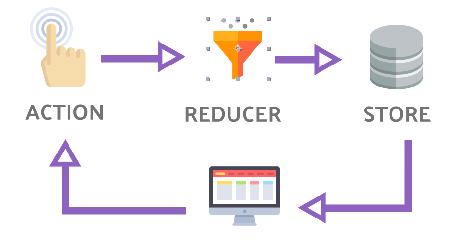

- [Overview](#overview)
  - [Data Flow](#data-flow)
- [Actions](#actions)
- [Reducers](#reducers)
  - [Reducer Composition](#reducer-composition)
- [Store](#store)
  - [Subscribing to Store](#subscribing-to-store)
  - [Dispatching Actions](#dispatching-actions)
- [Middleware](#middleware)
  - [Redux-Thunk Middleware (Async Operations)](#redux-thunk-middleware-async-operations)
- [Async](#async)
  - [Async Actions](#async-actions)


# Overview


## Data Flow
* The data lifecycle in any Redux app follows these 4 steps:
  * **You** call ```store.dispatch(action)```
  * **The Redux store** calls the **reducer function** you gave it
    * With two argument; **current state** and the **action**
  * **The root reducer** may combine the output of multiple reducers into a single state tree
  * **The Redux store** saves the complete state tree returned by the root reducer


# Actions
* Plain objects
* "type" field is required

```js
{ type: 'COMPLETE_TODO', index: 1 } // Action 1
{ type: 'TOGGLE_TODO', index: 1 } // Action 2
{ type: 'SET_VISIBILITY_FILTER', filter: 'SHOW_COMPLETED' } // Action 3
// ...
```
# Reducers
* Pure functions
* Signature ```(state, action) => state```
* Does not mutate the input state, returns next state

```js
function counter(state = 0, action) {
  switch (action.type) {
    case 'INCREMENT':
      return state + 1
    case 'DECREMENT':
      return state - 1
    default:
      return state
  }
}

let store = createStore(counter);
```

* Things you should never do inside a reducer:
  * Mutate its arguments
  * Perform side effects like API calls and routing transitions
  * Call non-pure functions, e.g. ```Date.now()``` or ```Math.random()```
* Given the same arguments, it should calculate the next state and return it. 
  * No surprises. 
  * No side effects. 
  * No API calls.
  * No mutations. 
  * Just a calculation.

## Reducer Composition
```js 
// splitted reducers by business logic, feature, functionality etc...
// merge them into a single reducer while creating store

// Reducer for "visibilityFilter" feature
const initialState = 'SHOW_ALL';

function visibilityFilter(state = initialState, action) {
  if (action.type === 'SET_VISIBILITY_FILTER') {
    return action.filter
  } else {
    return state
  }
}

// Reducer for "todos" feature
const initialState = [];

function todos(state = initialState, action) {
  switch (action.type) {
    case 'ADD_TODO': { return state.concat([{ text: action.text, completed: false }]); }
    case 'TOGGLE_TODO':
      return state.map((todo, i) => action.index === i ? { text: todo.text, completed: !todo.completed } : todo)
    default:
      return state
  }
}

// merged reducer for store
const initialState = {};

function todoApp(state = initialState, action) {
  return {
    todos: todos(state.todos, action),
    visibilityFilter: visibilityFilter(state.visibilityFilter, action)
  }
}

const store = createStore(todoApp);
```

```js
// better way to merge/combine reducers (combineReducer method):
import { combineReducers, createStore } from 'redux';
const todoApp = combineReducers({ visibilityFilter, todos });
const store = createStore(todoApp);
```

* Note that each of these reducers is managing its **own part** of the global state
* Each reducer is **independent** from other


# Store
* Creates singleton store with using reducer
* The store has the following responsibilities:
  * Holds application state
  * Allows access to state via ```getState()```
  * Allows state to be updated via ```dispatch(action)```
  * Registers listeners via ```subscribe(listener)```
  * Handles unregistering of listeners via the function returned by ```subscribe(listener)```

## Subscribing to Store
* Subscribe method returns a function which you can use while unsubscribing

```ts
const unsubscribe = store.subscribe(() => console.log(store.getState()));

// ... do some fancy stuff

unsubscribe(); // Stop listening to state updates
```

```ts
// RxJS way
const storeObservable = new Observable(subscriber => {
  return store.subscribe(() => subscriber.next(store.getState()));
});


const subscription = storeObservable.subscribe(state => console.log(state));

// ... do some fancy stuff

subscription.unsubscribe();
```


## Dispatching Actions


```ts
store.dispatch(addTodo('Learn about actions'));
store.dispatch(toggleTodo(0));
store.dispatch(setVisibilityFilter(VisibilityFilters.SHOW_COMPLETED));
```

# Middleware
* With a plain basic Redux store, you can only do simple synchronous updates by dispatching an action.
* Middleware **extend** the store's abilities, and let you write **async** logic that interacts with the store.
* Without middleware, Redux store only supports **synchronous** data flow.
* Any middleware you use can then intercept anything you dispatch, and in turn, can pass actions to the next middleware in the chain.
* When the last middleware in the chain dispatches an action, it has to be a **plain object**.
* It provides a third-party extension point **between dispatching an action, and the moment it reaches the reducer**
* Middlewares can be used for:
  * logging
  * crash reporting
  * talking to an asynchronous API
  * routing
  * and more...

## Redux-Thunk Middleware (Async Operations)
* Redux Thunk middleware allows you to write action creators that return a **function** instead of an action object. 
* The thunk can be used
  * to delay the dispatch of an action
  * to dispatch only if a certain condition is met
* The inner function receives the store methods **dispatch** and **getState** as parameters.
* Github Link: [Redux-Thunk](https://github.com/reduxjs/redux-thunk)

```ts
const INCREMENT_COUNTER = 'INCREMENT_COUNTER';

function increment() {
  return { type: INCREMENT_COUNTER };
}

function incrementAsync() {
  return (dispatch) => {
    setTimeout(() => dispatch(increment()), 1000);
  };
}

// ...

import thunk from 'redux-thunk';
const store = createStore(rootReducer, applyMiddleware(thunk));

// ...
```

# Async

## Async Actions
* We have to use middlewares to handle async operations [Redux-Thunk Middleware (Async Operations)](#redux-thunk-middleware-async-operations)
* We need to create **synchronous** actions to be used
  * before the async operation is started (to inform user - like showing loading spinner)
  * after the async operation is finished (to save the results and to inform user)
  * if the error occurs during the async operation (to inform user)
* We need to create **asynchronous** action which returns a **function** instead of an action object
  * See an example on the [Redux-Thunk Middleware (Async Operations)](#redux-thunk-middleware-async-operations) part

