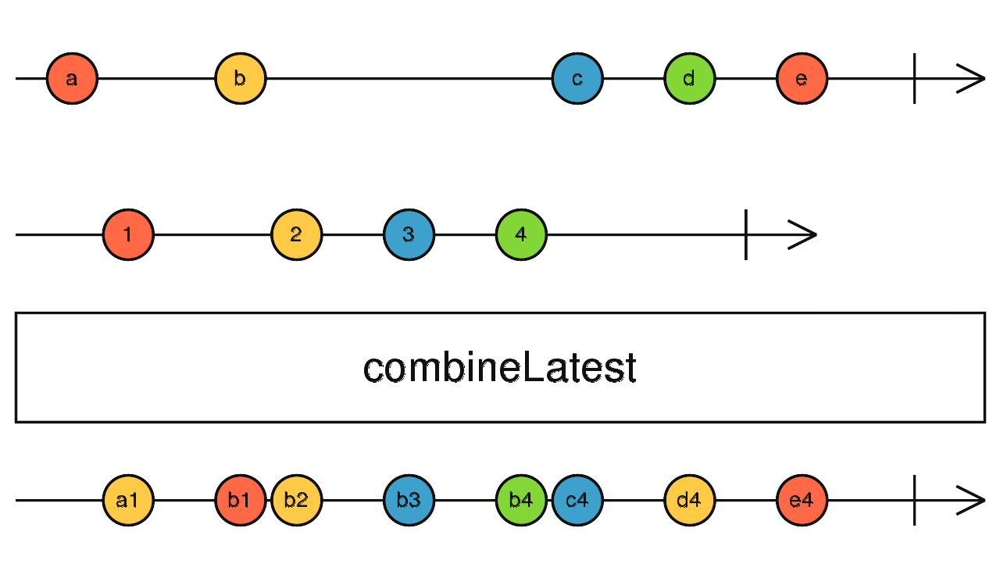
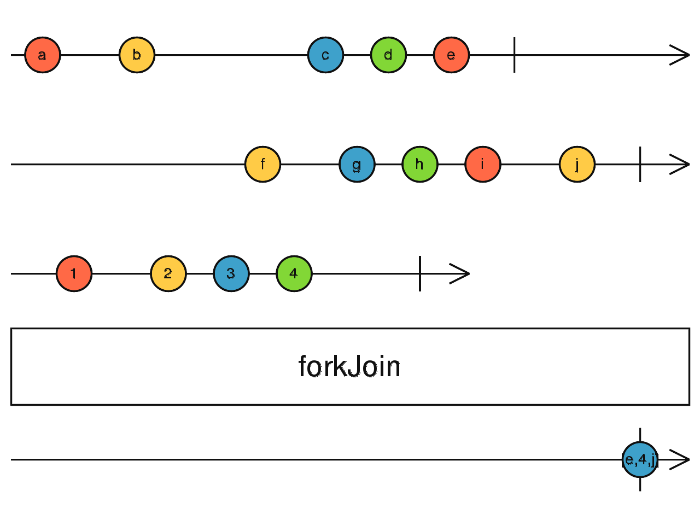
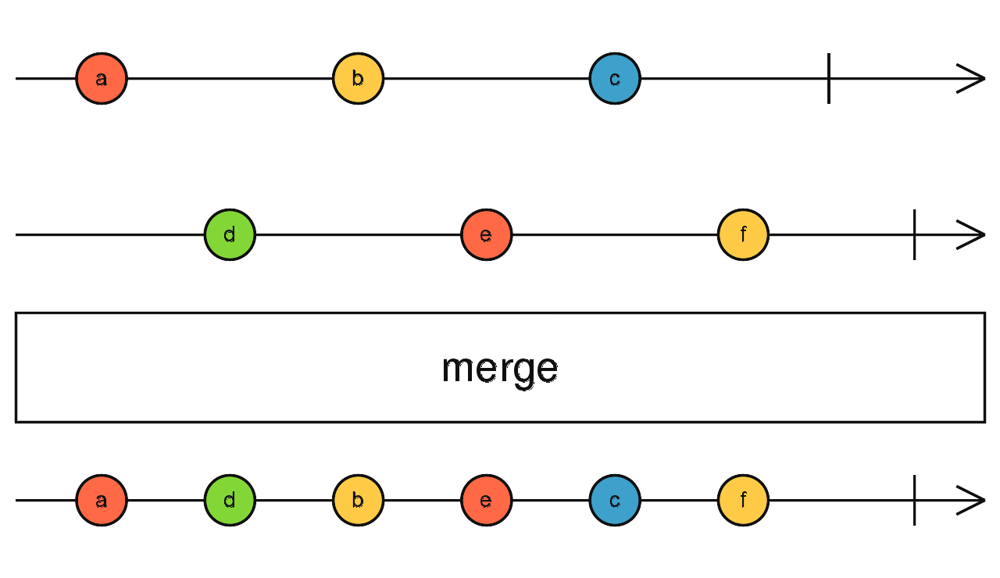

- [General](#general)
  - [Marble Diagrams](#marble-diagrams)
- [Observables](#observables)
  - [Executing Observables](#executing-observables)
  - [Creating with "new Observable()"](#creating-with-new-observable)
  - [Creating with "create()"](#creating-with-create)
  - [Creating with "ajax()"](#creating-with-ajax)
  - [Creating with "defer()"](#creating-with-defer)
  - [Creating with "empty()"](#creating-with-empty)
  - [Creating with "from()"](#creating-with-from)
  - [Creating with "fromEvent()"](#creating-with-fromevent)
  - [Creating with "generate()"](#creating-with-generate)
  - [Creating with "interval()"](#creating-with-interval)
  - [Creating with "of()"](#creating-with-of)
  - [Creating with "range()"](#creating-with-range)
  - [Creating with "throwError()"](#creating-with-throwerror)
  - [Creating with "timer()"](#creating-with-timer)
  - [Creating with "iif()"](#creating-with-iif)
  - [Creating with "combineLatest()"](#creating-with-combinelatest)
  - [Creating with "concat()"](#creating-with-concat)
  - [Creating with "forkJoin()"](#creating-with-forkjoin)
  - [Creating with "merge()"](#creating-with-merge)
  - [Creating with "race()"](#creating-with-race)
  - [Creating with "zip()"](#creating-with-zip)
- [Operators](#operators)
  - [Creating Custom Operator](#creating-custom-operator)
- [Subsription (Disposable)](#subsription-disposable)
  - [Unsubscribing (Disposing)](#unsubscribing-disposing)

# General

- This document written for RxJS version 6.x
- RxJS is a library for composing asynchronous and event-based programs by using observable sequences.
- It provides:
  - one core type, the Observable,
  - satellite types (Observer, Schedulers, Subjects)
  - operators to allow handling asynchronous events as collections
- The essential concepts in RxJS which solve async event management are:
  - **Observable**: represents the idea of an invokable collection of future values or events.
  - **Observer**: is a collection of callbacks that knows how to listen to values delivered by the Observable.
  - **Subscription**: represents the execution of an Observable, is primarily useful for cancelling the execution.
  - **Operators**: are pure functions that enable a functional programming style of dealing with collections with operations like map, filter, concat, reduce, etc.
  - **Subject**: is the equivalent to an EventEmitter, and the only way of multicasting a value or event to multiple Observers.
  - **Schedulers**: are centralized dispatchers to control concurrency, allowing us to coordinate when computation happens on e.g. setTimeout or requestAnimationFrame or others.
- You need to:
  - subscribe the "**observable**"
  - with "**observer**" definiton of what you are going to do when something happened
  - then you must unsubscribe the "**subscription**"
  - optionally you can define pipeline with "**operators**" for "**observable**"

## Marble Diagrams

- **Marble Diagrams** are visual representations of how operators work, and include the input Observable(s), the operator and its parameters, and the output Observable.


# Observables

## Executing Observables

- There are three types of values an Observable Execution can deliver:
  - "**Next**" notification: sends a value such as a Number, a String, an Object, etc.
  - "**Error**" notification: sends a JavaScript Error or exception.
  - "**Complete**" notification: does not send a value.

## Creating with "new Observable()"

```ts
const observable = new Observable((subscriber: Observer<string>) => {
  setInterval(() => {
    subscriber.next("hi");
  }, 1000);
});
```

## Creating with "create()"

- Same as `new Observable()`

```ts
const observable = Observable.create((subscriber: Observer<string>) => {
  setInterval(() => {
    subscriber.next("hi");
  }, 1000);
});
```

## Creating with "ajax()"

- It creates an observable for an Ajax request

```ts
ajax(`https://api.github.com/users?per_page=5`);

ajax.getJSON(`https://api.github.com/users?per_page=5`);

ajax({
  url: "https://httpbin.org/delay/2",
  method: "POST",
  headers: {
    "Content-Type": "application/json",
    "rxjs-custom-header": "Rxjs"
  },
  body: {
    rxjs: "Hello World!"
  }
});
```

## Creating with "defer()"

- Creates the Observable lazily, that is, only when it is subscribed.
- calls an Observable factory to make an Observable for each new Observer.

```ts
defer(() => {
  return Math.random() > 0.5 ? fromEvent(document, "click") : interval(1000);
});
```

## Creating with "empty()"

- Creates an Observable that emits no items to the Observer
- immediately emits a **complete** notification.

```ts
interval(1000).pipe(
  mergeMap(x => {
    return x % 2 === 1 ? of("a", "b", "c") : empty();
  })
);
```

## Creating with "from()"

- Creates an Observable from:
  - an Array,
  - an array-like object,
  - a Promise,
  - an iterable object,
  - an Observable-like object

```ts
from([10, 20, 30]); // 10 // 20 // 30
from(Promise.resolve("Hello"));
from("hello"); // 'h' // 'e' // 'l' // 'l' // 'o'
```

## Creating with "fromEvent()"

- Creates an Observable from DOM events, or Node.js EventEmitter events or others.
- Every time resulting Observable is subscribed, event handler function will be registered to event target on given event type.
- When that event fires, value passed as a first argument to registered function will be emitted by output Observable.
- When Observable is unsubscribed, function will be unregistered from event target.
- Supports following types of event targets
  - **DOM EventTarget**:
    - This is an object with **addEventListener** and **removeEventListener** methods.
  - **Node.js EventEmitter**
    - An object with **addListener** and **removeListener** methods.
  - **JQuery-style event target**
    - An object with on and off methods
  - **DOM NodeList**
    - List of DOM Nodes, returned for example by `document.querySelectorAll`.

```ts
// signature
fromEvent<T>(target: FromEventTarget<T>, eventName: string, options?: EventListenerOptions | ((...args: any[]) => T), resultSelector?: ((...args: any[]) => T)): Observable<T>


fromEvent(document, 'click');
```

## Creating with "generate()"

- Generates an observable sequence by running a state-driven **loop** producing the sequence's elements

```ts
// signature
generate<T, S>(initialStateOrOptions: S | GenerateOptions<T, S>, condition?: ConditionFunc<S>, iterate?: IterateFunc<S>, resultSelectorOrObservable?: (ResultFunc<S, T>) | SchedulerLike, scheduler?: SchedulerLike): Observable<T>

generate(0, (x) => x < 3, (x) => x + 1); // 0 // 1 // 2
```

## Creating with "interval()"

- Creates an Observable that emits **sequential numbers** every specified **interval** of time

```ts
interval(1000);
```

## Creating with "of()"

- Converts the **arguments** to an observable sequence.

```ts
of(10, 20, 30); // 10 // 20 // 30
of([10, 20, 30]); // [10, 20, 30]
of("hello", "world");
```

## Creating with "range()"

- Creates an Observable that emits a sequence of numbers within a specified range.

```ts
// signature
range(start: number = 0, count?: number, scheduler?: SchedulerLike): Observable<number>

range(1, 5) // 1 // 2 // 3 // 4 // 5
```

## Creating with "throwError()"

- Creates an Observable that emits no items to the Observer
- immediately emits an **error** notification.

```ts
interval(1000).pipe(
  mergeMap(x => {
    return x === 2 ? throwError("Twos are bad") : of("a", "b", "c");
  })
);

// a
// b
// c
// a
// b
// c
// Twos are bad
```

## Creating with "timer()"

- Creates an Observable that starts emitting after an dueTime
- then emits increasing numbers after each period of time
- Its like interval, but you can specify when should the emissions start

```ts
// signature
timer(dueTime: number | Date = 0, periodOrScheduler?: number | SchedulerLike, scheduler?: SchedulerLike): Observable<number>

timer(3000, 1000)
```

## Creating with "iif()"

- Decides at subscription time which Observable will actually be subscribed.
- iif accepts a condition function and two Observables.
- When an Observable returned by the operator is **subscribed**, condition function will be called.

```ts
// signature
iif<T, F>(condition: () => boolean, trueResult: SubscribableOrPromise<T> = EMPTY, falseResult: SubscribableOrPromise<F> = EMPTY): Observable<T | F>

let subscribeToFirst;
const firstOrSecond = iif(
  () => subscribeToFirst,
  of('first'),
  of('second'),
);

subscribeToFirst = true;
firstOrSecond.subscribe(value => console.log(value));
// "first"

subscribeToFirst = false;
firstOrSecond.subscribe(value => console.log(value));
// "second"
```

## Creating with "combineLatest()"

- Combines multiple Observables to create an Observable whose values are calculated from the latest values of each of its input Observables.
- Whenever any input Observable emits a value, it computes a formula using the latest values from all the inputs, then emits the output of that formula.
- if you pass n Observables to operator, returned Observable will always emit an **array** of n values, in order corresponding to **order of** passed Observables
- even if some Observable **completes**, result of combineLatest will still emit values when other Observables do.
- if any Observable **errors**, combineLatest will error immediately as well, and all other Observables will be unsubscribed



```ts
const firstTimer = timer(0, 1000); // emit 0, 1, 2... after every second, starting from now
const secondTimer = timer(500, 1000); // emit 0, 1, 2... after every second, starting 0,5s from now
const combinedTimers = combineLatest(firstTimer, secondTimer);
// Logs
// [0, 0] after 0.5s
// [1, 0] after 1s
// [1, 1] after 1.5s
// [2, 1] after 2s
```

## Creating with "concat()"

- Creates an output Observable which **sequentially** emits all values from given Observable and then moves on to the next.
- Concatenates multiple Observables together by **sequentially** emitting their values, one Observable after the other
- if some input Observable **never completes**, concat will also never complete and Observables following the one that did not complete will never be subscribed.
- If any Observable in chain **errors**, instead of passing control to the next Observable, concat will error immediately as well.


```ts
const timer = interval(1000).pipe(take(4));
const sequence = range(1, 10);
const result = concat(timer, sequence);

// results in:
// 0 -1000ms-> 1 -1000ms-> 2 -1000ms-> 3 -immediate-> 1 ... 10
```

## Creating with "forkJoin()"

- Wait for Observables to complete and then combine last values they emitted.
- Accepts:
  - an Array of ObservableInput or
  - a dictionary Object of ObservableInput
- Returns an Observable that emits either:
  - an array of values in the exact same order as the passed array, or
  - a dictionary of values in the same shape as the passed dictionary.



```ts
const observable = forkJoin({
  foo: of(1, 2, 3, 4),
  bar: Promise.resolve(8),
  baz: timer(4000)
});
// Logs:
// { foo: 4, bar: 8, baz: 0 } after 4 seconds

const observable = forkJoin([of(1, 2, 3, 4), Promise.resolve(8), timer(4000)]);
// Logs:
// [4, 8, 0] after 4 seconds
```

## Creating with "merge()"

- **Flattens** multiple Observables together by blending their values into **one** Observable.
- Creates an output Observable which concurrently emits all values from every given input Observable



```ts
const clicks = fromEvent(document, "click");
const timer = interval(1000);
const clicksOrTimer = merge(clicks, timer);

// Results in the following:
// timer will emit ascending values, one every second(1000ms) to console
// clicks logs MouseEvents to console everytime the "document" is clicked
```

## Creating with "race()"

- Returns an Observable that mirrors the first source Observable to emit an item.

```ts
const obs1 = interval(1000).pipe(mapTo("fast one"));
const obs2 = interval(3000).pipe(mapTo("medium one"));
const obs3 = interval(5000).pipe(mapTo("slow one"));

race(obs3, obs1, obs2);

// result:
// 'fast one'
```

## Creating with "zip()"

- Combines multiple Observables to create an Observable whose values are calculated from the values, in order, of each of its input Observables.

```ts
const eventTime = eventName =>
  fromEvent(document, eventName).pipe(map(() => new Date()));

const mouseClickDuration = zip(
  eventTime("mousedown"),
  eventTime("mouseup")
).pipe(map(([start, end]) => Math.abs(start.getTime() - end.getTime())));
```

# Operators

- Operators are functions.
- There are two kinds of operators:
  - **Pipeable Operators**:
    - are the kind that can be piped to **Observables** using the syntax `observableInstance.pipe(operator())`
    - When called, they do not change the existing Observable instance, they return a **new Observable**.
    - A Pipeable Operator is essentially a pure function which takes one Observable as input and generates another Observable as output.
    - Subscribing to the output Observable will also subscribe to the input Observable.
  - **Creation Operators**:
    - are the other kind of operator, which can be called as standalone functions to create a new Observable.

## Creating Custom Operator

- You must
  - implement all three Observer functions, next(), error(), and complete() when subscribing to the input Observable.
  - implement a "teardown" function that cleans up when the Observable completes (in this case by unsubscribing and clearing any pending timeouts).
  - return that teardown function from the function passed to the Observable constructor.

```ts
import { Observable } from "rxjs";

function delay(delayInMillis) {
  return observable =>
    new Observable(observer => {
      // this function will called each time this
      // Observable is subscribed to.
      const allTimerIDs = new Set();
      const subscription = observable.subscribe({
        next(value) {
          const timerID = setTimeout(() => {
            observer.next(value);
            allTimerIDs.delete(timerID);
          }, delayInMillis);
          allTimerIDs.add(timerID);
        },
        error(err) {
          observer.error(err);
        },
        complete() {
          observer.complete();
        }
      });
      // the return value is the teardown function,
      // which will be invoked when the new
      // Observable is unsubscribed from.
      return () => {
        subscription.unsubscribe();
        allTimerIDs.forEach(timerID => {
          clearTimeout(timerID);
        });
      };
    });
}
```

# Subsription (Disposable)

- A Subscription has one important method, unsubscribe, that takes no argument and just disposes the resource held by the subscription

## Unsubscribing (Disposing)

- Because Observable Executions may be infinite, and it's common for an Observer to want to abort execution in finite time, we need an API for canceling an execution.
- Since each execution is exclusive to one Observer only, once the Observer is done receiving values, it has to have a way to stop the execution, in order to avoid wasting computation power or memory resources.

```ts
import { from } from "rxjs";

const observable = from([10, 20, 30]);
const subscription = observable.subscribe(x => console.log(x));
// Later:
subscription.unsubscribe();
```
