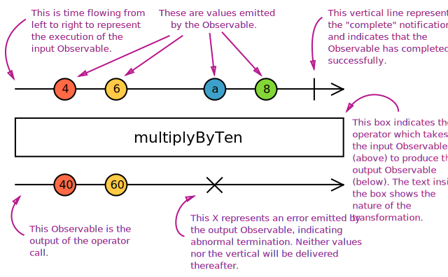

- [General](#general)
  - [Marble Diagrams](#marble-diagrams)
- [Observables](#observables)
  - [Executing Observables](#executing-observables)
  - [Creating with "new Observable()"](#creating-with-new-observable)
  - [Creating with "ajax()"](#creating-with-ajax)
- [Operators](#operators)
  - [Creating Custom Operator](#creating-custom-operator)
- [Subsription (Disposable)](#subsription-disposable)
  - [Unsubscribing (Disposing)](#unsubscribing-disposing)

# General

- This document written for RxJS version 6.x
- RxJS is a library for composing asynchronous and event-based programs by using observable sequences.
- It provides:
  - one core type, the Observable,
  - satellite types (Observer, Schedulers, Subjects)
  - operators to allow handling asynchronous events as collections
- The essential concepts in RxJS which solve async event management are:
  - **Observable**: represents the idea of an invokable collection of future values or events.
  - **Observer**: is a collection of callbacks that knows how to listen to values delivered by the Observable.
  - **Subscription**: represents the execution of an Observable, is primarily useful for cancelling the execution.
  - **Operators**: are pure functions that enable a functional programming style of dealing with collections with operations like map, filter, concat, reduce, etc.
  - **Subject**: is the equivalent to an EventEmitter, and the only way of multicasting a value or event to multiple Observers.
  - **Schedulers**: are centralized dispatchers to control concurrency, allowing us to coordinate when computation happens on e.g. setTimeout or requestAnimationFrame or others.
- You need to:
  - subscribe the "**observable**"
  - with "**observer**" definiton of what you are going to do when something happened
  - then you must unsubscribe the "**subscription**"
  - optionally you can define pipeline with "**operators**" for "**observable**"

## Marble Diagrams

- **Marble Diagrams** are visual representations of how operators work, and include the input Observable(s), the operator and its parameters, and the output Observable.



# Observables

## Executing Observables

- There are three types of values an Observable Execution can deliver:
  - "**Next**" notification: sends a value such as a Number, a String, an Object, etc.
  - "**Error**" notification: sends a JavaScript Error or exception.
  - "**Complete**" notification: does not send a value.

## Creating with "new Observable()"

```ts
import { Observable, Observer } from "rxjs";

const observable = new Observable((subscriber: Observer<string>) => {
  setInterval(() => {
    subscriber.next("hi");
  }, 1000);
});
```

## Creating with "ajax()"

- It creates an observable for an Ajax request

```ts
ajax(`https://api.github.com/users?per_page=5`);

ajax.getJSON(`https://api.github.com/users?per_page=5`);

ajax({
  url: "https://httpbin.org/delay/2",
  method: "POST",
  headers: {
    "Content-Type": "application/json",
    "rxjs-custom-header": "Rxjs"
  },
  body: {
    rxjs: "Hello World!"
  }
});
```

# Operators

- Operators are functions.
- There are two kinds of operators:
  - **Pipeable Operators**:
    - are the kind that can be piped to **Observables** using the syntax `observableInstance.pipe(operator())`
    - When called, they do not change the existing Observable instance, they return a **new Observable**.
    - A Pipeable Operator is essentially a pure function which takes one Observable as input and generates another Observable as output.
    - Subscribing to the output Observable will also subscribe to the input Observable.
  - **Creation Operators**:
    - are the other kind of operator, which can be called as standalone functions to create a new Observable.

## Creating Custom Operator

- You must
  - implement all three Observer functions, next(), error(), and complete() when subscribing to the input Observable.
  - implement a "teardown" function that cleans up when the Observable completes (in this case by unsubscribing and clearing any pending timeouts).
  - return that teardown function from the function passed to the Observable constructor.

```ts
import { Observable } from "rxjs";

function delay(delayInMillis) {
  return observable =>
    new Observable(observer => {
      // this function will called each time this
      // Observable is subscribed to.
      const allTimerIDs = new Set();
      const subscription = observable.subscribe({
        next(value) {
          const timerID = setTimeout(() => {
            observer.next(value);
            allTimerIDs.delete(timerID);
          }, delayInMillis);
          allTimerIDs.add(timerID);
        },
        error(err) {
          observer.error(err);
        },
        complete() {
          observer.complete();
        }
      });
      // the return value is the teardown function,
      // which will be invoked when the new
      // Observable is unsubscribed from.
      return () => {
        subscription.unsubscribe();
        allTimerIDs.forEach(timerID => {
          clearTimeout(timerID);
        });
      };
    });
}
```

# Subsription (Disposable)

- A Subscription has one important method, unsubscribe, that takes no argument and just disposes the resource held by the subscription

## Unsubscribing (Disposing)

- Because Observable Executions may be infinite, and it's common for an Observer to want to abort execution in finite time, we need an API for canceling an execution.
- Since each execution is exclusive to one Observer only, once the Observer is done receiving values, it has to have a way to stop the execution, in order to avoid wasting computation power or memory resources.

```ts
import { from } from "rxjs";

const observable = from([10, 20, 30]);
const subscription = observable.subscribe(x => console.log(x));
// Later:
subscription.unsubscribe();
```
