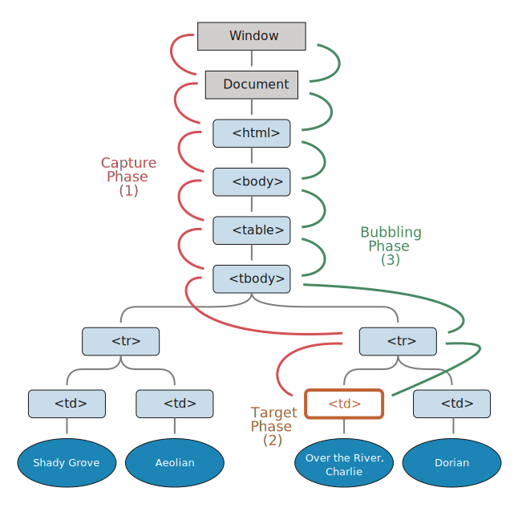
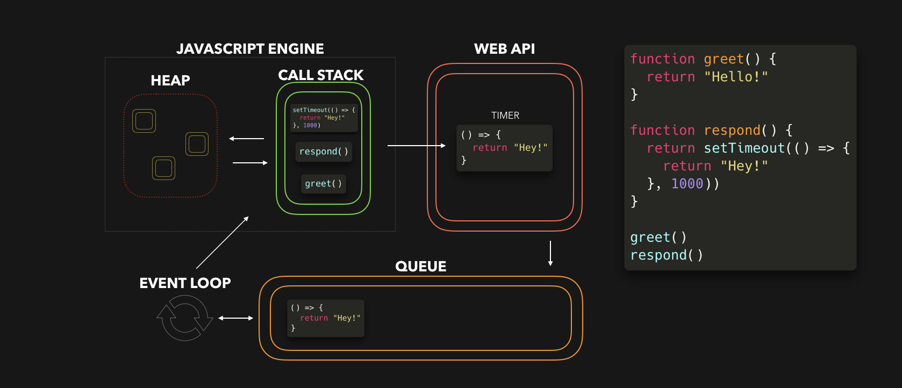

- [Hoisting](#hoisting)
  - [Variable Hoisting](#variable-hoisting)
  - [`var` Hoisting](#var-hoisting)
  - [`let` and `const` Hoisting](#let-and-const-hoisting)
- [Scope](#scope)
  - [Block Scope](#block-scope)
  - [Function Scope](#function-scope)
  - [Module Scope](#module-scope)
  - [Global Scope](#global-scope)
- [Variable Definitions (var, let, const)](#variable-definitions-var-let-const)
  - [TDZ - Temporal Dead Zone](#tdz---temporal-dead-zone)
- [Closures](#closures)
- [Function Declaration (Function Statement) vs Function Expression](#function-declaration-function-statement-vs-function-expression)
  - [Name](#name)
  - [Hoisting](#hoisting-1)
  - [Benefits of Function Expressions](#benefits-of-function-expressions)
- [Inheritance and The Prototype Chain](#inheritance-and-the-prototype-chain)
  - [From the Book (Boring)](#from-the-book-boring)
    - [Inheriting Properties](#inheriting-properties)
    - [Inheriting Methods](#inheriting-methods)
  - [Step-by-step Explanation](#step-by-step-explanation)
    - [Constructor Function](#constructor-function)
    - [ES6 Classes](#es6-classes)
- [Event Bubbling and Capturing](#event-bubbling-and-capturing)
  - [Bubbling](#bubbling)
    - [`event.target`](#eventtarget)
    - [Stop Bubbling](#stop-bubbling)
  - [Capturing](#capturing)
    - [Stop Capturing](#stop-capturing)
- [Event Loop](#event-loop)
  - [Call Stack](#call-stack)
  - [Web API](#web-api)
  - [Queue](#queue)
  - [Move Task from Queue to Call Stack](#move-task-from-queue-to-call-stack)
  - [Microtask Queue vs (Macro)task Queue](#microtask-queue-vs-macrotask-queue)
- [Generator Functions and Iterators](#generator-functions-and-iterators)
  - [`yield` Keyword](#yield-keyword)
  - [Generator Object](#generator-object)
  - [Iterators](#iterators)
  - [Generator Functions as Obeserver](#generator-functions-as-obeserver)
- [Proxy & Reflect API](#proxy--reflect-api)
- [Symbol Primitive Type](#symbol-primitive-type)
- [Currying](#currying)
- [Modules](#modules)
- [Strict Mode](#strict-mode)
  - [Invoking strict mode](#invoking-strict-mode)
    - [For Scripts](#for-scripts)
    - [For Functions](#for-functions)
    - [For Modules](#for-modules)
    - [For Classes](#for-classes)

<br />
<br />
<br />

# Hoisting

- Hoisting is a JavaScript mechanism where **variables**, **function declarations** and **classes** are moved to the top of their scope before code execution.
- Variable and class declarations are also hoisted, so they too can be referenced before they are declared.

## Variable Hoisting

- **JavaScript only hoists declarations, not initializations!**
- This means that initialization doesn't happen until the associated line of code is executed, even if the variable was originally initialized then declared, or declared and initialized in the same line.
- Until that point in the execution is reached the variable has its **default initialization** (`undefined` for a variable declared using `var`, otherwise **uninitialized**).

> **Note**: Conceptually variable hoisting is often presented as the interpreter "splitting variable declaration and initialization, and moving **just** the declarations to the top of the code".

## `var` Hoisting

- The default initialization of the var is undefined.

```ts
console.log(num); // Returns 'undefined' from hoisted var declaration
var num = 6; // Initialization and declaration.
console.log(num); // Returns 6 after the line with initialization is executed.

// after hoisting
var num;
console.log(num); // Returns 'undefined'
num = 6;
console.log(num); // Returns 6
```

## `let` and `const` Hoisting

- Variables declared with `let` and `const` are also hoisted but, unlike `var`, **are not initialized** with a default value.
- A `ReferenceError` exception will be thrown if a variable declared with `let` or `const` is read before it is initialized.

```ts
console.log(num); // TDZ, Throws ReferenceError exception as the variable is uninitialized
let num = 6; // Initialization

// after hoisting
let num;
console.log(num); // Throws ReferenceError
num = 6;
```

<br />
<br />
<br />

# Scope

- The scope is the current context of execution in which values and expressions are "**visible**" or can be referenced.
- If a variable or expression is not in the current scope, it will not be available for use.
- Scopes can also be layered in a hierarchy, so that **child scopes have access to parent scopes, but not vice versa**.
- JavaScript has the following kinds of scopes:
  - **Global scope:** The default scope for all code running in script mode
  - **Module scope:** The scope for code running in module mode
  - **Function scope:** The scope created with a function
  - **Block scope:** The scope created with a pair of curly braces (a block). variables declared with let or const can belong to this scope.

## Block Scope

- A code block in JavaScript defines a scope for variables declared using `let` and `const`.
- The code block of `if`, `for`, `while` statements also create a scope.

```ts
if (true) {
  // "if" block scope
  const message = "Hello";
  console.log(message); // 'Hello'
}
console.log(message); // throws ReferenceError
```

- `var` is **not** block scoped
- As seen in the above, the code block creates a scope for variables declared using `const` and `let`, however, that's not the case of variables declared using `var`.

> **A code block does not create a scope for var variables, but a function body does.**

## Function Scope

- A function in JavaScript defines a scope for variables declared using `var`, `let` and `const`.

```ts
function run() {
  // "run" function scope
  var message = "Run, Forrest, Run!";
  console.log(message); // 'Run, Forrest, Run!'
}
run();
console.log(message); // throws ReferenceError
```

- `run()` function body creates a scope. The variable `message` is accessible inside of the function scope, but **inaccessible** outside.

## Module Scope

- ES2015 module also creates a scope for variables, functions, classes.
- The variable which is defined in the module is not accessible outside of the module (unless explicitly exported using `export`).
- The module scope makes the module **encapsulated**.
- Every private variable (that's not exported) remains an internal detail of the module, and the module scope protects these variables from being accessed outside.
- The scope is an encapsulation mechanism for code blocks, functions, and modules.

```ts
// FILE: circle.ts
const pi = 3.14159;
console.log(pi); // 3.14159
```

```ts
// FILE: index.ts
import "./circle";
console.log(pi); // throws ReferenceError
```

## Global Scope

- The global scope is the outermost scope.
- It is accessible from any inner (aka local) scope.
- A variable declared inside the global scope is named **global variable**.
- Global variables are accessible from any scope.

# Variable Definitions (var, let, const)

| Keyword | Scope          | Hoisting | Reassignable | Redeclarable |
| ------- | -------------- | -------- | ------------ | ------------ |
| `var`   | Function Scope | Yes      | Yes          | Yes          |
| `let`   | Block Scope    | No       | Yes          | No           |
| `const` | Block Scope    | No       | No           | No           |

- Scope:
  - `var` declarations are **globally scoped** or **function scoped**
    - The scope is global when a var variable is declared **outside** a function.
    - This means that any variable that is declared with `var` outside a function block is available for use in the **whole window**.
    - `var` is function scoped when it is declared within a function.
    - This means that it is available and can be accessed **only within that function**.
  - `let` and `const` are **block scoped**
    - A block is a chunk of code bounded by `{}`.
    - A block lives in curly braces.
    - Anything within curly braces is a block.
    - So a variable declared in a block with `let` or `const` is **only** available for use within that block.
- Re-assignment and re-declaration:
  - `var` variables can be updated and re-declared within its scope;
  - `let` variables can be updated but not re-declared;
  - `const` variables can neither be updated nor re-declared so every `const` variable must be initialized during declaration.
- Hoisting:
  - They are all hoisted to the top of their scope.
  - But while `var` variables are initialized with `undefined`,
  - `let` and `const` variables are not initialized.
  - So if you try to access the variables which are initialized with `let` or `const` you will get a `Reference Error`

## TDZ - Temporal Dead Zone

- TDZ is the term to describe the state where variables are **un-reachable**.
- They are **in scope**, but they **aren't declared**.
- The `let` and `const` variables are in the TDZ from the start of their enclosing scope **until they are declared.**

```ts
{
  // This is the temporal dead zone for the age variable!
  // This is the temporal dead zone for the age variable!
  // This is the temporal dead zone for the age variable!
  // This is the temporal dead zone for the age variable!
  let age = 25; // Whew, we got there! No more TDZ
  console.log(age);
}
```

<br />
<br />
<br />

# Closures

- A closure is a function that gives you an access to **variables in the outer scope** from its **inner scope**.
- In JavaScript, closures are created every time a function is created, at function creation time.
- To understand the closures, you need to know how the `lexical scoping` works first.
  - Lexical scoping defines the **scope of a variable** by the **position** of that variable declared in the source code.
  - JavaScript engine uses the **scope** to manage the variable **accessibility**.
  - According to `lexical scoping`, the scopes can be nested and the inner function can access the variables declared in its outer scope.

> Another Definition: A **closure** is the combination of a function bundled together (enclosed) with references to its surrounding state (the **lexical environment**).

```ts
function init() {
  var name = "Yigit"; // local variable

  // displayName() is the inner function, a closure
  function displayName() {
    console.log(name); // use variable declared in the parent function
  }
  displayName();
}
init();
```

- `init()` creates a local variable called `name` and a function called `displayName()`.
- The `displayName()` function:
  - is an **inner function** that is defined inside `init()`
  - and is available **only** within the body of the `init()` function
  - it has no local variables of its own
  - it can access the variable `name` declared in the parent function

```ts
function makeFunc() {
  const name = "Yigit"; // local variable

  // displayName() is the inner function, a closure
  function displayName() {
    console.log(name); // use variable declared in the parent function
  }
  return displayName;
}

const myFunc = makeFunc();
myFunc();
```

- Running this code has exactly the same effect as the previous example of the `init()` function above.
- What's different (and interesting) is that the `displayName()` inner function is returned from the outer function before being executed.
- In some programming languages, the local variables within a function exist for just the duration of that function's execution. Once `makeFunc()` finishes executing, you might expect that the name variable would no longer be accessible.
- The reason is that functions in JavaScript form **closures**.
- A closure is the combination of a function and the lexical environment within which that function was declared.
- This environment consists of any local variables that were in-scope at the time the closure was created.
- In this case, `myFunc` is a **reference** to the instance of the function `displayName` that is created when `makeFunc` is run.
- The instance of `displayName` maintains a reference to its lexical environment, within which the variable name exists.
- For this reason, when `myFunc` is invoked, the variable name remains available for use.

<br />
<br />
<br />

# Function Declaration (Function Statement) vs Function Expression

- **Function statement**:
  - The **function statement** declares a function.
  - A declared function is “**saved for later use**”, and will be executed later, when it is invoked (called).

```ts
function bar() {
  return 3;
}
```

- **Function expression**:
  - A JavaScript function can also be defined using an **expression**.
  - A function expression can be stored in a **variable**.
  - After a function expression has been stored in a variable, the variable can be used as a function.
  - Functions stored in variables do not need function names.

```ts
var x = function (a, b) {
  return a * b;
};
```

## Name

- When you create a function with a name, that is a **function declaration**.
- The name may be omitted in **function expressions**, making that function `anonymous`.

```ts
function doStuff() {} // declaration
const doStuff = () => {}; // expression
```

## Hoisting

- **Function declarations** are hoisted but **function expressions** are not.

```ts
doStuff(); // it works because of the function hoisting
function doStuff() {}
```

```ts
doStuff(); // it throws error
const doStuff = () => {};
```

## Benefits of Function Expressions

There are several different ways that function expressions become more useful than function declarations:

- As **closures**
- As arguments to other functions (**callbacks**)
- As Immediately Invoked Function Expressions (**IIFE**)

<br />
<br />
<br />

# Inheritance and The Prototype Chain

## From the Book (Boring)

- When it comes to inheritance, JavaScript only has one construct: `objects`.
- Each object has a private property which holds a link to another object called its `prototype`.
- That prototype object has a prototype of its own, and so on until an object is reached with `null` as its prototype.
- By definition, `null` has no prototype, and acts as the **final link in this prototype chain.**
- It is possible to mutate any member of the prototype chain.
- Although **classes** are now widely adopted and have become a new paradigm in JavaScript
- Classes do not bring a new inheritance pattern.
- While classes **abstract most of the prototypical mechanism away**, understanding how prototypes work under the hood is still useful.

### Inheriting Properties

- JavaScript objects are dynamic "bags" of properties (referred to as `own properties`).
- JavaScript objects have a link to a `prototype` object.
- When trying to access a property of an object, the property will not only be sought on the object, but on the prototype of the object, the prototype of the prototype, and so on until either a property with a matching name is found or the end of the prototype chain is reached.

### Inheriting Methods

- JavaScript does not have "methods" in the form that class-based languages define them.
- In JavaScript, any function can be added to an object in the form of a **property**.
- An inherited function acts just as any other property, including property shadowing (a form of method overriding).
- When an inherited function is executed, the value of `this` points to the **inheriting object**, **not to the prototype object** where the function is an own property.

<br />

## Step-by-step Explanation

### Constructor Function

- We often have to create many objects of the same type.
- Say we have a website where people can browse dogs!
- For every dog, we need object that represents that dog!
- Instead of writing a new object each time, I'll use a `constructor function` from which we can create Dog instances using the `new` keyword

```ts
function Dog(name, bread, color) {
  this.name = name;
  this.bread = bread;
  this.color = color;
  this.bark = function () {
    return "woof!";
  };
}
```

- When we created the Dog constructor function, it wasn't the only object we created.
- Automatically, we also created another object, called the `prototype`!
- By default, this object contains a `constructor` property, which is simply a reference to the original constructor function.

```ts
{
  prototype: {
    constructor: function Dog(name, bread, color) {...}
  }
}
```

- The `prototype` property in the constructor function is `non-enumerable`, meaning that **it doesn't show up when we try to access the objects properties.**
- Let's create some dogs that we want to show.

```ts
const dog1 = new Dog("Daisy", "Labrador", "black");
const dog2 = new Dog("Jack", "Jack Russell", "white");

console.log(dog1);
// Dog {
//   name: 'Daisy',
//   bread: 'Labrador',
//   color: 'black',
//   bark: f,
//   __proto__: {
//     constructor: function Dog(name, bread, color) {...}
//   }
// }
```

- `__proto__` is a reference to the `Dog.prototype` object.
- This is what **prototypal inheritance** is all about: each instance of the constructor has access to the prototype of the constructor


- Sometimes we have properties that **all instances share**.
- For example the `bark` function in this case: it's the exact same for every instance.
- Why create a new function each time we create a new dog, consuming memory each time?
- Instead, we can add it to the `Dog.prototype` object!

```ts
function Dog(name, bread, color) {
  this.name = name;
  this.bread = bread;
  this.color = color;
}

Dog.prototype.bark = function () {
  return "woof!";
};
```


- Whenever we try to access a property on the instance:
  - the engine **first searches locally to see if the property is defined** on the object itself.
  - However, if it can't find the property we're trying to access, the engine **walks down the prototype chain through** the `__proto__` property!


- `Dog.prototype` itself is an object, meaning that it's actually an instance of the `Object constructor`!
- That means that `Dog.prototype` also contains a `__proto__` property, which is a reference to `Object.prototype`!
- This is where all the built-in methods (like `toString` and so on) come from: they're on the prototype chain!
- The prototype chain doesn't go on forever.
- Eventually there's an object which prototype is equal to `null`: the `Object.prototype` object in general!
- If we try to access a property that's nowhere to be found locally or on the prototype chain, `undefined` gets returned.

### ES6 Classes

- ES6 introduced an easier syntax for constructor functions and working with prototypes: **classes**!
- Classes are only **syntactical sugar** for constructor functions. Everything still works the same way!

<br />
<br />
<br />

# Event Bubbling and Capturing

## Bubbling

- When an event happens on an element, it first runs the handlers on it, then on its parent, then all the way up on other ancestors.


```html
<form onclick="alert('form')">
  <div onclick="alert('div')">
    <p onclick="alert('p')">P</p>
  </div>
</form>
```

- A click on the inner `<p>` first runs onclick:
  - On that `<p>`
  - Then on the outer `<div>`
  - Then on the outer `<form>`
  - And so on upwards till the `document` object.
- The process is called **“bubbling”**, because events “bubble” from the inner element up through parents like a bubble in the water.
- Almost all events bubble.
  - For instance, a `focus` event does not bubble.
  - There are other examples too.
  - But still it’s an exception, rather than a rule, most events do bubble.

### `event.target`

- A **handler on a parent element** can always get the details about where it actually happened.
- **The most deeply nested element that caused the event is called a target element**, accessible as `event.target`.
- Differences from `this` or `event.currentTarget`
  - `event.target` is the **“target”** element that initiated the event, it **doesn’t change through the bubbling process**
  - `this` is the **“current”** element, the one that has a currently running handler on it

### Stop Bubbling

- A bubbling event goes from the target element straight up.
- Normally it goes upwards till `<html>`, and then to `document` object, and some events even reach `window`, calling all handlers on the path.
- But any handler may decide that the event **has been fully processed and stop the bubbling**.
- The method for it is `event.stopPropagation()`.
- If an element has multiple event handlers on a single event, then **even if one of them stops the bubbling, the other ones still execute.**
- In other words, `event.stopPropagation()` **stops the move upwards**, but on the current element all other handlers will run.
- To stop the bubbling and prevent handlers on the current element from running, there’s a method `event.stopImmediatePropagation()`.
- After it no other handlers execute.

> **Bubbling is convenient. Don’t stop it without a real need: obvious and architecturally well thought out.**

## Capturing

- There’s another phase of event processing called **“capturing”**.
- It is rarely used in real code, but sometimes can be useful.
- The standard DOM Events describes 3 phases of event propagation:
  - **Capturing phase**: the event goes down to the element.
  - **Target phase**: the event reached the target element.
  - **Bubbling phase**: the event bubbles up from the element.



- A click on `<td>` the event:
  - first goes through the ancestors chain down to the element (**capturing phase**),
  - then it reaches the target and triggers there (**target phase**),
  - and then it goes up (**bubbling phase**), calling handlers on its way.
- Capturing phase was invisible for us, because handlers added using `on<event>` don’t know anything about capturing, they only run on the 2nd and 3rd phases.
- To catch an event on the **capturing phase**, we need to set the handler `capture` option to `true`:

```ts
elem.addEventListener(..., {capture: true});
elem.addEventListener(..., true) // or, just "true" is an alias to {capture: true}
```

```html
<form>
  <div>
    <p>text</p>
  </div>
</form>

<script>
  for (let elem of document.querySelectorAll("*")) {
    elem.addEventListener(
      "click",
      (e) => console.log(`Capturing: ${elem.tagName}`),
      true
    );
    elem.addEventListener("click", (e) =>
      console.log(`Bubbling: ${elem.tagName}`)
    );
  }
</script>
```

- If you click on `<p>`, then the sequence is:
  - `HTML` → `BODY` → `FORM` → `DIV` -> `P` (**capturing phase**, the first listener)
  - `P` → `DIV` → `FORM` → `BODY` → `HTML` (**bubbling phase**, the second listener)

### Stop Capturing

- The `event.stopPropagation()` method and its sibling `event.stopImmediatePropagation()` can also be called on the capturing phase.
- **Then not only the futher capturing is stopped, but the bubbling as well.**
- In other words, normally the event goes first down (**“capturing”**) and then up (**“bubbling”**).
- But if `event.stopPropagation()` is called during the capturing phase, then the **event travel stops**, no bubbling will occur.

<br />
<br />
<br />

# Event Loop



- JavaScript is **single-threaded**: only one task can run at a time.
- The browser gives us some features that the JavaScript engine itself doesn’t provide: a **Web API**. - This includes the `DOM API`, `setTimeout`, `HTTP requests`, and so on.
- This can help us create some async, non-blocking behavior.

## Call Stack

- When we invoke a function, it gets added to the **call stack**.
- The call stack is part of the JS engine, this **isn’t browser specific**.
- It’s a stack, meaning that it’s first in, last out.
- When a function returns a value, it gets popped off the stack.


## Web API

- The respond function returns a `setTimeout` function.
- The `setTimeout` is provided to us by the **Web API**: it lets us delay tasks without blocking the main thread.
- The callback function that we passed to the `setTimeout` function, the arrow function `() => { return 'Hey' }` gets added to the **Web API**.
- In the meantime, the `setTimeout` function and the `respond` function get popped off the stack, they both returned their values.


## Queue

- In the Web API, a timer runs for as long as the second argument we passed to it, 1000ms.
- The callback **doesn’t immediately get added to the call stack**, instead it’s passed to the **queue**.
- This can be a confusing part: it doesn't mean that the callback function gets added to the callstack(thus returns a value) after 1000ms!
- It simply gets added to the **queue** after 1000ms.
- But it’s a queue, the function has got to wait for its turn!


## Move Task from Queue to Call Stack

- Time for the **event loop** to do its only task: connecting the queue with the call stack!
- If the **call stack is empty**, so if all previously invoked functions have returned their values and have been popped off the stack, **the first item in the queue gets added to the call stack**.
- In this case, no other functions were invoked, meaning that the call stack was empty by the time the callback function was the first item in the queue.


- The callback is **added to the call stack**, **gets invoked**, and **returns a value**, and **gets popped off the stack**.


## Microtask Queue vs (Macro)task Queue

- Within the Event Loop, there are actually **two types of queues**:
  - the `(macro)task queue` (or just called the `task queue`),
  - and the `microtask` queue
- **(Macro)tasks**:
  - `setTimeout`
  - `setInterval`
  - `setImmediate`
- **Microtasks**:
  - `process.nextTick`
  - Promise callback
  - `queueMicrotask`
- When a Promise resolves and calls its `then()`, `catch()` or `finally()` method, the callback within the method gets added to the **microtask queue**
- This means that the callback within the `then()`, `catch()` or `finally()` method **isn't executed immediately**, essentially adding some async behavior to our JavaScript code.
- The event loop gives a different priority to the tasks:
  - All functions in that are currently in the **call stack** get executed. When they returned a value, they get popped off the stack.
  - When the **call stack** is empty, all queued up **microtasks are popped onto the callstack** one by one, and get executed!
  - If both the **call stack and microtask queue** are empty, the event loop checks if there are tasks left on the **(macro)task queue**. The tasks get popped onto the callstack, executed, and popped off!


<br />
<br />
<br />

# Generator Functions and Iterators

- Regular functions follow something called a `run-to-completion` model: when we invoke a function, it will always run until it completes (unless there's an error somewhere).
- We can't just randomly pause a function somewhere in the middle whenever we want to.
- **Generator functions** don't follow the `run-to-completion` model!
- We create a generator function by writing an asterisk `*` after the `function` keyword.
- One of the biggest advantages of generators is the fact that they are **lazily evaluated.**
- This means that the value that gets returned after invoking the `next` method, is only computed after we specifically asked for it.

```ts
function* generatorFunction() {
  // ...
}
```

- But that's not all we have to do to use generator functions!
- Generator functions actually work in a completely different way compared to regular functions:
  - Invoking a generator function returns a **generator object**, which is an `iterator`.
  - We can use the `yield` keyword in a generator function to "**pause**" the execution.

## `yield` Keyword

```ts
function* generatorFunction() {
  yield "1";
  console.log("First log");
  yield "2";
  console.log("Second log");

  return "Done";
}
```

- The execution of the generator gets "**paused**" when it encounters a `yield` keyword.
- And the next time we run the function, it remembered where it previously paused, and runs from there.
- Flow:
  - The first time it runs, it "pauses" on the first line and yields the string value `'1'`
  - The second time it runs, it starts on the line of the previous yield keyword. It then runs all the way down till the second `yield` keyword and yields the value `'2'`.
  - The third time it runs, it start on the line of the previous `yield` keyword. It runs all the way down until it encounters the `return` keyword, and **returns** the value `'Done'`.
- How can we invoke the function again? This is where the generator object comes into play!

## Generator Object

- The generator object contains a `next` method (on the prototype chain).
- This method is what we'll use to **iterate** the generator object.
- However, in order to remember the state of where it previously left off after yielding a value, we need to assign the generator object to a variable.

```ts
function* generatorFunction() {
  yield "1";
  console.log("First log");
  yield "2";
  console.log("Second log");

  return "Done";
}

const genObj = generatorFunction();
genObj.next(); // returns { value: '1', done: false }
genObj.next(); // logs "First log" and returns { value: '2', done: false }
genObj.next(); // logs "Secong log" and returns { value: 'Done', done: true }
```

- The generator ran until it encountered the first `yield` keyword.
- It yielded an object containing a `value` property, and a `done` property. `{ value: ... , done: ... }`
  - The `value` property is equal to the value that we **yielded**.
  - The `done` property is a `boolean` value, which is only set to `true` once the generator function returned a value (not yielded)
- **We can only iterate a generator object once!**

## Iterators

- A generator function returns an `iterator` (the generator object).
- We can use `for of` loops, and the `spread operator` on the returned object.

```ts
function* generatorFunction() {
  yield 1;
  yield 2;
  yield 3;
}

const genObj1 = generatorFunction();
console.log([...genObj1]); // [1, 2, 3]

const genObj2 = generatorFunction();
for (let item of genObj2) {
  console.log(item);
}
// prints 1, 2, 3
```

- We can also use `for-of` loops and the `spread` syntax with `arrays`, `strings`, `maps`, and `sets`.
- It's because they implement the **iterator** protocol: the `[Symbol.iterator]`
- We can simply just add the `[Symbol.iterator]` property manually, and make non-iterables iterable.
- `[Symbol.iterator]` has to return an **iterator**, containing a `next` method which returns an object: `{ value: '...', done: false/true }`
- We can simply set the value of `[Symbol.iterator]` equal to a `generator function`, as this returns an iterator by default.

```ts
const object = {
  name: "Yigit",
  [Symbol.iterator]: function* () {
    yield this;
  },
};

console.log([...object]); // [{ name: 'Yigit' }]
```

- What if only wants to get field names?

```ts
const object = {
  name: "Yigit",
  surname: "Yigit",
  [Symbol.iterator]: function* () {
    yield Object.keys(this);
  },
};

console.log([...object]); // [[ 'name', 'surname' ]]
```

- `Object.keys(this)` is an `array`, so the value that got yielded is an array.
- Then we spread this yielded array into another array, resulting in a nested array.
- We can yield individual values from iterators within a generator using the `yield*` keyword, so the **yield with an asterisk**

```ts
const object = {
  name: "Yigit",
  surname: "Yigit",
  [Symbol.iterator]: function* () {
    yield* Object.keys(this);
  },
};

console.log([...object]); // [ 'name', 'surname' ]
```

## Generator Functions as Obeserver

- Another use of generator functions, is that we can use them as **observer functions**.
- A generator can wait for incoming data, and only if that data is passed, it will process it. An example:

```ts
function* generatorFunction() {
  const second = yield 1;
  console.log(second);

  return "Done";
}

const genObj = generatorFunction();
genObj.next(); // returns { value: '1', done: false }
genObj.next("Some text"); // logs "Some text" and returns { value: 'Done', done: true }
```

- A big difference here is that we don't just have `yield [value]`.
- Instead, we assign a value called `second`, and yield value.
- The `second` variable value will be the value that we pass to the `next` method the next time.
- It's important to see here that the first invocation of the next method doesn't keep track of any input yet.
- We simply start the observer by invoking it the first time.
- The generator waits for our input, before it continues, and possibly processes the value that we pass to the next method.

<br />
<br />
<br />

# Proxy & Reflect API

<br />
<br />
<br />

# Symbol Primitive Type

<br />
<br />
<br />

# Currying

<br />
<br />
<br />

# Modules

<br />
<br />
<br />

# Strict Mode

- JavaScript's strict mode is a way to **opt in** to a restricted variant of JavaScript, thereby implicitly **opting-out** of "**sloppy mode**" (normal mode).
- Strict mode isn't just a subset: it intentionally has different semantics from normal code.
- Strict mode code and non-strict mode code **can coexist**, so scripts can opt into strict mode incrementally.
- Strict mode makes several changes to normal JavaScript semantics:
  - Eliminates some JavaScript silent errors by changing them to throw **errors**.
  - Fixes mistakes that make it difficult for JavaScript engines to perform optimizations: strict mode code can sometimes be made to run faster than identical code that's not strict mode.
  - Prohibits some syntax likely to be defined in future versions of ECMAScript

## Invoking strict mode

- Strict mode applies to entire **scripts** or to individual **functions**.
- It **doesn't apply** to block statements enclosed in {} braces; attempting to apply it to such contexts does nothing.

### For Scripts

```ts
// Whole-script strict mode syntax
"use strict";
const v = "Hi! I'm a strict mode script!";
```

### For Functions

```ts
function myStrictFunction() {
  // Function-level strict mode syntax
  "use strict";
  function nested() {
    return "And so am I!";
  }
  return `Hi! I'm a strict mode function! ${nested()}`;
}

function myNotStrictFunction() {
  return "I'm not strict.";
}
```

### For Modules

- ECMAScript 2015 introduced JavaScript modules and therefore a 3rd way to enter strict mode. - The entire contents of JavaScript modules are **automatically in strict mode**, with no statement needed to initiate it.

```ts
function myStrictFunction() {
  // because this is a module, I'm strict by default
}
export default myStrictFunction;
```

### For Classes

- All parts of ECMAScript **classes are strict mode code**, including both class declarations and class expressions — and so also including all parts of class bodies.

<br />
<br />
<br />
