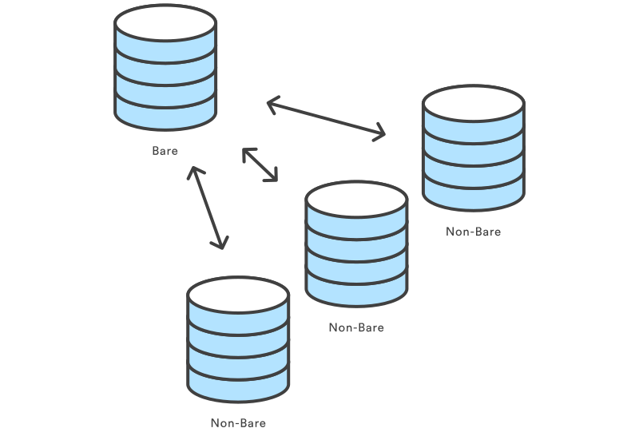
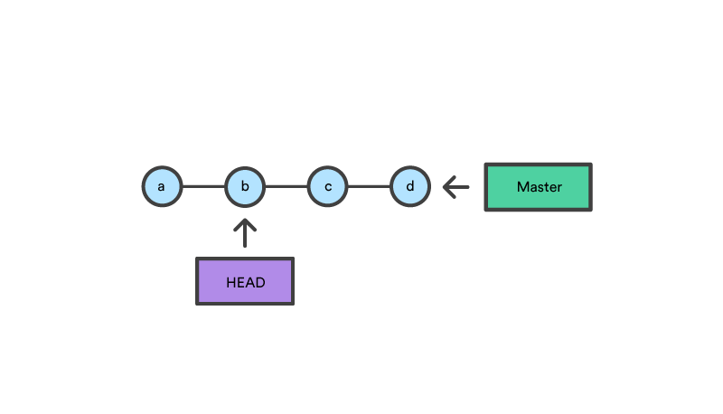

- [THREE TREES](#three-trees)
  - [1. Working Directory](#1-working-directory)
  - [2. Staging Index](#2-staging-index)
  - [3. Commit History](#3-commit-history)
- [SETTING UP REPO](#setting-up-repo)
  - [Init](#init)
  - [Init Bare (Remote) Repo](#init-bare-remote-repo)
  - [Remote](#remote)
  - [Clone](#clone)
- [SAVING CHANGES](#saving-changes)
  - [Add](#add)
  - [Commit](#commit)
  - [Stash](#stash)
- [UNDOING](#undoing)
  - [Checkout](#checkout)
  - [Revert](#revert)
  - [Reset](#reset)
    - [Soft](#soft)
    - [Mixed](#mixed)
    - [Hard](#hard)
  - [Clean](#clean)
  - [Rm](#rm)
- [COLLABORATION](#collaboration)
  - [Push](#push)
  - [Pull](#pull)
  - [Branch](#branch)
- [OTHERS](#others)
  - [Config](#config)
  - [Gitignore](#gitignore)


---


# THREE TREES
* Tree is not traditional tree structure.
* It is the name of node and pointer-based data structure to track a timeline of edits.

## 1. Working Directory
* Sync with local filesystem.
* Tracks changes on local filesystem.

## 2. Staging Index
* Tracks working directory changes that are specified with "git add" to be stored in the next commit.

## 3. Commit History
* Saved changes history.

# SETTING UP REPO

## Init
* Adds git support to working tree.
* Creates local master branch.
* Does not create remote repo connection.

```bash
mkdir ~/my-repo
cd ~/my-repo
git init 
```

```bash
mkdir ~/my-repo
git init ~/my-repo
```

## Init Bare (Remote) Repo
* Creates bare repo.
* Bare repo can be considered as remote repo.
* Does not create working directory.

```bash
git init --bare ~/my-bare-repo
```



## Remote

```bash
git remote add origin <URL>
```

## Clone
* Copies exist remote repo into local working directory.
* Automaticly adds remote repo connection to local repo as origin.

```bash
git clone https://github.com/yigityuce/N2MS.git [working-directory]
```


---
# SAVING CHANGES
* Traditional Save = Git Commit

## Add
* Working Directory -> Staging Area
* Named as staging.
* Adds file that newly created or changed one to staging area.

```bash
git add <filename|directory>
```

```bash
git add --all
```

* Partial add. 
* Interactive command line tool.
 
```bash
git add -p
```

## Commit
* Staging Area -> local/master
* Save changes as git style to local repo.

```bash
git commit -m "Commit Message"
```

* With amend option:
  * Previous commit will be editted.
  * Does not create new commit.
  * Staged changes will be added to previous commit.

```bash
git commit --amend
```

## Stash
* Temporary storage of working directory changes that are not ready for commit.
* After stashed changes you can work on something else at working directory.
* Then you can re-apply stashed changes.
* Stashes are local.
* Stash command stores all uncommitted changes,
  * including staged and unstaged
  * but excluding ignored and untracked files (ex. new files).
* Can be multiple stash.

```bash
// Stashing
git stash
```

```bash
// Stashing with description
git stash save "Stash description"
```

```bash
// Re-applying from stash

// deletes it from stash stack, and applies to working directory
git stash pop

// keep storing it at stash stack, and applies to working directory
git stash apply
```

```bash
// Stashing with untracked files (ex. new files)
git stash -u
```

```bash
// Stashing with untracked files and ignored files
git stash -a
```

```bash
// List stashes
git stash list
```

```bash
// Drop specific stash
git stash drop stash@{0}
```

```bash
// Clear all stashes
git stash clear
```


---

# UNDOING
* Traditional Undo = Move Back in Time

## Checkout
* Switching between different versions of target entity already on the local repo **via changing the HEAD reference**.
* Entity can be:
  * Commit
  * Branch
  * File

```bash
git checkout <entity>
```

```bash
// Create new branch and checkout
git checkout -b <new-branch>
```

```bash
// Create new branch from specific branch and checkout
git checkout -b <new-branch> <existing-branch>
```




* Checking out on a previous commit, HEAD reference will be **detached HEAD**.
```bash 
git checkout b
```

  
* In a detached state, any new commits will be orphaned when you change branches back to an original branch.
* You can create new branch from this previous commit with below command.
* This will create new history timeline. 
```bash 
git checkout -b new_branch_without_crazy_commit
```


## Revert
* Creates new commit with inversion of the latest commit.
* Timeline moves forward, but its kind of an undo operation.
* Undoned commit is still in timeline.
* We are still on the same branch.

```bash
git revert <commit>
```

## Reset


* Moves both the HEAD and branch refs to the specified previous commit.
* **Great for local changes.**
* **It causes complications at remote repo.**
  * Git will assume that the branch being pushed is not up to date because of it's missing commits.


```bash
git reset b
```

* It always affects [Commit Tree](#3-commit-history).
* Arguments at the below affect the [Staging Index](#2-staging-index) and [Working Directory](#1-working-directory) trees.

### Soft
* Just update references.
* Staging Index and Working Directory are left untouched.
* 
```bash
git reset --soft
```

### Mixed
* Just resets Staging Index.
* Moves changes from Staging Index to Working Directory. 
  * Makes staged changes unstaged.

```bash
git reset --mixed
git reset
```

### Hard
* With this option Staging Index and Working Directory are reset also.
* This means any pending work in the Staging Index and Working Directory **will be lost**.
* This operation can't be undone.

```bash
git reset --hard <commit>
```


Notes:
* Revert is a safe way of undo.
* Reset can be dangerous. Especially with *hard* option.
* Reset will never delete commits.
  * Commits become orphaned.
  * Orphaned commits have not a direct path from a ref to access them.
  * Orphaned commits will be deleted after 30 days (default) by garbage collector.
* Working directory and staging index are not permenant like Commit History.
* Never reset commit after pushed.


## Clean
* Works on untracked files.
* Clean can't be undone.
* Remove untracked files from filesystem.

```bash
git clean
```

## Rm
* Remove files from stage index.
* Inverse of git add.
* Unstage files.

```bash
git rm
```


---
# COLLABORATION

## Push
* local/master -> remote/origin/master
* Send changes that are done with git commit at local repo to a remote repo.

```bash
git push -u origin master 
```

## Pull
remote/origin/master -> local/master

```bash
git pull
```

## Branch


```bash
// List branches
git branch
```

```bash
// New branch
git branch <new_branch>
```

# OTHERS
## Config
## Gitignore