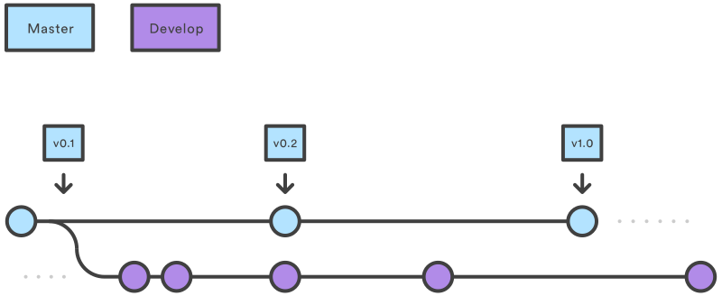

- [THREE TREES](#three-trees)
  - [1. Working Directory](#1-working-directory)
  - [2. Staging Index](#2-staging-index)
  - [3. Commit History](#3-commit-history)
- [SETTING UP REPO](#setting-up-repo)
  - [Init](#init)
  - [Init Bare (Remote) Repo](#init-bare-remote-repo)
  - [Remote](#remote)
  - [Clone](#clone)
- [SAVING CHANGES](#saving-changes)
  - [Add](#add)
  - [Commit](#commit)
  - [Stash](#stash)
- [UNDOING](#undoing)
  - [Checkout](#checkout)
  - [Revert](#revert)
  - [Reset](#reset)
    - [Soft](#soft)
    - [Mixed](#mixed)
    - [Hard](#hard)
  - [Clean](#clean)
  - [Rm](#rm)
- [REWRITING HISTORY](#rewriting-history)
  - [Amend](#amend)
  - [Rebase](#rebase)
  - [Reflog](#reflog)
- [COLLABORATION](#collaboration)
  - [Fetch](#fetch)
  - [Pull](#pull)
  - [Push](#push)
  - [Branch](#branch)
  - [Checkout](#checkout-1)
  - [Merge](#merge)
    - [Fast-Forward Merge](#fast-forward-merge)
    - [3-Way Merge](#3-way-merge)
- [WORKFLOWS](#workflows)
  - [Centralized Workflow](#centralized-workflow)
  - [Feature Branch Workflow](#feature-branch-workflow)
  - [Gitflow Workflow](#gitflow-workflow)
  - [Forking Workflow](#forking-workflow)
  - [Recommandations](#recommandations)
    - [Short-lived branches](#short-lived-branches)
    - [Minimize and simplify reverts](#minimize-and-simplify-reverts)
- [OTHERS](#others)
  - [Config](#config)
  - [Gitignore](#gitignore)


---


# THREE TREES
* Tree is not traditional tree structure.
* It is the name of node and pointer-based data structure to track a timeline of edits.

## 1. Working Directory
* Sync with local filesystem.
* Tracks changes on local filesystem.

## 2. Staging Index
* Tracks working directory changes that are specified with "git add" to be stored in the next commit.

## 3. Commit History
* Saved changes history.

# SETTING UP REPO

## Init
* Adds git support to working tree.
* Creates local master branch.
* Does not create remote repo connection.

```bash
mkdir ~/my-repo
cd ~/my-repo
git init 
```

```bash
mkdir ~/my-repo
git init ~/my-repo
```

## Init Bare (Remote) Repo
* Creates bare repo.
* Bare repo can be considered as remote repo.
* Does not create working directory.


```bash
git init --bare ~/my-bare-repo
```


## Remote
* Lets you create, view, and delete connections to other repositories.
* It is a helper method for modifing remote related config file.

List the remote connections you have to other repositories.

```bash
# -v: show urls also
git remote [-v]
```

```bash
git remote add <name> <url>
```

```bash
git remote rm <name>
```

```bash
git remote rename <old-name> <new-name>
```


## Clone
* Copies exist remote repo into local working directory.
* Automaticly adds remote repo connection to local repo as origin.

```bash
git clone https:#github.com/yigityuce/N2MS.git [working-directory]
```


---
# SAVING CHANGES
* Traditional Save = Git Commit

## Add
* Working Directory -> Staging Area
* Named as staging.
* Adds file that newly created or changed one to staging area.

```bash
git add <filename|directory>
```

```bash
git add --all
```

* Partial add. 
* Interactive command line tool.
 
```bash
git add -p
```

## Commit
* Staging Area -> local/master
* Save changes as git style to local repo.

```bash
git commit -m "Commit Message"
```

## Stash
* Temporary storage of working directory changes that are not ready for commit.
* After stashed changes you can work on something else at working directory.
* Then you can re-apply stashed changes.
* Stashes are local.
* Stash command stores all uncommitted changes,
  * including staged and unstaged
  * but excluding ignored and untracked files (ex. new files).
* Can be multiple stash.

```bash
# Stashing
git stash
```

```bash
# Stashing with description
git stash save "Stash description"
```

```bash
# Re-applying from stash

# deletes it from stash stack, and applies to working directory
git stash pop

# keep storing it at stash stack, and applies to working directory
git stash apply
```

```bash
# Stashing with untracked files (ex. new files)
git stash -u
```

```bash
# Stashing with untracked files and ignored files
git stash -a
```

```bash
# List stashes
git stash list
```

```bash
# Drop specific stash
git stash drop stash@{0}
```

```bash
# Clear all stashes
git stash clear
```


---

# UNDOING
* Traditional Undo = Move Back in Time

## Checkout
* Switching between different versions of target entity already on the local repo **via changing the HEAD reference**.
* Entity can be:
  * Commit
  * Branch
  * File

```bash
git checkout <entity>
```

```bash
# Create new branch and checkout
git checkout -b <new-branch>
```

```bash
# Create new branch from specific branch and checkout
git checkout -b <new-branch> <existing-branch>
```


* Checking out on a previous commit, HEAD reference will be **detached HEAD**.
```bash 
git checkout b
```

  
* In a detached state, any new commits will be orphaned when you change branches back to an original branch.
* You can create new branch from this previous commit with below command.
* This will create new history timeline. 
```bash 
git checkout -b new_branch_without_crazy_commit
```


## Revert
* Creates new commit with inversion of the latest commit.
* Timeline moves forward, but its kind of an undo operation.
* Undoned commit is still in timeline.
* We are still on the same branch.

```bash
git revert <commit>
```

## Reset


* Moves both the HEAD and branch refs to the specified previous commit.
* **Great for local changes.**
* **It causes complications at remote repo.**
  * Git will assume that the branch being pushed is not up to date because of it's missing commits.


```bash
git reset b
```

* It always affects [Commit Tree](#3-commit-history).
* Arguments at the below affect the [Staging Index](#2-staging-index) and [Working Directory](#1-working-directory) trees.

### Soft
* Just update references.
* Staging Index and Working Directory are left untouched.
* 
```bash
git reset --soft
```

### Mixed
* Just resets Staging Index.
* Moves changes from Staging Index to Working Directory. 
  * Makes staged changes unstaged.

```bash
git reset --mixed
git reset
```

### Hard
* With this option Staging Index and Working Directory are reset also.
* This means any pending work in the Staging Index and Working Directory **will be lost**.
* This operation can't be undone.

```bash
git reset --hard <commit>
```


Notes:
* Revert is a safe way of undo.
* Reset can be dangerous. Especially with *hard* option.
* Reset will never delete commits.
  * Commits become orphaned.
  * Orphaned commits have not a direct path from a ref to access them.
  * Orphaned commits will be deleted after 30 days (default) by garbage collector.
  * Orphaned commits can be found and restored using reflog.
* Working directory and staging index are not permenant like Commit History.
* Never reset commit after pushed.


## Clean
* Works on untracked files.
* Clean can't be undone.
* Remove untracked files from filesystem.

```bash
git clean
```

## Rm
* Remove files from stage index.
* Inverse of git add.
* Unstage files.

```bash
git rm
```

---
# REWRITING HISTORY

## Amend
* Amend is an option for commit.
* With amend option:
  * Previous commit will be editted.
  * Does not create new commit.
  * Staged changes will be added to previous commit.
* Can be used to edit previous commit message.
* Never amend commit after pushed.

```bash
git commit --amend
```

## Rebase 


* Change base commit of the branch to another commit.
* Never rebase commit after pushed.
* Generally used to maintain linear timeline. (Clean history)
  * Create new branch (Feature) from a previous commit.
  * Develop some new features.
  * Then add new features to master HEAD.


* Another use case of the rebase is integrating remote (forwarded/upstream) changes with your local commits that have the base with old commit **at the same branch**.

```bash
# base can be branch, ref (HEAD), commit
git rebase <base>
```

```bash
# -i: interactive
# used for making decision about to do something for every commit.

# Rebase Commit Commands:
# p, pick = use commit
# r, reword = use commit, but edit the commit message
# e, edit = use commit, but stop for amending
# s, squash = use commit, but meld into previous commit
# f, fixup = like "squash", but discard this commit's log message
# x, exec = run command (the rest of the line) using shell
# d, drop = remove commit 
git rebase -i <base>
```

## Reflog
* Reference logs.
* Reflog tracks ref updates in local repo. 
* Reflog allows you to go back to commits even they are not referenced by any branch or tag.
* Provides a safety net in case the history was accidentally changed.
  * For ex. Assume that you accidentally do hard reset to previous commit.
  * Commits that reset are orphaned now and can't be reach with standard way.
  * In this situation you can use reflog to find out orphaned commit ref.
  * And hard reset to that ref.
* Reflog entries have an expiration date. The default expiration is 90 days.

```bash
git reflog
```

```bash
git reflog --relative-date
```

```bash
# show special ref's reflog
# ref can be branch
git reflog show <ref>
```

```bash
git reflog show stash
```


---
# COLLABORATION

## Fetch
* Remote Repo -> Remote Repo's Local Tracking Ref
* Downloads commits, files and refs from remote repo.
* **But does not merge them to your working directory.**
* Generally use to find out remote repo status.

```bash
# Fetch all of the branches from the repository.
git fetch <remote>
```

```bash
# Fetch specified branch from the repository.
git fetch <remote> <branch>
```

## Pull
* Remote Repo -> Working Directory
* Downloads commits, files and refs from remote repo.
* **And immediatelly merges it with your working directory.**
* pull = fetch + merge


**Ex. 1.: Git Pull Merging Strategy**
* Diagram before pull.


* Pull operation executed
```bash
git pull
```

* Diagram after pull.
* Automatically merged.
* Merge commit H is generated.
  


**Ex. 2.: Rebase Merging Strategy**
* Diagram before pull.


* Pull operation executed
```bash
git pull --rebase
```

* Diagram after pull.
* Does not create new merge commit.
* Append remote commits to local origin/master commit history.
  


## Push
* local/master -> remote/origin/master
* Send changes that are done with git commit at local repo to a remote repo.

```bash
# remote: remote name
# branch: remote branch
git push <remote> <branch> 
```

```bash
# push all local branches
git push <remote> -all
```

* Local tags won't be pushed unless you specified --tags option.
```bash
# push all local tags
git push <remote> -tags
```

## Branch
* A branch represents an independent line of development.
* New commits are recorded in the history for the current branch.

```bash
# List branches
git branch
```

```bash
# New branch
git branch <branch>
```

```bash
# Delete merged branch.
# Git prevents delete operation of unmerged branch.
git branch -d <branch>
```

```bash
# Force delete unmerged branch.
git branch -D <branch>
```

```bash
# Rename the current branch.
git branch -m <new-branch-name>
```

## Checkout
* For more info see [Checkout Documentation](#checkout)

## Merge
* Puts a forked history back together again.
* The current branch will be updated. 
* But the target branch will be completely unaffected. 
* Creates new merge commit.
* If **conflict** is detected when merging, this will need to user intervention to continue.
  * Same code piece is changed at both branches.
  * Git stops merging at merge commit stage and adds some identifier to confilicted file lines.
  * Then you should pick one of them and commit.

Before merging:
* Confirm you are the right receiving branch. (Ex. master)
* Make sure the receiving branch and the merging branch are up-to-date.

```bash
# branch: branch name that is merged into current branch
git merge <branch>
```

### Fast-Forward Merge
* It can occur when there is a linear path from the current branch to the target branch.
* It means the base of the merging branch is the HEAD of the receiving branch.


### 3-Way Merge
* A fast-forward merge is not possible if the branches have diverged.
* It creates new merge commit to tie together the two histories.
* Many developers like to use fast-forward merges (facilitated through rebasing) for small features or bug fixes, while reserving 3-way merges for the integration of longer-running features.


---
# WORKFLOWS
* These workflows are designed to be guidelines rather than concrete rules.
* Some things to consider when evaluating a Git workflow are:
  * Does this workflow scale with team size?
  * Is it easy to undo mistakes and errors with this workflow?
  * Does this workflow impose any new unnecessary cognitive overhead to the team?


## Centralized Workflow


* Similar to SVN.
* Uses a central repository to serve as the single point-of-entry for all changes to the project.
* All changes are committed into master.
* Does not require any other branch.
* Compared to other workflows, the Centralized Workflow has no defined pull request or forking patterns.
* Flow:
  * Clone
  * Edit
  * Commit
  * Push
  * In any conflict:
    *  Fetch
    *  Rebase
    *  Push


## Feature Branch Workflow
* Feature Branching is a logical extension of Centralized Workflow.
* All feature development should be done at seperate branch instead of master.
* This makes it easy to developer to develop own features without distrubute the main codebase.
* It also guarantees the main codebase never includes broken code.
* It also makes it possible to do pull requests.
  * Pull requests make it easy for your team to comment on each other’s work.
* Flow:
  * Pull (fetch + rebase --hard master) (fetch + merge)
  * Create branch
  * Checkout newly created branch
  * Edit
  * Commit
  * Push
  * Open pull request
    * can add reviewers
  * Resolve comments about pull request.
  * If everything is ok then merge to master.

## Gitflow Workflow
* It doesn't add any new concept to Feature Branch Workflow.
* It defines strictly which, when and how branches will be used for.
* [Git flow extension](https://github.com/nvie/gitflow) can be used.




* Instead of a single master branch, it uses two branches to record the history.
* The master branch stores the **official release** history.
* The *develop* branch serves as an **integration** branch for features.
* Tag all commits in the master branch with a version number.


* Use feature branch for new feature.
  * This feature branch should use *develop* branch as parent.
  * After feature completed, this should be merged to *develop* branch. 


* When the features are ready to new version,
* Fork *release* branch from *develop* branch.
* This starts new release cycle.
* At this point no new features can be added.
* Only release-related things can be done in this branch like:
  * Bugfix
  * Documentation
  * etc.
* When it is ready to go
  * Get merged into master branch.
  * Get tagged with version number. 
  * Should be merged back into *develop* branch


## Forking Workflow
* Instead of using a single server-side repository to act as the “central” codebase, it gives every developer their own server-side repository.
  * Each developer has a server-side repository that forked from original repo
  * And local copy of that.
* This allows the maintainer to accept commits from any developer without giving them write access to the official codebase.
* This also makes it an ideal workflow for **open source** projects.
* Flow:
  * A developer 'forks' an 'official' server-side repository. This creates their own server-side copy.
  * The new server-side copy is cloned to their local system.
  * A Git remote path for the 'official' repository is added to the local clone.
  * A new local feature branch is created.
  * The developer makes changes on the new branch.
  * New commits are created for the changes.
  * The branch gets pushed to the developer's own server-side copy.
  * The developer opens a pull request from the new branch to the 'official' repository.
  * The pull request gets approved for merge and is merged into the original server-side repository


## Recommandations
### Short-lived branches
* The longer separate branch from the master causes the higher risk for merge conflicts and deployment challenges. 
* Short-lived branches promote cleaner merges and deploys.

### Minimize and simplify reverts
* Define a workflow that helps to prevent committing the broken code and then will have to be reverted.
  * This causes to merge revert commit.
* For example define a rule that the development branch has to pass the tests before merging into master branch.
* Define a workflow that allows easy reverts that will not disrupt the flow for other team members.


---
# OTHERS
## Config
## Gitignore